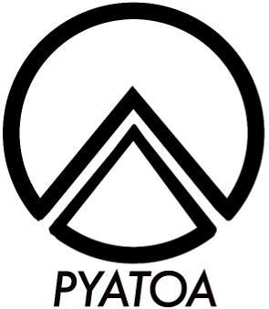

# Python's Adjoint Tomography Operations Assistant  

## Misfit assessment for the modern tomographer

  

**Pyatoa**\* is a waveform-based misfit quantification package, with additional 
tools for measurement aggregation, and visualizations of inversion results. 
It is meant to facilitate the execution and assessment of seismic waveform 
inversion.

---

- Documentation, including install instructions, example problems and API, can 
  be found on [Read the Docs](https://pyatoa.readthedocs.io).

- Pyatoa is under current active development, and is bundled with other
  inversion software under the [adjTomo organization](https://github.com/adjtomo).

- If you find any issues, have questions, or would like to join the community, 
  please feel free to open up a [GitHub Issue](https://github.com/adjtomo/pyatoa/issues) or [start a discussion](https://github.com/orgs/adjtomo/discussions). 

---

The design philosophy of **Pyatoa** is easy-to-use interface that 
make tomography research approachable, flexible, and repeatable.

 \**pronounced Py-uh-toe-uh (ˈpaɪəˈtoʊə), inspired by the famed volcano Krakatoa* 

