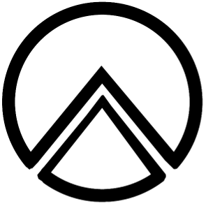

## Python's Adjoint Tomography Operations Assitant  
### Misfit assessment for the modern tomographer

---
Documentation can be found here (in development): https://pyatoa.readthedocs.io/en/latest/

---

  

Pyatoa is a waveform-based misfit quantification package, which provides abstraction over a few Python based tools.  
It also provides tools for measurement aggregation, and simple statistical visualizations, facilitating the assessment of seismic inveresions.

**[ObsPy:](https://github.com/obspy/obspy/wiki)** for seismic data fetching, handling, processing and organization.    
**[Pyflex:](https://krischer.github.io/pyflex/)** a Python port of Flexwin, an automatic time window selection algorithm.  
**[Pyadjoint:](http://krischer.github.io/pyadjoint/)** a package for calculating misfit and creating adjoint sources.  
**[PyASDF:](https://seismicdata.github.io/pyasdf/)** heirarchical data storage for seismic data.  
**[Pandas:](https://pandas.pydata.org/)** aggregation and organization of measurement information

Pyatoa can be used bog-standard, or customized with simple Python scripting, to gather, process, window, measure, visualize, save and export waveform data. It was designed as a tool to be used in conjunction with [Seisflows](https://github.com/rmodrak/seisflows), an automated workflow for seismic inversions, and [Specfem3D Cartesian](https://geodynamics.org/cig/software/specfem3d/), a numerical solver for seismic wave propogation, but is generally applicable thanks to the flexibility of ObsPy.

The design philosophy of Pyatoa follows closely with Obspy; that is, flexible classes and functions that can be used for rapid development, repeatable measurements, quick data handling, and simple but powerful visualization, while still leaving room for an easy transition to more detailed scientific research. 

