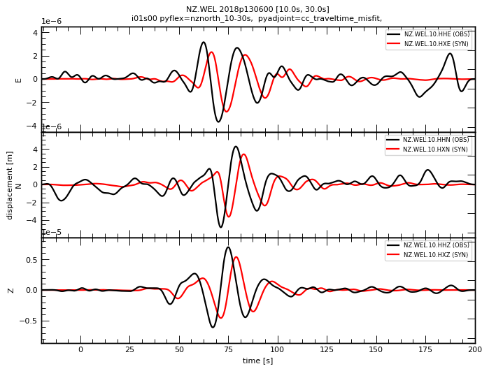
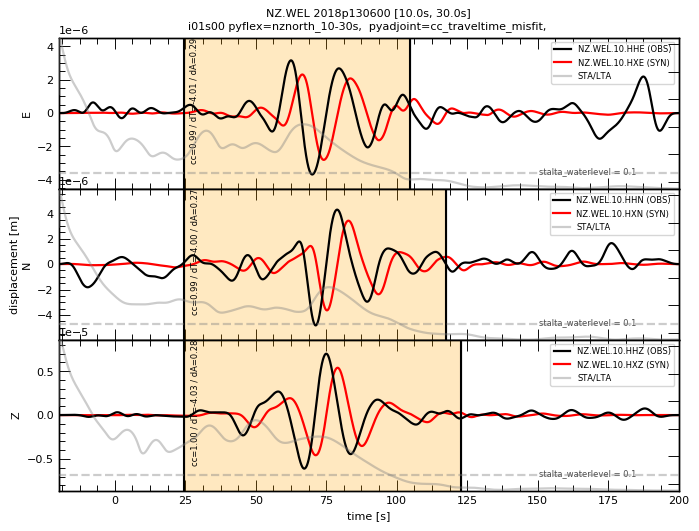
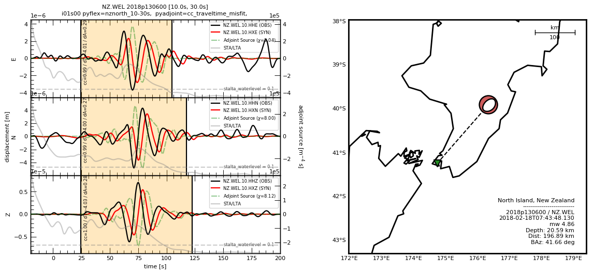

Data-Synthetic Misfit
=====================

``Pyatoa`` provides functionality to address misfit quantification
within a seismic tomography workflow. Operations include: seismic data
gathering, waveform time-windowing, adjoint source creation, data
storage, and measurement aggregation. In this Quickstart page, we
demonstrate the capabilities of ``Pyatoa`` by collecting and processing
seismic data. For more in-depth descriptions and tutorials, see the
other pages in this documentation page, as well as the Pyatoa API.

A New Zealand example
~~~~~~~~~~~~~~~~~~~~~

To illustrate functionality, we need to use a real earthquake and its
recorded seismic waveforms. For the purposes of this tutorial, we’ll be
using the `M6.2 Eketahuna
earthquake <https://www.geonet.org.nz/earthquake/story/2014p051675>`__
that occurred in New Zealand in 2014. For this event, seismic waveform
data was collected by the broadband seismic network of New Zealand
`(GeoNet) <https://www.geonet.org.nz/data/network/sensor/search>`__. We
begin with imports of some of Pyatoa’s core classes, and set the logging
to be verbose using the DEBUG option.

.. code:: python

    import shutil
    from pyasdf import ASDFDataSet
    from pyatoa import logger, Config, Manager, Inspector
    logger.setLevel("DEBUG")

The ``ASDFDataSet`` is used for storage of seismic data. It is
preferable to name the dataset after a unique event identifier.

.. code:: python

    event_id = "2018p130600"  # this is the unique GeoNet ID for the Eketahuna event
    dataset_original_fid = f"../tests/test_data/{event_id}.h5"  # it is preferable to name the dataset after the event id
    
    # Copy the original data so we don't end up overwriting test data
    dataset_fid = f"../tests/test_data/docs_data/{event_id}.h5"
    shutil.copy(dataset_original_fid, dataset_fid)
    
    ds = ASDFDataSet(dataset_fid)

The Pyatoa ``Config`` object contains parameters which control the
misfit quantification workflow. Since ``Pyatoa`` was designed to be used
within seismic inversion tools, ``iteration`` and ``step_count``
attributes are available to keep track of where in the inversion we are.
Let’s say this is the beginning of the inversion, so the first iteration
and the zeroth step count.

We also choose some preset parameters for our preprocessing, time
windowing and adjoint source generation algorithms.

.. code:: python

    cfg = Config(iteration=1, step_count=0, 
                 event_id=event_id,
                 client="GEONET",
                 min_period=10, 
                 max_period=30,
                 start_pad=20,
                 end_pad=200,
                 pyflex_preset="nznorth_10-30s", 
                 adj_src_type="cc_traveltime_misfit",
                 )

.. parsed-literal::

    [2022-03-03 11:02:43] - pyatoa - DEBUG: Component list set to E/N/Z

Finally, the ``Manager`` class is instantiated. The ``Manager`` is
responsible for gathering, processing and storing data. It uses its
``config`` attribute to control the gathering and processing, and stores
data to the ``ASDFDataSet``.

.. code:: python

    mgmt = Manager(config=cfg, ds=ds)

Gathering metadata and observed waveforms
~~~~~~~~~~~~~~~~~~~~~~~~~~~~~~~~~~~~~~~~~

First we need event metadata for this earthquake. Since we are working
in the New Zealand domain, a moment tensor will automatically be
appended from the GeoNet moment tensor catalog.

   **NOTE:** Moment tensors are only available from the GeoNet moment
   tensor catalog, and from the Global Centroid Moment Tensor catalog.

.. code:: python

    mgmt.gather(choice="event")

.. parsed-literal::

    [2022-03-03 11:02:44] - pyatoa - DEBUG: gathering event
    [2022-03-03 11:02:44] - pyatoa - INFO: searching ASDFDataSet for event info
    [2022-03-03 11:02:44] - pyatoa - DEBUG: matching event found: 2018p130600

.. parsed-literal::

    Manager Data
        dataset   [ds]:        2018p130600.h5
        quakeml   [event]:     smi:local/cmtsolution/2018p130600/event
        station   [inv]:       None
        observed  [st_obs]:    None
        synthetic [st_syn]:    None
    Stats & Status
        half_dur:              0.0
        time_offset_sec:       None
        standardized:          False
        obs_processed:         False
        syn_processed:         False
        nwin   [windows]:      None
        misfit [adjsrcs]:      None

.. code:: python

    mgmt.event

.. parsed-literal::

    Event:	2018-02-18T07:43:48.130000Z | -39.949, +176.299 | 4.86 mw
    
    	                  resource_id: ResourceIdentifier(id="smi:local/cmtsolution/2018p130600/event")
    	                   event_type: 'earthquake'
    	          preferred_origin_id: ResourceIdentifier(id="smi:local/cmtsolution/2018p130600/origin#cmt")
    	       preferred_magnitude_id: ResourceIdentifier(id="smi:local/cmtsolution/2018p130600/magnitude#mw")
    	 preferred_focal_mechanism_id: ResourceIdentifier(id="smi:local/cmtsolution/2018p130600/focal_mechanism")
    	                         ---------
    	           event_descriptions: 1 Elements
    	                     comments: 1 Elements
    	             focal_mechanisms: 1 Elements
    	                      origins: 2 Elements
    	                   magnitudes: 3 Elements

With event information, we can now gather observation waveforms and
station metadata. We will choose the station
`NZ.WEL <https://www.geonet.org.nz/data/network/sensor/WEL>`__, located
in Wellington, New Zealand. We can use wildcards in the channel code to
gather all available components, which are N, E and Z. Under the hood,
Pyatoa is calling the ObsPy FDSN webservice client.

.. code:: python

    mgmt.gather(code="NZ.WEL.??.HH?", choice=["inv", "st_obs"])

.. parsed-literal::

    [2022-03-03 11:02:44] - pyatoa - INFO: gathering data for NZ.WEL.??.HH?
    [2022-03-03 11:02:44] - pyatoa - INFO: gathering observed waveforms
    [2022-03-03 11:02:44] - pyatoa - INFO: searching ASDFDataSet for observations
    [2022-03-03 11:02:44] - pyatoa - INFO: searching local filesystem for observations
    [2022-03-03 11:02:44] - pyatoa - DEBUG: querying client GEONET
    [2022-03-03 11:02:46] - pyatoa - INFO: matching observed waveforms found
    [2022-03-03 11:02:46] - pyatoa - INFO: saved to ASDFDataSet with tag 'observed'
    [2022-03-03 11:02:46] - pyatoa - INFO: gathering StationXML
    [2022-03-03 11:02:46] - pyatoa - INFO: searching ASDFDataSet for station info
    [2022-03-03 11:02:46] - pyatoa - INFO: searching local filesystem for station info
    [2022-03-03 11:02:46] - pyatoa - DEBUG: querying client GEONET
    /home/bchow/miniconda3/envs/docs/lib/python3.7/site-packages/obspy/io/stationxml/core.py:98: UserWarning: The StationXML file has version 1, ObsPy can read versions (1.0, 1.1). Proceed with caution.
      version, ", ".join(READABLE_VERSIONS)))
    [2022-03-03 11:02:46] - pyatoa - INFO: matching StationXML found
    [2022-03-03 11:02:46] - pyatoa - INFO: saved to ASDFDataSet

.. parsed-literal::

    Manager Data
        dataset   [ds]:        2018p130600.h5
        quakeml   [event]:     smi:local/cmtsolution/2018p130600/event
        station   [inv]:       NZ.WEL
        observed  [st_obs]:    3
        synthetic [st_syn]:    None
    Stats & Status
        half_dur:              0.0
        time_offset_sec:       None
        standardized:          False
        obs_processed:         False
        syn_processed:         False
        nwin   [windows]:      None
        misfit [adjsrcs]:      None

.. code:: python

    mgmt.inv

.. parsed-literal::

    Inventory created at 2022-03-02T06:13:37.000000Z
    	Created by: Delta
    		    
    	Sending institution: GeoNet (WEL(GNS_Test))
    	Contains:
    		Networks (1):
    			NZ
    		Stations (1):
    			NZ.WEL (Wellington)
    		Channels (3):
    			NZ.WEL.10.HHZ, NZ.WEL.10.HHN, NZ.WEL.10.HHE

.. code:: python

    # mgmt.st_obs = st_obs
    mgmt.st_obs

.. parsed-literal::

    3 Trace(s) in Stream:
    NZ.WEL.10.HHE | 2018-02-18T07:43:28.133092Z - 2018-02-18T07:47:08.133092Z | 100.0 Hz, 22001 samples
    NZ.WEL.10.HHN | 2018-02-18T07:43:28.133092Z - 2018-02-18T07:47:08.133092Z | 100.0 Hz, 22001 samples
    NZ.WEL.10.HHZ | 2018-02-18T07:43:28.133091Z - 2018-02-18T07:47:08.133091Z | 100.0 Hz, 22001 samples

Creating synthetic waveforms
~~~~~~~~~~~~~~~~~~~~~~~~~~~~

Unfortunately we can’t easily gather synthetic data (st_syn), as this
needs to be generated using an external numerical solver. For the sake
of this tutorial, we’ll simply shift the phase and scale the amplitude
of our observed data to create our “synthetic” data.

.. code:: python

    def generate_synthetic_data(st, shift_sec=4, multiply_amp=0.8, 
                                tail_taper_pct=0.5):
        """
        Generate synthetic data using observed data by shifting waveform
        then padding zeros.
        
        :type shift_sec: float
        :param shift_sec: the number of seconds to shift data by
        """
        import numpy as np
    
        st = st.copy()
        
        # First we need to remove instrument response because Pyatoa wont
        # do that for synthetic traces
        st.detrend("linear").detrend("demean").taper(0.05)
        st.remove_response(inventory=mgmt.inv, output="DISP")
        
        for tr in st:
            # Time delay the waveform by a certain number of seconds
            num_samples = int(tr.stats.sampling_rate * shift_sec)
            tr.data = np.concatenate([np.zeros(num_samples), tr.data[:-num_samples]])
            
            # Multiply amplitudes by some percentage
            tr.data *= multiply_amp
            
            # Taper ends to make data look more 'synthetic'
            tr.taper(tail_taper_pct, side="both")
            
            # Change the channel naming for clarity
            cha = tr.stats.channel
            tr.stats.channel = f"{cha[0]}X{cha[2]}"
    
        return st
    
    mgmt.st_syn = generate_synthetic_data(mgmt.st_obs)

Now we can standardize and preprocess our waveforms. Standardization
involves matching the time series of the observation and synthetic
waveforms. Preprocessing involves instrument response removal and
frequency domain filtering.

.. code:: python

    mgmt.standardize().preprocess()

.. parsed-literal::

    [2022-03-03 11:02:47] - pyatoa - INFO: standardizing streams
    [2022-03-03 11:02:47] - pyatoa - DEBUG: start and endtimes already match to 0.001
    [2022-03-03 11:02:47] - pyatoa - DEBUG: time offset is -19.996908s
    [2022-03-03 11:02:47] - pyatoa - INFO: preprocessing observation data
    [2022-03-03 11:02:47] - pyatoa - INFO: adjusting taper to cover time offset -19.996908
    [2022-03-03 11:02:47] - pyatoa - DEBUG: removing response, units to DISP
    [2022-03-03 11:02:47] - pyatoa - DEBUG: rotating from generic coordinate system to ZNE
    [2022-03-03 11:02:47] - pyatoa - DEBUG: bandpass filter: 10.0 - 30.0s w/ 2.0 corners
    [2022-03-03 11:02:47] - pyatoa - INFO: preprocessing synthetic data
    [2022-03-03 11:02:47] - pyatoa - INFO: adjusting taper to cover time offset -19.996908
    [2022-03-03 11:02:47] - pyatoa - DEBUG: no response removal, synthetic data or requested not to
    [2022-03-03 11:02:47] - pyatoa - DEBUG: bandpass filter: 10.0 - 30.0s w/ 2.0 corners

.. parsed-literal::

    Manager Data
        dataset   [ds]:        2018p130600.h5
        quakeml   [event]:     smi:local/cmtsolution/2018p130600/event
        station   [inv]:       NZ.WEL
        observed  [st_obs]:    3
        synthetic [st_syn]:    3
    Stats & Status
        half_dur:              0.0
        time_offset_sec:       -19.996908
        standardized:          True
        obs_processed:         True
        syn_processed:         True
        nwin   [windows]:      None
        misfit [adjsrcs]:      None

.. code:: python

    mgmt.plot(choice="wav")

Time windowing
~~~~~~~~~~~~~~

Great, now that we have similar looking waveforms, we can use ``Pyflex``
to generate time windows in which the two waveforms are in good
agreement.

.. code:: python

    mgmt.window()

.. parsed-literal::

    [2022-03-03 11:02:47] - pyatoa - INFO: running Pyflex w/ map: nznorth_10-30s
    [2022-03-03 11:02:48] - pyatoa - INFO: 1 window(s) selected for comp E
    [2022-03-03 11:02:48] - pyatoa - INFO: 1 window(s) selected for comp N
    [2022-03-03 11:02:48] - pyatoa - INFO: 1 window(s) selected for comp Z
    [2022-03-03 11:02:48] - pyatoa - DEBUG: saving misfit windows to ASDFDataSet
    [2022-03-03 11:02:48] - pyatoa - INFO: 3 window(s) total found

.. parsed-literal::

    Manager Data
        dataset   [ds]:        2018p130600.h5
        quakeml   [event]:     smi:local/cmtsolution/2018p130600/event
        station   [inv]:       NZ.WEL
        observed  [st_obs]:    3
        synthetic [st_syn]:    3
    Stats & Status
        half_dur:              0.0
        time_offset_sec:       -19.996908
        standardized:          True
        obs_processed:         True
        syn_processed:         True
        nwin   [windows]:      3
        misfit [adjsrcs]:      None

.. code:: python

    mgmt.windows

.. parsed-literal::

    {'E': [Window(left=4440, right=12487, center=8463, channel_id=NZ.WEL.10.HHE, max_cc_value=0.9874679817513736, cc_shift=-401, dlnA=0.28778062445734676)],
     'N': [Window(left=4440, right=13755, center=9097, channel_id=NZ.WEL.10.HHN, max_cc_value=0.9882763627416018, cc_shift=-400, dlnA=0.27103148125935195)],
     'Z': [Window(left=4440, right=14266, center=9353, channel_id=NZ.WEL.10.HHZ, max_cc_value=0.9980045265746231, cc_shift=-403, dlnA=0.28038555365102025)]}

.. code:: python

    mgmt.plot(choice="wav")

Adjoint source creation
~~~~~~~~~~~~~~~~~~~~~~~

Now we can use ``Pyadjoint`` to calculate the misfit and generate
adjoint sources within each of these time windows.

.. code:: python

    mgmt.measure()

.. parsed-literal::

    [2022-03-03 11:02:49] - pyatoa - DEBUG: running Pyadjoint w/ type: cc_traveltime_misfit
    [2022-03-03 11:02:49] - pyatoa - INFO: 8.040 misfit for comp E
    [2022-03-03 11:02:49] - pyatoa - INFO: 8.000 misfit for comp N
    [2022-03-03 11:02:49] - pyatoa - INFO: 8.120 misfit for comp Z
    [2022-03-03 11:02:49] - pyatoa - DEBUG: saving adjoint sources to ASDFDataSet
    [2022-03-03 11:02:49] - pyatoa - INFO: total misfit 24.161

.. parsed-literal::

    Manager Data
        dataset   [ds]:        2018p130600.h5
        quakeml   [event]:     smi:local/cmtsolution/2018p130600/event
        station   [inv]:       NZ.WEL
        observed  [st_obs]:    3
        synthetic [st_syn]:    3
    Stats & Status
        half_dur:              0.0
        time_offset_sec:       -19.996908
        standardized:          True
        obs_processed:         True
        syn_processed:         True
        nwin   [windows]:      3
        misfit [adjsrcs]:      24.160500000000003

.. code:: python

    mgmt.adjsrcs

.. parsed-literal::

    {'E': <pyadjoint.adjoint_source.AdjointSource at 0x7fa7f1160e10>,
     'N': <pyadjoint.adjoint_source.AdjointSource at 0x7fa7f117ef50>,
     'Z': <pyadjoint.adjoint_source.AdjointSource at 0x7fa7e115c490>}

.. code:: python

    mgmt.plot(choice="both")

Stored data
~~~~~~~~~~~

All the data that we have collected during this workflow is stored in
the ``ASDFDataSet``. We can access it by querying the data set itself,
or by re-loading data using the ``Manager`` class. See the other
tutorials for more information about these features.

.. code:: python

    ds

.. parsed-literal::

    ASDF file [format version: 1.0.3]: '../tests/test_data/docs_data/2018p130600.h5' (716.7 KB)
    	Contains 1 event(s)
    	Contains waveform data from 2 station(s).
    	Contains 3 type(s) of auxiliary data: AdjointSources, Configs, MisfitWindows

.. code:: python

    ds.waveforms.NZ_WEL

.. parsed-literal::

    Contents of the data set for station NZ.WEL:
        - Has a StationXML file
        - 1 Waveform Tag(s):
            observed

.. code:: python

    ds.auxiliary_data.MisfitWindows.i01.s00

.. parsed-literal::

    6 auxiliary data item(s) of type 'MisfitWindows/i01/s00' available:
    	NZ_BFZ_E_0
    	NZ_BFZ_N_0
    	NZ_BFZ_Z_0
    	NZ_WEL_E_0
    	NZ_WEL_N_0
    	NZ_WEL_Z_0

.. code:: python

    ds.auxiliary_data.AdjointSources.i01.s00

.. parsed-literal::

    6 auxiliary data item(s) of type 'AdjointSources/i01/s00' available:
    	NZ_BFZ_BXE
    	NZ_BFZ_BXN
    	NZ_BFZ_BXZ
    	NZ_WEL_HXE
    	NZ_WEL_HXN
    	NZ_WEL_HXZ

Further capabilities for measurement aggregation are contained in the
``Inspector`` class, which has its own tutorial. Hopefully this initial
quickstart has provided some introiduction to the capabilities of the
``Pyatoa`` package!
