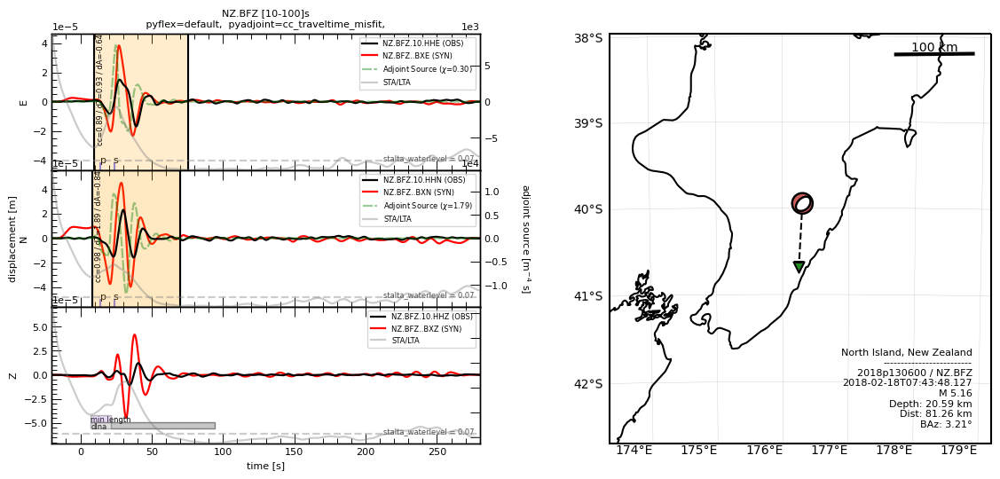

First Glance
============

Small code snippet to introduce you with Pyatoa. The code block below
loads example waveforms and metadata, then processes and plots the
waveforms alongside a source-receiver map.

.. code:: python

    from pyatoa import Manager
    
    mgmt = Manager()
    mgmt.load()
    mgmt.flow()
    mgmt.plot()

You can see the underlying information of the
:class:`Manager <pyatoa.core.manager.Manager>` class by printing it.
Important relative to a given source-receiver pair is displayed, as
well as the status of the processing workflow.

.. code:: python

    >>> print(mgmt)
    Manager Data
        dataset   [ds]:        None
        quakeml   [event]:     smi:nz.org.geonet/2018p130600
        station   [inv]:       NZ.BFZ
        observed  [st_obs]:    3
        synthetic [st_syn]:    3
    Stats & Status
        half_dur:              0.6989458964552759
        time_offset_sec:       -20.0
        standardized:          True
        obs_processed:         True
        syn_processed:         True
        nwin   [windows]:      2
        misfit [adjsrcs]:      2.09016925696681
    

Data, metadata, gathered misfit windows and output adjoint sources are
all accesible as attributes of the Manager. We can access the observed
waveforms through the ``st_obs`` attribute:

.. code:: python

    >>> mgmt.st_obs
    3 Trace(s) in Stream:
    NZ.BFZ.10.HHE | 2018-02-18T07:43:28.127644Z - 2018-02-18T07:48:28.097644Z | 33.3 Hz, 10000 samples
    NZ.BFZ.10.HHN | 2018-02-18T07:43:28.127644Z - 2018-02-18T07:48:28.097644Z | 33.3 Hz, 10000 samples
    NZ.BFZ.10.HHZ | 2018-02-18T07:43:28.127644Z - 2018-02-18T07:48:28.097644Z | 33.3 Hz, 10000 samples

Or grab the adjoint source data array through the ``adjsrcs`` attribute:

.. code:: python

    >>> mgmt.adjsrcs["E"].adjoint_source
    array([0., 0., 0., ..., 0., 0., 0.])

The underlying Config class controls the processing workflow and
resulting outputs. The current set options are default values.

.. code:: bash

    >>> mgmt.config
    CONFIG
        iteration:               None
        step_count:              None
        event_id:                None
    GATHER
        start_pad:               20
        end_pad:                 500
        save_to_ds:              True
    PROCESS
        min_period:              10
        max_period:              100
        filter_corners:          2
        unit_output:             DISP
        rotate_to_rtz:           False
        win_amp_ratio:           0.0
        synthetics_only:         False
    LABELS
        component_list:          ['E', 'N', 'Z']
        observed_tag:            observed
        synthetic_tag:           synthetic
        paths:                   {'waveforms': [], 'synthetics': [], 'responses': [], 'events': []}
    EXTERNAL
        pyflex_preset:           default
        adj_src_type:            cc_traveltime_misfit
        pyflex_config:           <pyflex.config.Config object at 0x167312850>
        pyadjoint_config:        <pyadjoint.config.Config object at 0x1655a2610>

Have a look at the `Gallery <gallery.html>`__ for other visual examples of what
Pyatoa can do. Or have a look at the `Data-Data Misfit example
<ex_data_data.html>`__ to see a longer Pyatoa code example.