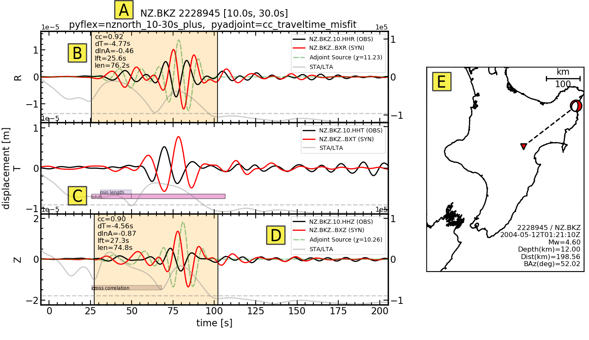

Gallery
=======

A picture is worth atleast 10 lines of code. Here we present images which help
illustrate the capabilities, structure, or intention of Pyatoa. Short captions
help explain what each image represents.

Waveform Breakdown
------------------

Misfit assessment for one source-receiver pair, generated using Pyatoa. 

- A) Waveform title with relevant information like processing parameters.
- B) Time windows shown with measurement information.
- C) Rejected time windows are shown as color-coded bars.
- D) Legend provides component identification and total calculated misfit
- E) Source-receiver map

.. include:: insp_gallery.rst
