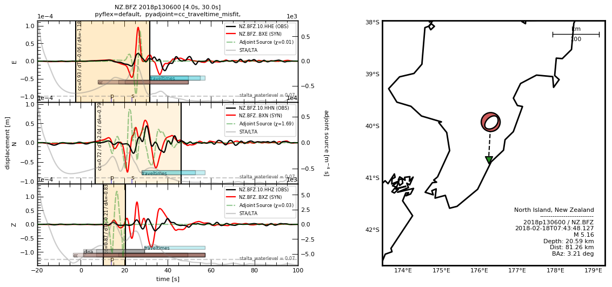

===================================================
Python’s Adjoint Tomography Operations Assistant
===================================================
`Pyatoa <https://github.com/adjtomo/pyatoa>`__ is an open-source, Python-based
misfit quantification toolbox for full waveform inversion and adjoint tomography.

Primarily intended to calculate misfit between two waveforms, it also contains
tools for visualization, data storage, and statistical analysis of misfit
for seismic inversions run with
`SeisFlows <https://github.com/adjtomo/seisflows>`__.

Pyatoa is hosted on `GitHub <https://github.com/adjtomo/pyatoa>`__ as part of
the `adjTomo organization <https://github.com/adjtomo>`__.



    An example of Pyatoa's waveform comparison capabilities. Observed 
    (black) and synthetic (red) waveforms compared within
    time windows (orange boxes), culminating in adjoint sources (green)

----------

Quickstart
~~~~~~~~~~~

- Have a look at the `Overview <overview.html>`__ page to learn about Pyatoa.
- `First Glance <first_glance.html>`__ shows you how to run a small misfit
  quantification example.
- The `Gallery <gallery.html>`__ displays figures and code illustrating
  how Pyatoa can be used to visualize waveform misfit and inversions.

--------------

Installation
------------

We recommend installing Pyatoa into a `Conda <https://conda.io>`__ environment
to avoid package or dependency conflicts with other Python packages. 
Installation via Pip is recommended for the latest, stable version. 

.. note::

    Cartopy must be installed via Conda otherwise you may encounter Pip 
    dependency errors


.. code:: bash

    conda create -n pyatoa
    conda activate pyatoa
    conda install cartopy
    pip install pyatoa

------------------------------------

Installing Development Version
``````````````````````````````

Pyatoa is under an active state of development, so for the latest version of the
codebase, installation must take place directly from the ``devel`` branch of the
code.

.. warning::

    API and code stability is subject to change without warning when using the
    ``devel`` branch

.. code:: bash

    git clone --branch devel https://github.com/adjtomo/pyatoa.git
    cd pyatoa/
    conda env create -f environment.yml
    conda activate pyatoa


Running Tests
`````````````

Tests ensure Pyatoa runs as expected after changes are made to the source code.
If working with the development version, You can run tests with Pytest.

.. code:: bash

   $ cd pyatoa/tests
   $ pytest

--------------

Cite Pyatoa
~~~~~~~~~~~~

If you use Pyatoa in your own research, please consider citing the related
publication:
`Chow et al. (2020) <https://academic.oup.com/gji/article/223/3/1461/5897358>`__.

    Chow, B., Kaneko, Y., Tape, C., Modrak, R., & Townend, J. (2020).
    *An automated workflow for adjoint tomography — waveform misfits and synthetic
    inversions for the North Island, New Zealand.*
    Geophysical Journal International, 223(3), 1461-1480.


.. toctree::
   :maxdepth: 1
   :hidden:
   :caption: Introduction

   overview
   first_glance
   gallery

.. toctree::
   :maxdepth: 1
   :hidden:
   :caption: Tutorials

   misfit
   discovery
   storage
   inspector
   standards

.. toctree:: 
   :maxdepth: 1
   :hidden:
   :caption: Examples

   ex_data_data
   ex_w_mpi

.. toctree::
   :maxdepth: 1
   :hidden:
   :caption: Development

   contributing
   code_dev_plan
   changelog

