Inspector Gallery
-----------------

The following figures can be generated by the Inspector class, which
facilitates analysis of inversion results generated using SeisFlows.

See `SeisFlows Inversion Assessment <inspector.html>`__ for an explanation of
what each plotting routine is showing.

.. code:: python

    from pyatoa.scripts.load_example_data import load_example_inspector
    
    insp = load_example_inspector()

.. code:: python

    insp.map(show=True, save=False)

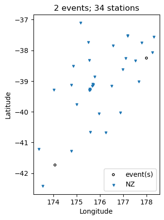

.. code:: python

    insp.event_depths(xaxis="longitude", show=True, save=False)

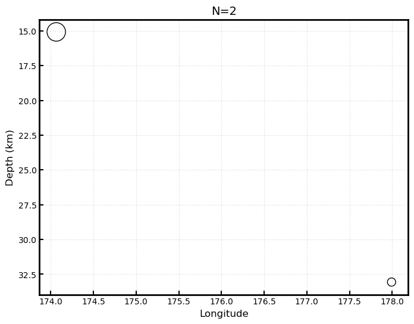

.. code:: python

    insp.raypaths(iteration="i01", step_count="s00", show=True, save=False)

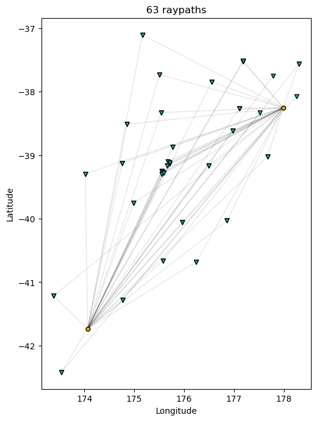

.. code:: python

    insp.raypath_density(iteration="i01", step_count="s00", show=True, save=False)

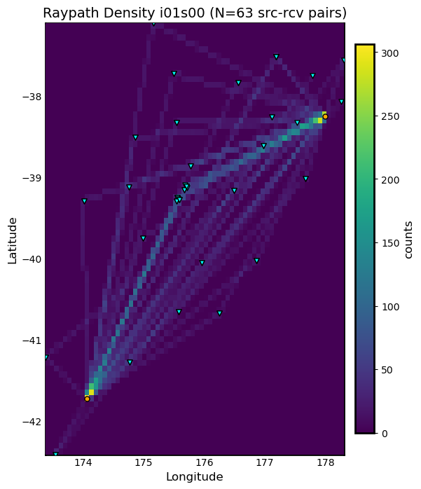

.. code:: python

    insp.event_hist(choice="magnitude", show=True, save=False)

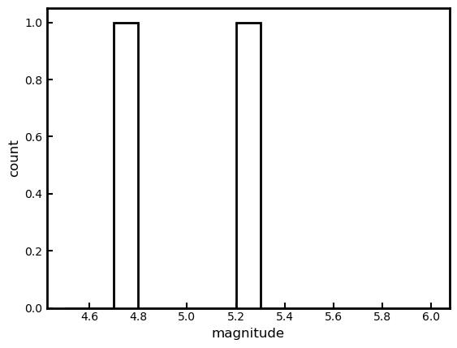

.. code:: python

    insp.travel_times(t_offset=-20, constants=[2, 4, 6, 8, 10], show=True, save=False)

.. image:: images/insp_gallery_files/insp_gallery_7_0.png

.. code:: python

    insp.plot_windows(iteration="i01", step_count="s00", show=True, save=False)

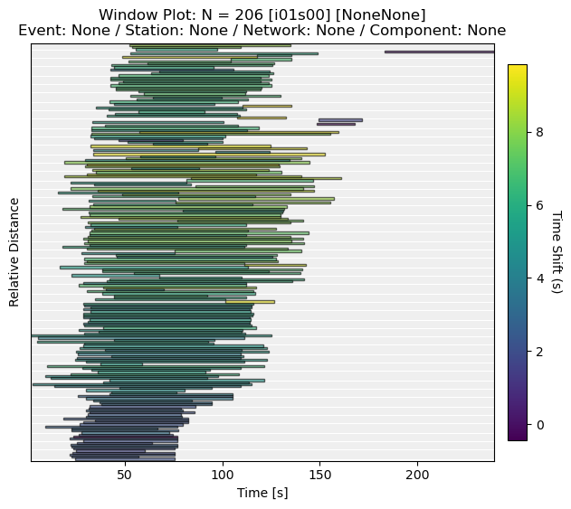

.. code:: python

    insp.convergence(windows="nwin", show=True, save=False)

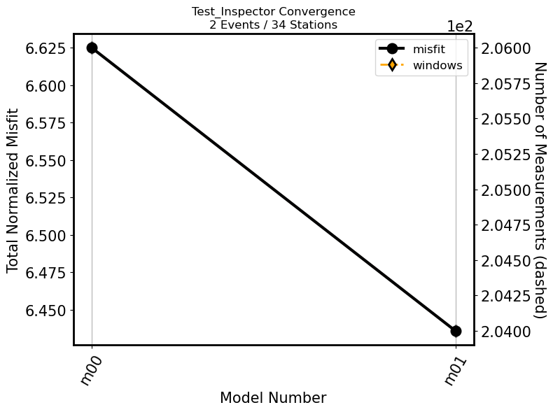

.. code:: python

    insp.hist(choice="cc_shift_in_seconds", show=True, save=False)

.. image:: images/insp_gallery_files/insp_gallery_10_1.png

.. code:: python

    insp.scatter(x="relative_starttime", y="max_cc_value", show=True, save=False)

.. image:: images/insp_gallery_files/insp_gallery_11_0.png

.. code:: python

    insp.measurement_hist(iteration="i01", step_count="s00", choice="station", show=True, save=False)

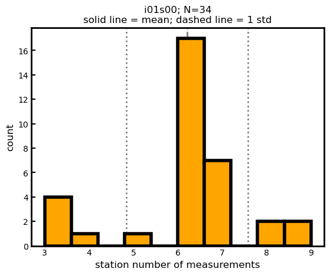

.. code:: python

    insp.measurement_hist(iteration="i01", step_count="s00", choice="event", show=True, save=False)

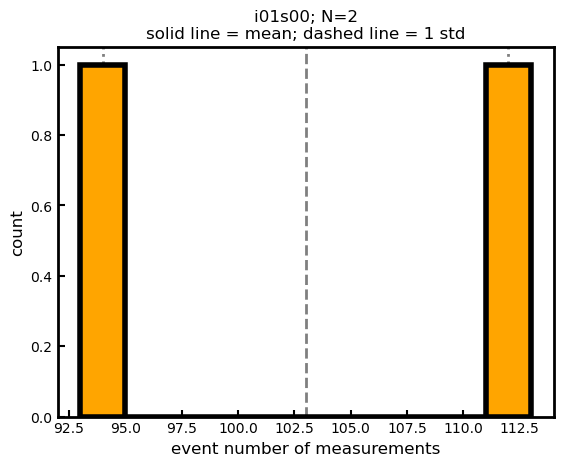

.. code:: python

    insp.station_event_misfit_map(station="BFZ", iteration="i01", step_count="s00",
                                  choice="misfit", show=True, save=False)

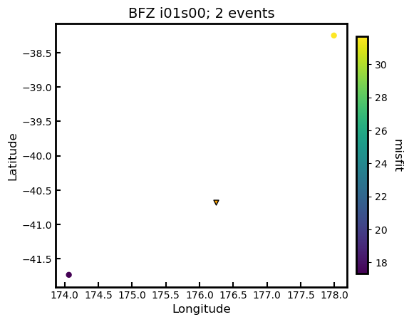

.. code:: python

    insp.event_station_misfit_map(event="2013p617227", iteration="i01", 
                                  step_count="s00", choice="misfit",
                                  show=True, save=False)

.. image:: images/insp_gallery_files/insp_gallery_15_0.png

.. code:: python

    insp.event_misfit_map(choice="misfit", show=True, save=False) 

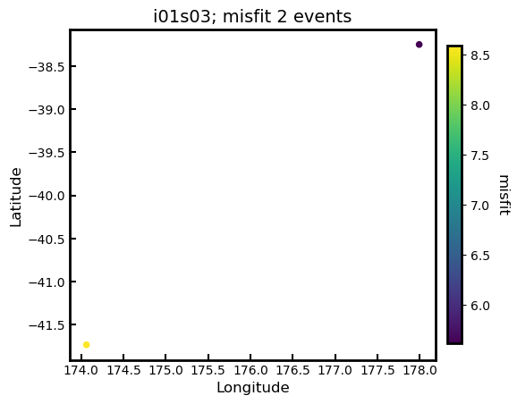

