Inspector Gallery
-----------------

The following figures can be generated by the Inspector class, which
facilitates analysis of inversion results generated using SeisFlows.

.. code:: python

    from pyatoa.scripts.load_example_data import load_example_inspector
    
    insp = load_example_inspector()

Source-Receiver Metadata
~~~~~~~~~~~~~~~~~~~~~~~~

A very simple source-receiver scatter plot can be created with the
``map`` function

.. code:: python

    insp.map(show=True, save=False)

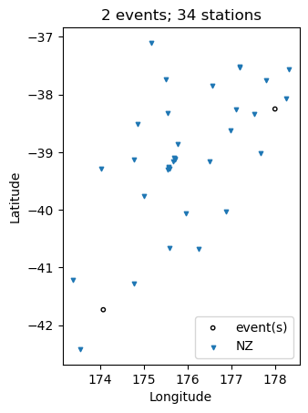

The ``event_depths`` functions plots a 2D cross section of all events at
depth

.. code:: python

    insp.event_depths(xaxis="longitude", show=True, save=False)

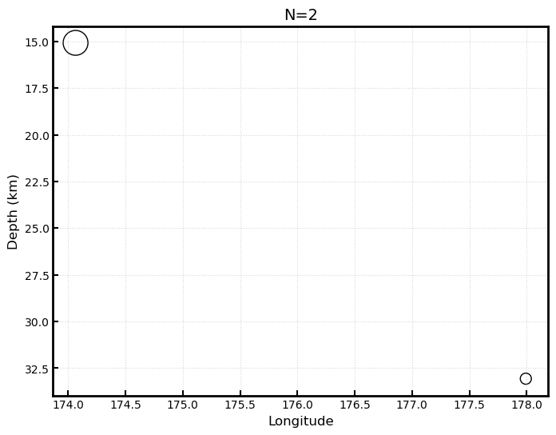

The ``raypaths`` function shows connecting lines for any source-receiver
pair that has atleast one measurement

.. code:: python

    insp.raypaths(iteration="i01", step_count="s00", show=True, save=False)

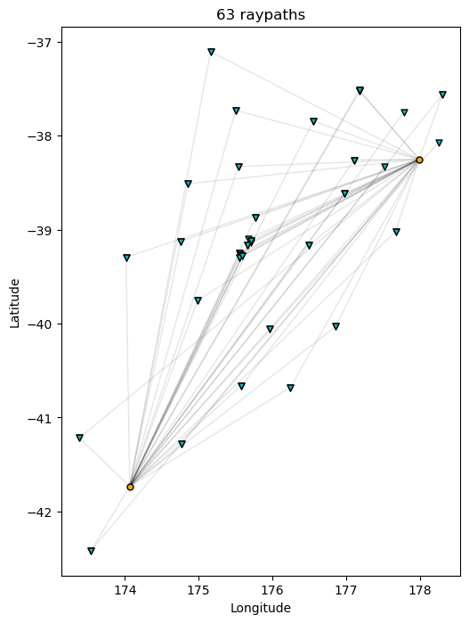

The ``raypath_density`` function provides a more detailed raypath plot,
which is colored by the density of overlapping raypaths

.. code:: python

    insp.raypath_density(iteration="i01", step_count="s00", show=True, save=False)

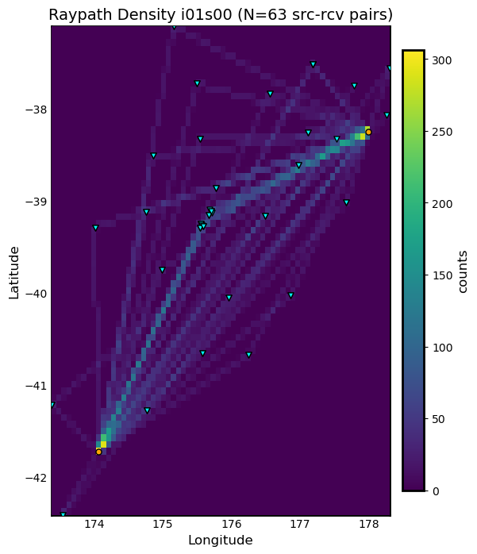

The ``event_hist`` function creates a simple event histogram based on
event information such as magnitude.

.. code:: python

    insp.event_hist(choice="magnitude", show=True, save=False)

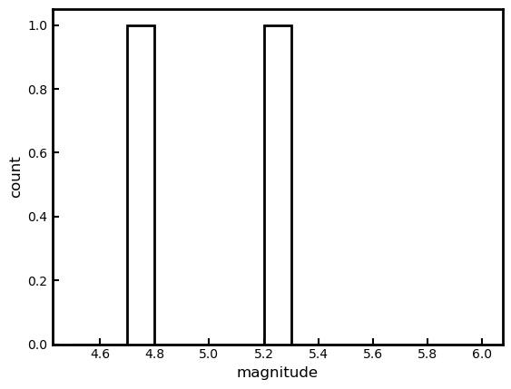

Misfit Window Timing
~~~~~~~~~~~~~~~~~~~~

The following plotting functions are concerned with visualizing the time
dependent part of the measurements

The ``travel_times`` function plots a proxy for phase arrivals, similar
to a seismic record section.

.. code:: python

    insp.travel_times(t_offset=-20, constants=[2, 4, 6, 8, 10], show=True, save=False)

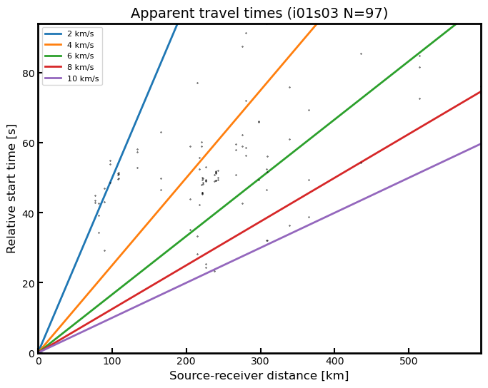

The ``plot_windows`` function plots time windows (as bars) against
source receiver distance, illustrating seismic phases included in the
inversion.

.. code:: python

    insp.plot_windows(iteration="i01", step_count="s00", show=True, save=False)

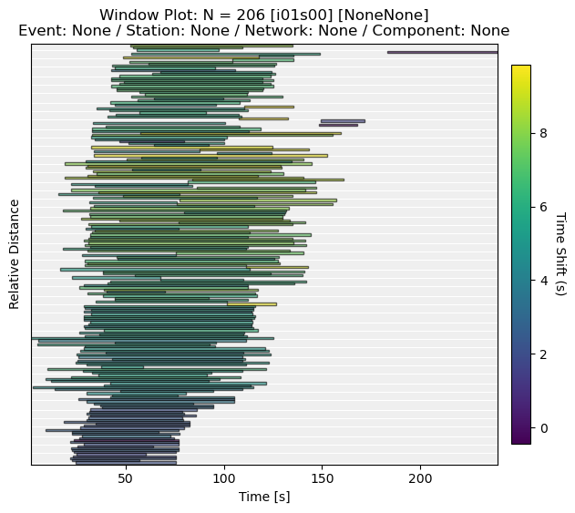

Inversion Statistics
~~~~~~~~~~~~~~~~~~~~

The following plotting functions help the user understand how an
inversion is progressing by comparing iterations against one another.
These are common inversion statistics plots shown in many tomography
publications.

The ``convergence`` function plots total misfit per iteration over the
course of an inversion. An additional Y axis is used to plot the number
of windows for each iteration (or the overall length of the time
windows)

.. code:: python

    insp.convergence(windows="nwin", show=True, save=False)

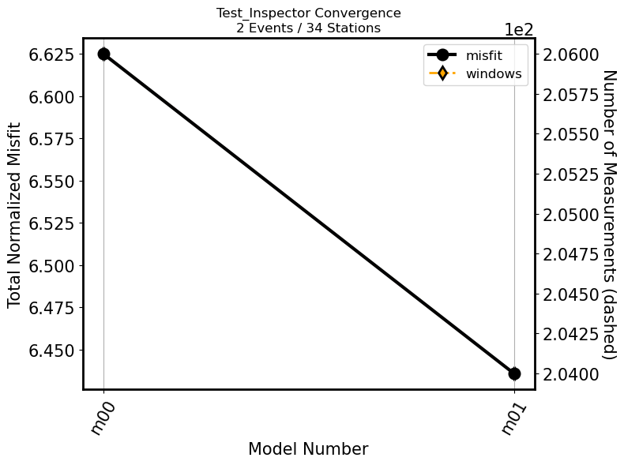

The ``hist`` function generates histograms for a given measurement
column, such as overall cross correlation or amplitude anomaly.

.. code:: python

    insp.hist(iteration="i01", step_count="s00", choice="cc_shift_in_seconds", show=True, save=False)

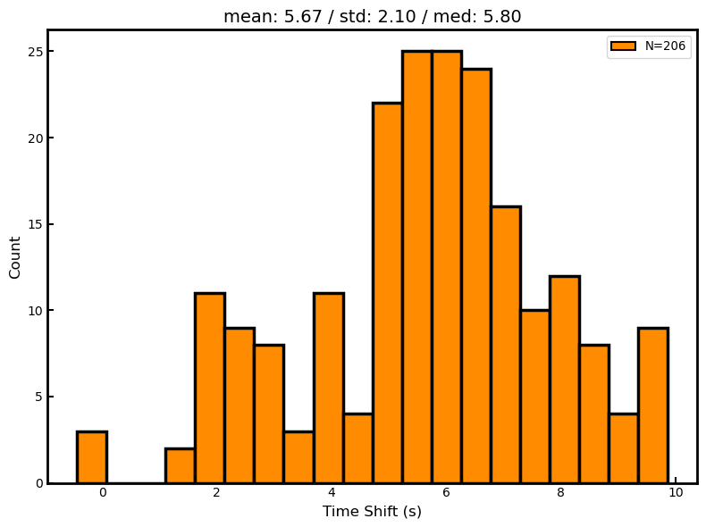

The ``hist`` function can also be used to generate two sets of
histograms that compare one iteration to another:

.. code:: python

    insp.hist(iteration="i01", step_count="s00", 
              iteration_comp="i01", step_count_comp="s01", 
              choice="dlnA", show=True, save=False)

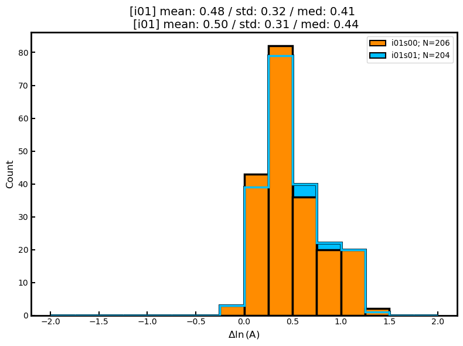

Measurement Statistics
~~~~~~~~~~~~~~~~~~~~~~

These plotting functions allow the user to plot measurements for a given
evaluation in order to better understand the statistical distribution of
measurements, or comparisons against one another.

The ``scatter`` function compares any two attributes in the ``windows``
dataframe

.. code:: python

    insp.scatter(x="relative_starttime", y="max_cc_value", show=True, save=False)

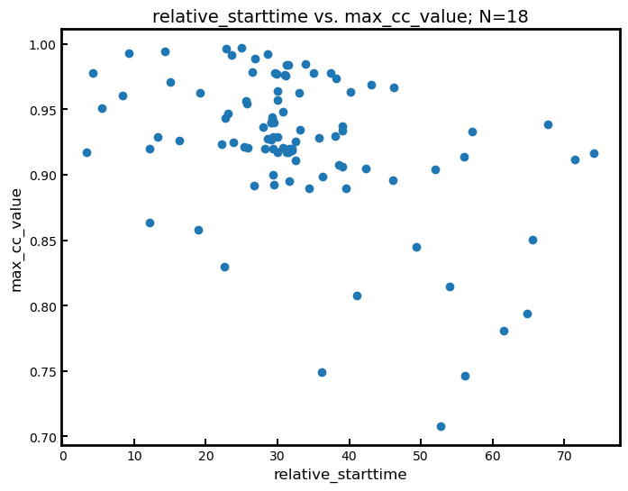

The ``measurement_hist`` function generates histograms of source or
receiver metadata. Useful for identifying events or stations which may
be outliers in terms of overall measurements.

.. code:: python

    insp.measurement_hist(iteration="i01", step_count="s00", choice="station", show=True, save=False)

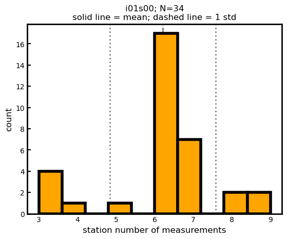

The ``station_event_misfit_map`` creates a map for a single station. All
other points correspond to events which the station has recorded. Colors
of these markers correspond to given measurement criteria.

.. code:: python

    insp.station_event_misfit_map(station="BFZ", iteration="i01", step_count="s00",
                                  choice="misfit", show=True, save=False)

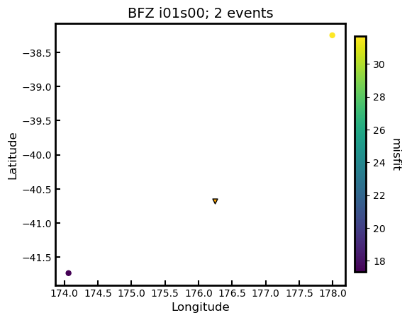

The ``station_event_misfit_map`` creates a map for a single event. All
other points correspond to stations which have recorded the event.
Colors of these markers correspond to given measurement criteria.

.. code:: python

    insp.event_station_misfit_map(event="2013p617227", iteration="i01", 
                                  step_count="s00", choice="misfit",
                                  show=True, save=False)

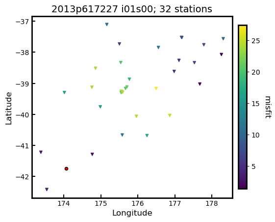

The ``event_misfit_map`` plots all events on a map and their
corresponding scaled misfit value for a given evaluation (defaults to
last evaluation in the Inspector).

.. code:: python

    insp.event_misfit_map(choice="misfit", show=True, save=False) 

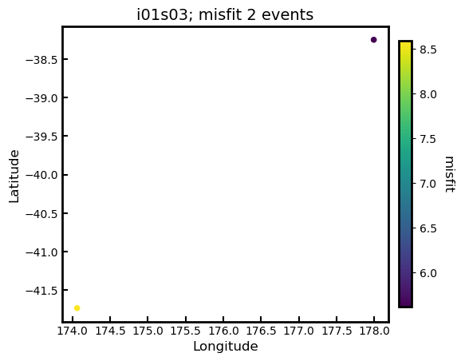

