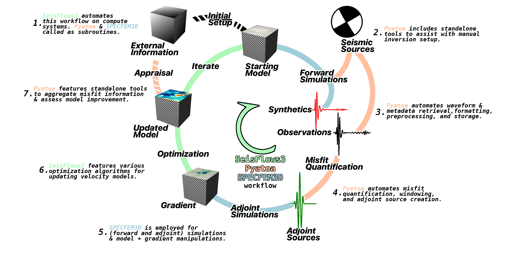
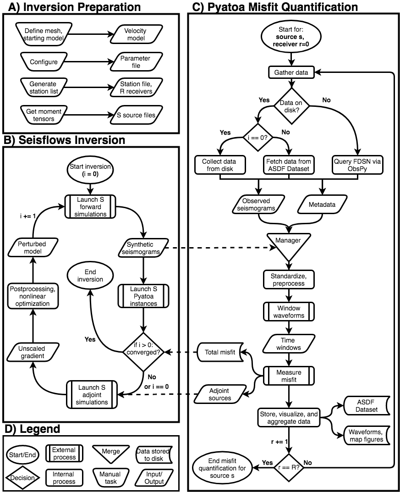

Overview
==============

    An annotated diagram showing how Pyatoa fits into the full waveform 
    inversion / adjoint tomography workflow alongside numerical solvers like
    `SPECFEM3D <https://geodynamics.org/cig/software/specfem3d/>`__ and the 
    workflow automation tool 
    `SeisFlows3 <https://github.com/bch0w/seisflows3>`__.

What is Pyatoa?
~~~~~~~~~~~~~~~

Pyatoa is a waveform assessment package. Put simply, it's
designed to compare one set of wiggles to another set of (similar) wiggles. The
objects within this package are meant to facilitate, augment, or complement
this core functionality. These include:

- Metadata and waveform collection
- Waveform standardization and preprocesing
- Time windowing and adjoint source generation
- Hierarchical data storage of waveforms, metadata, and measurements
- Bulk measurement aggregation and analysis
- Waveform and measurement plotting
- Interface with broader workflow tools

The aim of Pyatoa is to simplify and automate misfit quantification in adjoint
tomography. It does so by providing a high-level API to reduce the amount of
code required to accomplish repeatable tasks involved in waveform comparisons.

As the behavior of full waveform inversion is dependent on the input data, a 
high level of care must be taken in curating what is fed in. To ensure an
inversion stays on the rails, Pyatoa includes a custom data
structure for data access and storage, as well as internal fault 
tolerance and sanity checks throughout. Detailed logging is meant to ensure that
Pyatoa is not a black box.

Outside the standard routines, Pyatoa also includes a measurement aggregation 
tool to simplify bulk measurement assessment, while a series of plotting
routines facilitate visualization of standard inversion results.

Pyatoa is open-source and completely Python based.

What isn't Pyatoa?
~~~~~~~~~~~~~~~~~~

Pyatoa is not a standalone adjoint tomography workflow tool, it does not have
the capability to generate sythetic waveforms, submit jobs on HPC systems,
interface with numerical models, etc. Rather, it was built to augment the
capabilities of external numerical solvers like SPECFEM2D/3D/3D_GLOBE and 
workflow tools like SeisFlows3.

Pyatoa is not smart. Although it provides quality checks along the way, it
cannot do your science for you. Careful attention must be paid in
properly choosing input data and processing parameters based on the problem at 
hand. Garbage in == garbage out.

Pyatoa is not quiet, it logs almost every task that it performs. Although this
can be overwhelming, each log statement hold some importance. If you are running
Pyatoa for the first time, be sure to read the logs to get an idea of what is
going on under the hood.

Why is Pyatoa (necessary)?
~~~~~~~~~~~~~~~~~~~~~~~~~~~

Some question you might have regarding Pyatoa are: 

- Why is Pyatoa necessary? 
- If workflow tools like SeisFlows3 exist, what role does Pyatoa play?
- Is Pyatoa necessary to run seismic inversions? 

SeisFlows3 was written (originally as SeisFlows) to be an automated workflow 
tool for full waveform inversion, allowing for generalized interfacing with a 
number of numerical solvers and compute interfaces. 

Within the original SeisFlows package, we identified missing features necessary 
for earthquake-based full waveform tomography, namely: data gathering, 
waveform preprocessing, windowing, flexible adjoint source creation, 
inversion assessment, and figure generation.

Although these tasks could be performed manually (e.g., preprocess with ObsPy, 
window with Flexwin, create adjoint sources with NumPy, assess an inversion with 
Pandas, generate figures with Matlab and GMT), we sought to codify these 
routines in the name of automation, community, and reproducibility. 

For very simple workflows, e.g., a 2D synthetic inversion comparing whole 
waveforms, Pyatoa is not necessary. For pure data-synthetic waveform
comparisons, Pyatoa can be used standalone. To automate, assess and visualize an 
entire seismic inversion, a combination of Pyatoa and SeisFlows3 is required 
(see :doc:`Pyaflowa </pyaflowa>` documentation and the following flowchart).

    A detailed flowchart representing the inversion workflow. Dashed lines show 
    interactions between Seisflows and Pyatoa via data stored to disk. 
    (A) A one-time manual preparation is required to generate the velocity model, 
    define a single parameter file shared by SeisFlows3 and Pyatoa, and create 
    source and station files. 
    (B) A simplified SeisFlows3 inversion workflow. SeisFlows3 calls Pyatoa as a 
    subroutine to organize data, calculate misfit and generate adjoint sources. 
    (C) A Pyatoa misfit quantification instance where data are gathered, 
    processed, and compared. Input files necessary for adjoint simulations are
    returned to SeisFlow3.
    (D) Legend describing the flowchart shapes.

How do (I use) Pyatoa?
~~~~~~~~~~~~~~~~~~~~~~~

Pyatoa was written following the design philosophy of ObsPy, that means it's 
meant to be used as a Python tool, NOT as a standalone command-line tool, or 
GUI based program.
Pyatoa can be invoked through scripting, or in interactive Python
environments such as the Python interpreter, IPython, Jupyter Notebooks, etc.

This documentation page contains code snippets that provide an overview
of how Pyatoa and its underlying functionalities should be used. They are meant
to provide a jumping off point to communicate how one might leverage Pyatoa,
however they are by no means all encompassing.

    
