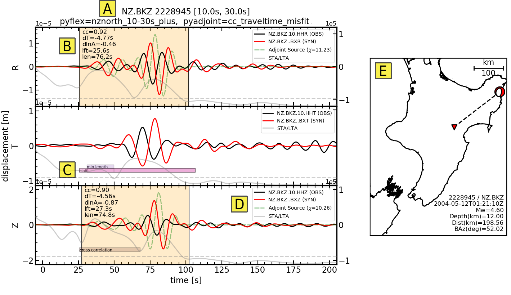

===================================================
Gallery
===================================================

A picture is worth atleast 10 lines of code. Here we present images which help
illustrate the capabilities, structure, or intention of Pyatoa. Short captions
help explain what each image represents.

--------------------------

Waveform Breakdown
---------------------

    Misfit assessment for one source-receiver pair, generated using Pyatoa. 
    A) Waveform title, which displays relevant information like processing 
    parameters. 
    B) Time windows are shown with measurement information for quick 
    assessment of waveforms and misfit. By default, cross-correlation (cc), 
    time shift in seconds (dT), amplitude anomaly (dlnA), 
    window start time in seconds (lft), and window length in seconds (len) 
    are provided. 
    C) Rejected time windows are shown as color-coded bars. Here preliminary 
    time windows are rejected for unacceptable time shift (tshift) and 
    minimum length (min length). 
    D) The legend provides component identification and total calculated misfit 
    for a single component. The gray short-term-average over long-term-average 
    waveform (STA/LTA) is used to determine preliminary windows, and is shown 
    alongside a waterlevel (dashed grey) used for the internal rejection 
    criteria. 
    E) A corresponding map with useful information pertaining to the given 
    source-receiver pair.

--------------------------

Inversion Flowchart
-------------------

.. figure:: images/inversion_flowchart.png
    :alt: An inversion flowchart showing Pyatoa's place in the workflow.

    A flowchart representing the inversion workflow. Dashed lines show 
    interactions between Seisflows and Pyatoa via data stored to disk. 
    A) A one-time manual preparation is required to generate the velocity model, 
    define a single parameter file shared by Seisflows and Pyatoa, and create 
    source and station files. 
    B) A simplified Seisflows inversion, ignoring the complexities involved in, 
    e.g., the optimization schema, workflow management, HPC job handling. 
    Seisflows calls Pyatoa as a subroutine to calculate misfit and generate 
    adjoint sources. C) A Pyatoa misfit quantification instance. Data are 
    preferentially gathered from disk, but online web service queries are 
    available via the International Federation of Digital Seismograph Networks 
    (FDSN). Synthetic seismograms from SPECFEM are made accessible by Seisflows. 
    A custom data structure (Manager) is responsible for collecting, processing, 
    and measuring waveforms. Data is saved to disk using ASDF Datasets. 
    Pyatoa provides additional auxiliary input files required for subsequent 
    adjoint simulations launched by Seisflows. 
    D) Legend describing the flowchart shapes.

