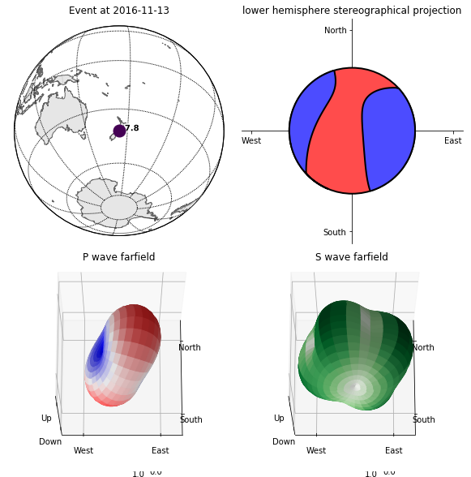
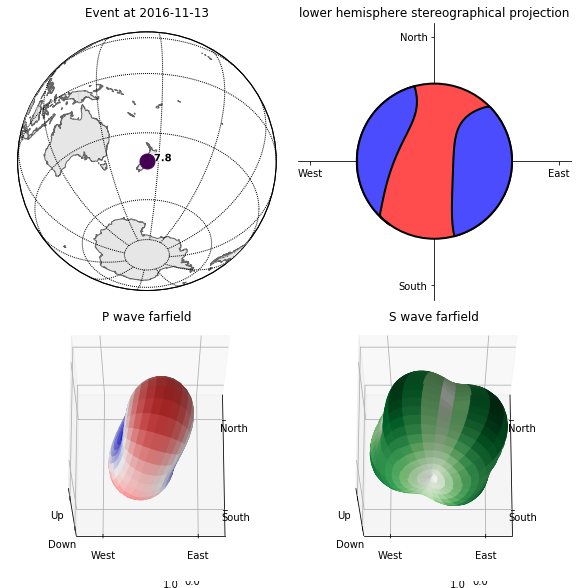

Gatherer
========

Data (i.e., metadata and seismic waveforms) gathering is an integral part of a seismic inversion workflow, and in Pyatoa is controlled by the :doc:`Gatherer </modules/core.gatherer>` class. 

Although data can directly be passed to the ``Manager`` class by the
user, Pyatoa provides some mid-level classes that deal with automated
data gathering, from local directory structures, ``ASDFDataSet``\ s or
with queries to the International Federation of Digital Seismographs web
service using the ObsPy ``Client`` module.

--------------

Event metadata
--------------

Event data can be gathered using the ObsPy FDSN web service client using
the ``Config.client`` parameter.

As an example we’ll gather event information from the `Mw7.8 Kaikoura
Earthquake, New
Zealand <http://ds.iris.edu/ds/nodes/dmc/tools/event/5197722>`__.

.. code:: ipython3

    from pyatoa import logger, Config, Manager
    logger.setLevel("DEBUG")

.. code:: ipython3

    cfg = Config(client="IRIS", event_id="5197722")
    mgmt = Manager(config=cfg)
    mgmt.gather(choice="event", try_fm=False)  # try_fm argument addressed next
    mgmt.event

.. parsed-literal::

    [2022-03-02 10:36:31] - pyatoa - DEBUG: Component list set to E/N/Z
    [2022-03-02 10:36:32] - pyatoa - DEBUG: gathering event
    [2022-03-02 10:36:32] - pyatoa - INFO: searching local filesystem for event info
    [2022-03-02 10:36:32] - pyatoa - INFO: no local event file found
    [2022-03-02 10:36:32] - pyatoa - DEBUG: event ID: 5197722, querying client IRIS

.. parsed-literal::

    Event:	2016-11-13T11:02:59.070000Z | -42.724, +173.065 | 7.8 Mww
    
    	            resource_id: ResourceIdentifier(id="smi:service.iris.edu/fdsnws/event/1/query?eventid=5197722")
    	             event_type: 'earthquake'
    	    preferred_origin_id: ResourceIdentifier(id="smi:service.iris.edu/fdsnws/event/1/query?originid=11363410")
    	 preferred_magnitude_id: ResourceIdentifier(id="smi:service.iris.edu/fdsnws/event/1/query?magnitudeid=177181336")
    	                   ---------
    	     event_descriptions: 1 Elements
    	                origins: 1 Elements
    	             magnitudes: 1 Elements

GCMT focal mechanisms
~~~~~~~~~~~~~~~~~~~~~

Events gathered using the IRIS webservice may also query the `Harvard
GCMT moment tensor catalog <https://www.globalcmt.org/CMTsearch.html>`__
for matching focal mechanism information. If we set the ``try_fm``
argument to ``True`` in the ``gather`` function, it will search for
matching moment tensor information using the ``Event`` origin time and
magnitude.

.. code:: ipython3

    mgmt = Manager(config=cfg)
    mgmt.gather(choice="event", try_fm=True)

.. parsed-literal::

    [2022-03-02 10:36:32] - pyatoa - DEBUG: gathering event
    [2022-03-02 10:36:32] - pyatoa - INFO: searching local filesystem for event info
    [2022-03-02 10:36:32] - pyatoa - INFO: no local event file found
    [2022-03-02 10:36:32] - pyatoa - DEBUG: event ID: 5197722, querying client IRIS
    [2022-03-02 10:36:33] - pyatoa - INFO: querying GCMT database for moment tensor
    [2022-03-02 10:36:34] - pyatoa - INFO: GCMT event found matching criteria

.. parsed-literal::

    Manager Data
        dataset   [ds]:        None
        quakeml   [event]:     smi:local/ndk/C201611131102A/event
        station   [inv]:       None
        observed  [st_obs]:    None
        synthetic [st_syn]:    None
    Stats & Status
        half_dur:              19.8
        time_offset_sec:       None
        standardized:          False
        obs_processed:         False
        syn_processed:         False
        nwin   [windows]:      None
        misfit [adjsrcs]:      None

.. code:: ipython3

    mgmt.event

.. parsed-literal::

    Event:	2016-11-13T11:03:53.200000Z | -42.030, +173.850 | 7.82 Mwc
    
    	                  resource_id: ResourceIdentifier(id="smi:local/ndk/C201611131102A/event")
    	                   event_type: 'earthquake'
    	         event_type_certainty: 'known'
    	          preferred_origin_id: ResourceIdentifier(id="smi:local/ndk/C201611131102A/origin#cmtorigin")
    	       preferred_magnitude_id: ResourceIdentifier(id="smi:local/ndk/C201611131102A/magnitude#moment_mag")
    	 preferred_focal_mechanism_id: ResourceIdentifier(id="smi:local/ndk/C201611131102A/focal_mechanism")
    	                         ---------
    	           event_descriptions: 2 Elements
    	             focal_mechanisms: 1 Elements
    	                      origins: 2 Elements
    	                   magnitudes: 3 Elements

.. code:: ipython3

    mgmt.event.preferred_focal_mechanism().moment_tensor

.. parsed-literal::

    MomentTensor
    	          resource_id: ResourceIdentifier(id="smi:local/ndk/C201611131102A/momenttensor")
    	    derived_origin_id: ResourceIdentifier(id="smi:local/ndk/C201611131102A/origin#cmtorigin")
    	        scalar_moment: 6.697e+20
    	               tensor: Tensor(m_rr=3.56e+20 [uncertainty=2.2e+18], m_tt=1.69e+20 [uncertainty=1.4e+18], m_pp=-5.25e+20 [uncertainty=1.5e+18], m_rt=-1.14e+20 [uncertainty=1.4e+19], m_rp=4.34e+20 [uncertainty=1.64e+19], m_tp=-2.04e+20 [uncertainty=1e+18])
    	 source_time_function: SourceTimeFunction(type='triangle', duration=39.6)
    	       inversion_type: 'zero trace'
    	        creation_info: CreationInfo(agency_id='GCMT', version='V10')
    	                 ---------
    	            data_used: 3 Elements

.. code:: ipython3

    mgmt.event.plot();

.. parsed-literal::

    /home/bchow/miniconda3/envs/docs/lib/python3.7/site-packages/numpy/core/fromnumeric.py:3208: VisibleDeprecationWarning: Creating an ndarray from ragged nested sequences (which is a list-or-tuple of lists-or-tuples-or ndarrays with different lengths or shapes) is deprecated. If you meant to do this, you must specify 'dtype=object' when creating the ndarray.
      return asarray(a).size
    /home/bchow/miniconda3/envs/docs/lib/python3.7/site-packages/matplotlib/figure.py:98: MatplotlibDeprecationWarning: 
    Adding an axes using the same arguments as a previous axes currently reuses the earlier instance.  In a future version, a new instance will always be created and returned.  Meanwhile, this warning can be suppressed, and the future behavior ensured, by passing a unique label to each axes instance.
      "Adding an axes using the same arguments as a previous axes "

New Zealand event metadata from GeoNet
~~~~~~~~~~~~~~~~~~~~~~~~~~~~~~~~~~~~~~

Pyatoa was originally designed for the New Zealand tomography problem,
so functions are available for querying the `GeoNet regional moment
tensor
catalog <https://github.com/GeoNet/data/blob/master/moment-tensor/GeoNet_CMT_solutions.csv>`__.

   **NOTE:** GeoNet moment tensors are automatically converted to GCMT
   convention, i.e. from XYZ to RTP (m_rr, m_tt, m_pp…) coordinates and
   into units of N*m.

Let’s try to grab to same `Mw7.8 Kaikoura
Earthquake <https://www.geonet.org.nz/earthquake/2016p858000>`__ using
its unique GeoNet identifier.

.. code:: ipython3

    cfg = Config(client="GEONET", event_id="2016p858000")
    mgmt = Manager(config=cfg)
    mgmt.gather(choice="event", try_fm=True)

.. parsed-literal::

    [2022-03-02 10:36:37] - pyatoa - DEBUG: Component list set to E/N/Z
    [2022-03-02 10:36:37] - pyatoa - DEBUG: gathering event
    [2022-03-02 10:36:37] - pyatoa - INFO: searching local filesystem for event info
    [2022-03-02 10:36:37] - pyatoa - INFO: no local event file found
    [2022-03-02 10:36:37] - pyatoa - DEBUG: event ID: 2016p858000, querying client GEONET
    [2022-03-02 10:36:38] - pyatoa - INFO: geonet moment tensor found for: 2016p858000
    [2022-03-02 10:36:38] - pyatoa - DEBUG: GeoNet moment tensor is in units of Newton*meters
    [2022-03-02 10:36:38] - pyatoa - INFO: GeoNet moment tensor appended to Event

.. parsed-literal::

    Manager Data
        dataset   [ds]:        None
        quakeml   [event]:     smi:nz.org.geonet/2016p858000
        station   [inv]:       None
        observed  [st_obs]:    None
        synthetic [st_syn]:    None
    Stats & Status
        half_dur:              21.35020886946541
        time_offset_sec:       None
        standardized:          False
        obs_processed:         False
        syn_processed:         False
        nwin   [windows]:      None
        misfit [adjsrcs]:      None

.. code:: ipython3

    mgmt.event

.. parsed-literal::

    Event:	2016-11-13T11:02:56.346094Z | -42.693, +173.022 | 7.820379733 Mw(mB) | manual
    
    	                  resource_id: ResourceIdentifier(id="smi:nz.org.geonet/2016p858000")
    	                   event_type: 'earthquake'
    	                creation_info: CreationInfo(agency_id='WEL(GNS_Primary)', author='scevent@akeqp01.geonet.org.nz', creation_time=UTCDateTime(2016, 11, 13, 11, 3, 27, 886738))
    	          preferred_origin_id: ResourceIdentifier(id="smi:nz.org.geonet/Origin#20161116052725.210418.52361")
    	       preferred_magnitude_id: ResourceIdentifier(id="smi:nz.org.geonet/Magnitude#20161116052734.469407.55057")
    	 preferred_focal_mechanism_id: ResourceIdentifier(id="smi:local/53799d16-845d-4c44-9136-82a26b2e295f")
    	                         ---------
    	           event_descriptions: 1 Elements
    	                     comments: 1 Elements
    	                        picks: 189 Elements
    	                   amplitudes: 200 Elements
    	             focal_mechanisms: 1 Elements
    	                      origins: 1 Elements
    	                   magnitudes: 5 Elements
    	           station_magnitudes: 200 Elements

.. code:: ipython3

    mgmt.event.preferred_focal_mechanism().moment_tensor

.. parsed-literal::

    MomentTensor
    	          resource_id: ResourceIdentifier(id="smi:local/e7f13f05-84d6-44f8-8666-3ea22e94836f")
    	        scalar_moment: 7.04e+20
    	               tensor: Tensor(m_rr=4.8e+20, m_tt=1.73e+20, m_pp=-6.53e+20, m_rt=-9.32e+19, m_rp=2.95e+20, m_tp=-2.39e+20)
    	   variance_reduction: -1.0
    	        double_couple: 0.57
    	 source_time_function: SourceTimeFunction(duration=42.70041773893082)

.. code:: ipython3

    mgmt.event.plot();

.. parsed-literal::

    /home/bchow/miniconda3/envs/docs/lib/python3.7/site-packages/numpy/core/fromnumeric.py:3208: VisibleDeprecationWarning: Creating an ndarray from ragged nested sequences (which is a list-or-tuple of lists-or-tuples-or ndarrays with different lengths or shapes) is deprecated. If you meant to do this, you must specify 'dtype=object' when creating the ndarray.
      return asarray(a).size
    /home/bchow/miniconda3/envs/docs/lib/python3.7/site-packages/matplotlib/figure.py:98: MatplotlibDeprecationWarning: 
    Adding an axes using the same arguments as a previous axes currently reuses the earlier instance.  In a future version, a new instance will always be created and returned.  Meanwhile, this warning can be suppressed, and the future behavior ensured, by passing a unique label to each axes instance.
      "Adding an axes using the same arguments as a previous axes "

--------------

Station metadata from local file system
---------------------------------------

Station metadata can be gathered from local file systems following SEED
response file naming conventions. The paths to response files can be
specified in the ``Config.paths['responses']`` list.

Naming Convention
~~~~~~~~~~~~~~~~~

By default, responses are searched for using file name and directory
structure templates that follow SEED formatting. This is defined as:

| **Default Directory Template:** path/to/responses/SSS.NN
| **Default File ID Template:** RESP.NN.SSS.LL.CCC

-  NN: The network code (e.g. NZ)
-  SSS: The station code (e.g. BFZ)
-  LL: The location code (e.g. 10)
-  CCC: The channel code (e.g. HHZ.D)

An example directory for station NZ.BFZ:
**path/to/response/BFZ.NZ/RESP.NZ.BFZ.10.HHZ**

!!! Include a link to the distribute_dataless script !!!

.. code:: ipython3

    cfg = Config(paths={"responses": ["../tests/test_data/test_seed"]})
    mgmt = Manager(config=cfg)
    mgmt.gather(code="NZ.BFZ.??.HH?", choice=["inv"]);

.. parsed-literal::

    [2022-03-02 10:36:41] - pyatoa - DEBUG: Component list set to E/N/Z
    [2022-03-02 10:36:41] - pyatoa - INFO: gathering data for NZ.BFZ.??.HH?
    [2022-03-02 10:36:41] - pyatoa - INFO: gathering StationXML
    [2022-03-02 10:36:41] - pyatoa - INFO: searching local filesystem for station info
    [2022-03-02 10:36:41] - pyatoa - DEBUG: searching for responses: ../tests/test_data/test_seed/BFZ.NZ/RESP.NZ.BFZ.??.HH?
    [2022-03-02 10:36:41] - pyatoa - INFO: retrieved response locally:
    ../tests/test_data/test_seed/BFZ.NZ/RESP.NZ.BFZ.10.HHE
    [2022-03-02 10:36:41] - pyatoa - INFO: retrieved response locally:
    ../tests/test_data/test_seed/BFZ.NZ/RESP.NZ.BFZ.10.HHN
    [2022-03-02 10:36:41] - pyatoa - INFO: retrieved response locally:
    ../tests/test_data/test_seed/BFZ.NZ/RESP.NZ.BFZ.10.HHZ
    [2022-03-02 10:36:41] - pyatoa - INFO: matching StationXML found

--------------

Observed waveforms from local file system
-----------------------------------------

Observed waveforms can either be collected from a local file system or
using the ObsPy webservice client. Waveform gathering is based on event
origin time, therefore an ``Event`` object must be present for data
gathering to work properly.

Naming convention
~~~~~~~~~~~~~~~~~

By default, observed waveforms are searched for using file name and
directory structure templates that follow SEED formatting. This is
defined as:

| **Default Directory Template:** path/to/observed/YYYY/NN/SSS/CCC/
| **Default File ID Template:** NN.SSS.LL.CCC.YYYY.DDD

-  YYYY: The year with the century (e.g., 1987)
-  NN: The network code (e.g. NZ)
-  SSS: The station code (e.g. BFZ)
-  LL: The location code (e.g. 10)
-  CCC: The channel code (e.g. HHZ.D)
-  DDD: The julian day of the year (January 1 is 001)

An example directory for station NZ.BFZ, for the day 2018-02-18:
**path/to/observed/2018/NZ/BFZ/HHZ/NZ.BFZ.10.HHZ.D.2018.049**

User-defined paths can be provided to the ``Config.paths`` attribute,
which takes the form of a dictionary of lists. Multiple paths can be
passed to each list, and data gathering routines will search each path
in order until relevant data is found.

Eketahuna example
~~~~~~~~~~~~~~~~~

Here we will gather event metadata for the `M6.2 Eketahuna earthquake,
New Zealand <https://www.geonet.org.nz/earthquake/2014p051675>`__, and
use its origintime to gather observed waveforms from the test data
directory, for which a matching directory structure has already been
created. We add a dummy path to show that how multiple paths can be
passed to the ``paths`` attribute. The logger output shows the location
of the waveforms found, which matches the example path shown above.

.. code:: ipython3

    cfg = Config(event_id="2018p130600", client="GEONET", paths={"waveforms": ["./dummy_path", "../tests/test_data/test_mseeds"]})
    cfg.paths

.. parsed-literal::

    [2022-03-02 10:36:41] - pyatoa - DEBUG: Component list set to E/N/Z

.. parsed-literal::

    {'waveforms': ['./dummy_path', '../tests/test_data/test_mseeds'],
     'synthetics': [],
     'responses': [],
     'events': []}

.. code:: ipython3

    mgmt = Manager(config=cfg)
    mgmt.gather(code="NZ.BFZ.??.HH?", choice=["event", "st_obs"]);

.. parsed-literal::

    [2022-03-02 10:36:41] - pyatoa - DEBUG: gathering event
    [2022-03-02 10:36:41] - pyatoa - INFO: searching local filesystem for event info
    [2022-03-02 10:36:41] - pyatoa - INFO: no local event file found
    [2022-03-02 10:36:41] - pyatoa - DEBUG: event ID: 2018p130600, querying client GEONET
    [2022-03-02 10:36:42] - pyatoa - INFO: geonet moment tensor found for: 2018p130600
    [2022-03-02 10:36:42] - pyatoa - DEBUG: GeoNet moment tensor is in units of Newton*meters
    [2022-03-02 10:36:42] - pyatoa - INFO: GeoNet moment tensor appended to Event
    [2022-03-02 10:36:42] - pyatoa - INFO: gathering data for NZ.BFZ.??.HH?
    [2022-03-02 10:36:42] - pyatoa - INFO: gathering observed waveforms
    [2022-03-02 10:36:42] - pyatoa - INFO: searching local filesystem for observations
    [2022-03-02 10:36:42] - pyatoa - DEBUG: searching for observations: ../tests/test_data/test_mseeds/2018/NZ/BFZ/HH?/NZ.BFZ.??.HH?.2018.049
    [2022-03-02 10:36:42] - pyatoa - DEBUG: querying client GEONET
    [2022-03-02 10:36:44] - pyatoa - INFO: matching observed waveforms found

--------------

Waveforms and station metadata from FDSN
----------------------------------------

Observed waveforms and station metdata may also be fetched from FDSN
webservices using the `ObsPy Client
module <https://docs.obspy.org/packages/obspy.clients.fdsn.html>`__. If
paths are provided to the ``Config`` class, searches in local
filesystems will occur first, but if not matching waveforms or metadata
are found, then gathering will default to querying FDSN. Lets gather the
same waveform data from the Eketahuna example.

.. code:: ipython3

    cfg = Config(event_id="2018p130600", client="GEONET")
    mgmt = Manager(config=cfg)
    mgmt.gather(code="NZ.BFZ.??.HH?", choice=["event", "inv", "st_obs"]);

.. parsed-literal::

    [2022-03-02 10:36:44] - pyatoa - DEBUG: Component list set to E/N/Z
    [2022-03-02 10:36:44] - pyatoa - DEBUG: gathering event
    [2022-03-02 10:36:44] - pyatoa - INFO: searching local filesystem for event info
    [2022-03-02 10:36:44] - pyatoa - INFO: no local event file found
    [2022-03-02 10:36:44] - pyatoa - DEBUG: event ID: 2018p130600, querying client GEONET
    [2022-03-02 10:36:44] - pyatoa - INFO: geonet moment tensor found for: 2018p130600
    [2022-03-02 10:36:44] - pyatoa - DEBUG: GeoNet moment tensor is in units of Newton*meters
    [2022-03-02 10:36:44] - pyatoa - INFO: GeoNet moment tensor appended to Event
    [2022-03-02 10:36:44] - pyatoa - INFO: gathering data for NZ.BFZ.??.HH?
    [2022-03-02 10:36:44] - pyatoa - INFO: gathering observed waveforms
    [2022-03-02 10:36:44] - pyatoa - INFO: searching local filesystem for observations
    [2022-03-02 10:36:44] - pyatoa - DEBUG: querying client GEONET
    [2022-03-02 10:36:45] - pyatoa - INFO: matching observed waveforms found
    [2022-03-02 10:36:45] - pyatoa - INFO: gathering StationXML
    [2022-03-02 10:36:45] - pyatoa - INFO: searching local filesystem for station info
    [2022-03-02 10:36:45] - pyatoa - DEBUG: querying client GEONET
    /home/bchow/miniconda3/envs/docs/lib/python3.7/site-packages/obspy/io/stationxml/core.py:98: UserWarning: The StationXML file has version 1, ObsPy can read versions (1.0, 1.1). Proceed with caution.
      version, ", ".join(READABLE_VERSIONS)))
    [2022-03-02 10:36:45] - pyatoa - INFO: matching StationXML found

--------------

Gathering synthetic waveforms
-----------------------------

Pyatoa was designed around SPECFEM3D Cartesian, and so synthetic
waveforms are expected in the ASCII outputs of SPECFEM. Synthetic
waveforms can only be gathered from a local file system and are searched
for using the ``Config.paths['synthetics']`` list.

Synthetic data will be read in as an ObsPy Stream object. Since SPECFEM
ASCII files have no header information, an ``Event`` attribute is
required to set the origin time of the synthetic data. ### Naming
convention

The naming convention by default is set by ASCII output files of
SPECFEM.

| **Default File ID Template:** NN.SSS.CCC.EEEE \* NN: The network code
  (e.g. NZ)
| \* SSS: The station code (e.g. BFZ)
| \* CCC: The channel code, where the instrument code (second letter) is
  always ‘X’, to denote generated data, as per SEED convention
  (e.g. BXZ)
| \* EEEE: The SEM extension which denotes the units of the synthetics.
  Usually something like ‘semd’, where ‘d’ stands for displacement.

An example directory for station NZ.BFZ, for the day 2018-02-18:
**path/to/synthetics/NZ.BFZ.BXZ.semd**

   **NOTE:** An optional ``syn_dir_template`` can be passed to to the
   ``gather`` function to prepend additional paths, e.g. if many
   synthetics have been generated and grouped by event.

.. code:: ipython3

    mgmt.config.paths["synthetics"].append("../tests/test_data/")
    mgmt.gather(code="NZ.BFZ.??.BX?", choice=["st_syn"], syn_dir_template="synthetics")

.. parsed-literal::

    [2022-03-02 10:36:45] - pyatoa - INFO: gathering data for NZ.BFZ.??.BX?
    [2022-03-02 10:36:45] - pyatoa - INFO: gathering synthetic waveforms
    [2022-03-02 10:36:45] - pyatoa - INFO: searching local filesystem for synthetics
    [2022-03-02 10:36:45] - pyatoa - DEBUG: searching for synthetics: ../tests/test_data/synthetics/{net}.{sta}.*{cmp}.sem{dva}
    [2022-03-02 10:36:45] - pyatoa - INFO: retrieved synthetics locally:
    ../tests/test_data/synthetics/NZ.BFZ.BXE.semd
    [2022-03-02 10:36:45] - pyatoa - INFO: retrieved synthetics locally:
    ../tests/test_data/synthetics/NZ.BFZ.BXN.semd
    [2022-03-02 10:36:45] - pyatoa - INFO: retrieved synthetics locally:
    ../tests/test_data/synthetics/NZ.BFZ.BXZ.semd
    [2022-03-02 10:36:45] - pyatoa - INFO: matching synthetic waveforms found

.. parsed-literal::

    Manager Data
        dataset   [ds]:        None
        quakeml   [event]:     smi:nz.org.geonet/2018p130600
        station   [inv]:       NZ.BFZ
        observed  [st_obs]:    3
        synthetic [st_syn]:    3
    Stats & Status
        half_dur:              0.6989458964552759
        time_offset_sec:       None
        standardized:          False
        obs_processed:         False
        syn_processed:         False
        nwin   [windows]:      None
        misfit [adjsrcs]:      None

--------------

One-time mass data gathering
----------------------------

It may be useful to do a one-time mass data gathering prior to a seismic
inversion, to assess for example how many stations a given event is
recorded on, or to assess which stations show good data quality. Pyatoa
provides a multithreaded data gathering scheme to set up the
ASDFDataSets that will be used in a future seismic inversion.

We need a few prerequisite pieces of data: \* Event origin time \*
ASDFDataSet \* Station codes for desired data

.. code:: ipython3

    from pyasdf import ASDFDataSet
    
    event_id = "2016p858000"
    ds = ASDFDataSet(f"../tests/test_data/docs_data/{event_id}.h5")
    cfg = Config(client="GEONET", event_id=event_id)
    
    mgmt = Manager(config=cfg, ds=ds)
    mgmt.gather(choice="event", try_fm=False)

.. parsed-literal::

    [2022-03-02 10:36:45] - pyatoa - DEBUG: Component list set to E/N/Z
    [2022-03-02 10:36:45] - pyatoa - DEBUG: gathering event
    [2022-03-02 10:36:45] - pyatoa - INFO: searching ASDFDataSet for event info
    [2022-03-02 10:36:45] - pyatoa - INFO: searching local filesystem for event info
    [2022-03-02 10:36:45] - pyatoa - INFO: no local event file found
    [2022-03-02 10:36:45] - pyatoa - DEBUG: event ID: 2016p858000, querying client GEONET
    [2022-03-02 10:36:46] - pyatoa - DEBUG: event QuakeML added to ASDFDataSet

.. parsed-literal::

    Manager Data
        dataset   [ds]:        2016p858000.h5
        quakeml   [event]:     smi:nz.org.geonet/2016p858000
        station   [inv]:       None
        observed  [st_obs]:    None
        synthetic [st_syn]:    None
    Stats & Status
        half_dur:              None
        time_offset_sec:       None
        standardized:          False
        obs_processed:         False
        syn_processed:         False
        nwin   [windows]:      None
        misfit [adjsrcs]:      None

Now we can gather data en masse using the desired stations codes.
Wildcards are accepted and passed into the ObsPy webservice client
query. Gathered data will be saved to the ASDFDataSet in the Pyatoa
format, which can be used for subsequent inversion efforts. The
multithreaded process will tell the user how many pieces of information
were retrieved for each station, in this case 1 dataless file and 3
waveforms, 1 per component.

.. code:: ipython3

    import warnings
    
    station_codes = ["NZ.BFZ.??.HH?", "NZ.KNZ.??.HH?", "NZ.PUZ.??.HH?", "NZ.WEL.??.HH?"]
    
    # We will ignore the UserWarning regarding ObsPy read versions
    with warnings.catch_warnings():
        warnings.simplefilter("ignore")
        mgmt.gatherer.gather_obs_multithread(station_codes)

.. parsed-literal::

    [2022-03-02 10:36:46] - pyatoa - INFO: mass gathering observation data

.. parsed-literal::

    NZ.PUZ.??.HH? data count: 4
    NZ.KNZ.??.HH? data count: 4
    NZ.BFZ.??.HH? data count: 4
    NZ.WEL.??.HH? data count: 4

.. code:: ipython3

    print(ds.waveforms.list())
    ds.waveforms.NZ_BFZ

.. parsed-literal::

    ['NZ.BFZ', 'NZ.KNZ', 'NZ.PUZ', 'NZ.WEL']

.. parsed-literal::

    Contents of the data set for station NZ.BFZ:
        - Has a StationXML file
        - 1 Waveform Tag(s):
            observed

--------------

From an ASDFDataSet
-------------------

Once stored in an ASDFDataSet, data can be re-retrieved using the gather
function. ASDFDataSet retrieval is prioritized above local file system
recovery. See the ‘Data Storage’ section for some examples of
reading/writing data from ASDFDataSets.
