Inspector
=========

The :doc:`Inspector </modules/core.inspector>` class uses the Pandas library to aggregate and manipulate measurement information collected during in ASDFDataSets duriung a seismic inversion. A built in suite of :doc:`plotting tools </modules/visuals.insp_plot>` helps users visualize inversion data.

Information the Inspector aggregates includes: source and receiver metadata, their relationships (source-receiver distance, backazimuth), misfit window information, and adjoint source information. Measurements are stored down to the level of a single misfit window on a given component of a source-receiver pair. 

Direct access to this aggregated information facilitates the generation useful statistics and plots with the goal of better understanding misfit within a single iteration, or over the course of the inversion. 

Some pre-defined functions allow quick access to useful inversion information, while the underlying DataFrame object provides all the power of the Pandas library to be used for assessing misfit and time windows for an inversion.

.. code:: ipython3

    def disp(df):
        """
        Pretty print Pandas dataframe in Jupyter notebook cell, only show first 10 and last 10 rows.
        Note: this is not required, and only used for aesthetic purposes in the docs page as the native
        output is pretty ugly.
        """
        try:
            return print(df.to_string(max_rows=20))
        except Exception as e:
            print(df)

--------------

Preparation
-----------

The ``Inspector`` class searches for ASDFDataSets to aggregate data
from. These datasets are usually created during a seismic inversion. For
example, running SeisFlows3 + Pyaflowa will generate datasets at each
evaluation of the misfit function (!!! Add link to this page). For this
short example, we will manually fill a dataset to illustrate the
``Inspector`` initialization routine.

.. code:: ipython3

    import os
    import obspy
    from pyasdf import ASDFDataSet
    from pyatoa import Config, Manager, Inspector, logger
    logger.setLevel("INFO")

.. code:: ipython3

    # This code block initiates an ASDFDataSet with waveform and metadata, to illustrate 
    # the Inspector. First read in test waveform data and metadata
    inv = obspy.read_inventory("../tests/test_data/test_dataless_NZ_BFZ.xml")
    cat = obspy.read_events("../tests/test_data/test_catalog_2018p130600.xml")
    event = cat[0]
    st_obs = obspy.read("../tests/test_data/test_obs_data_NZ_BFZ_2018p130600.ascii")
    st_syn = obspy.read("../tests/test_data/test_syn_data_NZ_BFZ_2018p130600.ascii")
    
    # The Manager class can fill up a dataset with the write() function. Processing results
    # accumulated during the flow() function automatically write to the dataset.
    ds_fid = "../tests/test_data/docs_data/inspector_doc/docs_ASDFDataSet.h5"
    
    if os.path.exists(ds_fid):
        os.remove(ds_fid)
        
    with ASDFDataSet(ds_fid) as ds:
        cfg = Config(iteration=1, step_count=0)
        mgmt = Manager(ds=ds, config=cfg, inv=inv, event=event, st_obs=st_obs, st_syn=st_syn)
        mgmt.write()
        mgmt.flow()

::

    ---------------------------------------------------------------------------

    FileNotFoundError                         Traceback (most recent call last)

    ~/miniconda3/envs/docs/lib/python3.7/site-packages/h5py/_hl/files.py in make_fid(name, mode, userblock_size, fapl, fcpl, swmr)
        231         try:
    --> 232             fid = h5f.open(name, h5f.ACC_RDWR, fapl=fapl)
        233         # Not all drivers raise FileNotFoundError (commented those that do not)

    h5py/_objects.pyx in h5py._objects.with_phil.wrapper()

    h5py/_objects.pyx in h5py._objects.with_phil.wrapper()

    h5py/h5f.pyx in h5py.h5f.open()

    FileNotFoundError: [Errno 2] Unable to open file (unable to open file: name = '../tests/test_data/docs_data/inspector_doc/docs_ASDFDataSet.h5', errno = 2, error message = 'No such file or directory', flags = 1, o_flags = 2)

    
    During handling of the above exception, another exception occurred:

    FileNotFoundError                         Traceback (most recent call last)

    /tmp/ipykernel_77690/280123024.py in <module>
         14     os.remove(ds_fid)
         15 
    ---> 16 with ASDFDataSet(ds_fid) as ds:
         17     cfg = Config(iteration=1, step_count=0)
         18     mgmt = Manager(ds=ds, config=cfg, inv=inv, event=event, st_obs=st_obs, st_syn=st_syn)

    ~/miniconda3/envs/docs/lib/python3.7/site-packages/pyasdf/asdf_data_set.py in __init__(self, filename, compression, shuffle, debug, mpi, mode, single_item_read_limit_in_mb, format_version)
        205         # Open file or take an already open HDF5 file object.
        206         if not self.mpi:
    --> 207             self.__file = h5py.File(filename, mode=mode)
        208         else:
        209             self.__file = h5py.File(

    ~/miniconda3/envs/docs/lib/python3.7/site-packages/h5py/_hl/files.py in __init__(self, name, mode, driver, libver, userblock_size, swmr, rdcc_nslots, rdcc_nbytes, rdcc_w0, track_order, fs_strategy, fs_persist, fs_threshold, fs_page_size, page_buf_size, min_meta_keep, min_raw_keep, locking, **kwds)
        505                                  fs_persist=fs_persist, fs_threshold=fs_threshold,
        506                                  fs_page_size=fs_page_size)
    --> 507                 fid = make_fid(name, mode, userblock_size, fapl, fcpl, swmr=swmr)
        508 
        509             if isinstance(libver, tuple):

    ~/miniconda3/envs/docs/lib/python3.7/site-packages/h5py/_hl/files.py in make_fid(name, mode, userblock_size, fapl, fcpl, swmr)
        243             h5fd.ROS3D if ros3 else -1,
        244         ) else OSError:
    --> 245             fid = h5f.create(name, h5f.ACC_EXCL, fapl=fapl, fcpl=fcpl)
        246     else:
        247         raise ValueError("Invalid mode; must be one of r, r+, w, w-, x, a")

    h5py/_objects.pyx in h5py._objects.with_phil.wrapper()

    h5py/_objects.pyx in h5py._objects.with_phil.wrapper()

    h5py/h5f.pyx in h5py.h5f.create()

    FileNotFoundError: [Errno 2] Unable to create file (unable to open file: name = '../tests/test_data/docs_data/inspector_doc/docs_ASDFDataSet.h5', errno = 2, error message = 'No such file or directory', flags = 15, o_flags = c2)

--------------

Initializing and data discovery
-------------------------------

The ``Inspector`` class will automatically search for data with the
``discover`` function. An optional ``tag`` is used for output filenames.
If ``tag`` is not set, the tag will use the name ``default``.

During data discovery function, the ``Inspector`` retrieves source and
receiver metadata, misfit windows information (e.g., starttimes, time
shifts, amplitude anomalies etc.), adjoint source information (e.g.,
total misfit).

These data are stored in a Pandas dataframe and uniquely labelled by
keyword (e.g., iteration, event id, station name, component) so that
they are easily accessible.

.. code:: ipython3

    # Initialize the Inspector and discover all available datasets (of which there is only 1)
    insp = Inspector(tag="default", verbose=True)
    insp.discover(path="../tests/test_data/docs_data/inspector_doc")
    # Remove dataset from test data to avoid large fileset in the repo
    os.remove(ds_fid)
    print(insp)

::

    ---------------------------------------------------------------------------

    FileNotFoundError                         Traceback (most recent call last)

    /tmp/ipykernel_77690/2482726052.py in <module>
          3 insp.discover(path="../tests/test_data/docs_data/inspector_doc")
          4 # Remove dataset from test data to avoid large fileset in the repo
    ----> 5 os.remove(ds_fid)
          6 print(insp)

    FileNotFoundError: [Errno 2] No such file or directory: '../tests/test_data/docs_data/inspector_doc/docs_ASDFDataSet.h5'

Accessing data within the Inspector
-----------------------------------

Let’s see how we can access the information that was collected during
the data discover phase. There are two main categories here: metadata
and measurement data

Source and receiver metadata
~~~~~~~~~~~~~~~~~~~~~~~~~~~~

A list of event ids and station names can be accessed through the
``events`` and ``stations`` attributes, respectfully. Metadata,
including locations and source information like magnitude and origint
time are accesible through the ``sources`` and ``receivers`` attributes.
The ``srcrcv`` attribute provides information relating to each
source-receiver pair.

.. code:: ipython3

    # The `events` attributes simply lists all event ids (pulled from QuakeML resource IDs)
    disp(insp.events)

.. parsed-literal::

    []

.. code:: ipython3

    # The `stations` attributes lists receiver names (without network codes)
    disp(insp.stations)

.. parsed-literal::

    []

.. code:: ipython3

    # `sources` provides more detailed event information, including origin time, hypocentral location, and magnitude.
    disp(insp.sources)

.. parsed-literal::

    Empty DataFrame
    Columns: []
    Index: []

.. code:: ipython3

    # `receivers` provides more detailed station information, with network code and location
    disp(insp.receivers)

.. parsed-literal::

    Empty DataFrame
    Columns: []
    Index: []

.. code:: ipython3

    # The `srcrcv` attribute provides information relating to source-receiver pairs
    # including epicentral distance and backazimuth. Each pair will get a row in this dataframe.
    disp(insp.srcrcv)

.. parsed-literal::

    None

--------------

Measurement data from misfit windows
~~~~~~~~~~~~~~~~~~~~~~~~~~~~~~~~~~~~

During an inversion, Pyatoa (via Pyflex and Pyadjoint) collects
information from each misfit window and adjoint source. The Inspector
aggregates and labels all this information within a Pandas dataframe so
that it is easily accesible. Information is stored in the ``windows``
attribute.

Each row in the ``window`` attribute corresponds to a single misfit
window, which in turn is related to a component, station, event, and
iteration. Since the ``windows`` attribute is simply a Pandas dataframe,
all standard Pandas operations can be used to access data.

.. code:: ipython3

    disp(insp.windows)

.. parsed-literal::

    Empty DataFrame
    Columns: []
    Index: []

.. code:: ipython3

    # Rows in the `windows` dataframe are accessible via array indexing
    insp.windows.iloc[0]

::

    ---------------------------------------------------------------------------

    IndexError                                Traceback (most recent call last)

    /tmp/ipykernel_77690/3079271589.py in <module>
          1 # Rows in the `windows` dataframe are accessible via array indexing
    ----> 2 insp.windows.iloc[0]
    

    ~/miniconda3/envs/docs/lib/python3.7/site-packages/pandas/core/indexing.py in __getitem__(self, key)
        929 
        930             maybe_callable = com.apply_if_callable(key, self.obj)
    --> 931             return self._getitem_axis(maybe_callable, axis=axis)
        932 
        933     def _is_scalar_access(self, key: tuple):

    ~/miniconda3/envs/docs/lib/python3.7/site-packages/pandas/core/indexing.py in _getitem_axis(self, key, axis)
       1564 
       1565             # validate the location
    -> 1566             self._validate_integer(key, axis)
       1567 
       1568             return self.obj._ixs(key, axis=axis)

    ~/miniconda3/envs/docs/lib/python3.7/site-packages/pandas/core/indexing.py in _validate_integer(self, key, axis)
       1498         len_axis = len(self.obj._get_axis(axis))
       1499         if key >= len_axis or key < -len_axis:
    -> 1500             raise IndexError("single positional indexer is out-of-bounds")
       1501 
       1502     # -------------------------------------------------------------------

    IndexError: single positional indexer is out-of-bounds

.. code:: ipython3

    # Each of these series can in turn be queried for specific attributes
    insp.windows.iloc[0].absolute_starttime

::

    ---------------------------------------------------------------------------

    IndexError                                Traceback (most recent call last)

    /tmp/ipykernel_77690/2589852639.py in <module>
          1 # Each of these series can in turn be queried for specific attributes
    ----> 2 insp.windows.iloc[0].absolute_starttime
    

    ~/miniconda3/envs/docs/lib/python3.7/site-packages/pandas/core/indexing.py in __getitem__(self, key)
        929 
        930             maybe_callable = com.apply_if_callable(key, self.obj)
    --> 931             return self._getitem_axis(maybe_callable, axis=axis)
        932 
        933     def _is_scalar_access(self, key: tuple):

    ~/miniconda3/envs/docs/lib/python3.7/site-packages/pandas/core/indexing.py in _getitem_axis(self, key, axis)
       1564 
       1565             # validate the location
    -> 1566             self._validate_integer(key, axis)
       1567 
       1568             return self.obj._ixs(key, axis=axis)

    ~/miniconda3/envs/docs/lib/python3.7/site-packages/pandas/core/indexing.py in _validate_integer(self, key, axis)
       1498         len_axis = len(self.obj._get_axis(axis))
       1499         if key >= len_axis or key < -len_axis:
    -> 1500             raise IndexError("single positional indexer is out-of-bounds")
       1501 
       1502     # -------------------------------------------------------------------

    IndexError: single positional indexer is out-of-bounds

.. code:: ipython3

    # The User can query a single column, e.g., to get all cc values in a list. Pandas is great:)
    insp.windows["max_cc_value"]

::

    ---------------------------------------------------------------------------

    KeyError                                  Traceback (most recent call last)

    ~/miniconda3/envs/docs/lib/python3.7/site-packages/pandas/core/indexes/base.py in get_loc(self, key, method, tolerance)
       3360             try:
    -> 3361                 return self._engine.get_loc(casted_key)
       3362             except KeyError as err:

    ~/miniconda3/envs/docs/lib/python3.7/site-packages/pandas/_libs/index.pyx in pandas._libs.index.IndexEngine.get_loc()

    ~/miniconda3/envs/docs/lib/python3.7/site-packages/pandas/_libs/index.pyx in pandas._libs.index.IndexEngine.get_loc()

    pandas/_libs/hashtable_class_helper.pxi in pandas._libs.hashtable.PyObjectHashTable.get_item()

    pandas/_libs/hashtable_class_helper.pxi in pandas._libs.hashtable.PyObjectHashTable.get_item()

    KeyError: 'max_cc_value'

    
    The above exception was the direct cause of the following exception:

    KeyError                                  Traceback (most recent call last)

    /tmp/ipykernel_77690/2922241543.py in <module>
          1 # The User can query a single column, e.g., to get all cc values in a list. Pandas is great:)
    ----> 2 insp.windows["max_cc_value"]
    

    ~/miniconda3/envs/docs/lib/python3.7/site-packages/pandas/core/frame.py in __getitem__(self, key)
       3456             if self.columns.nlevels > 1:
       3457                 return self._getitem_multilevel(key)
    -> 3458             indexer = self.columns.get_loc(key)
       3459             if is_integer(indexer):
       3460                 indexer = [indexer]

    ~/miniconda3/envs/docs/lib/python3.7/site-packages/pandas/core/indexes/base.py in get_loc(self, key, method, tolerance)
       3361                 return self._engine.get_loc(casted_key)
       3362             except KeyError as err:
    -> 3363                 raise KeyError(key) from err
       3364 
       3365         if is_scalar(key) and isna(key) and not self.hasnans:

    KeyError: 'max_cc_value'

.. code:: ipython3

    # Which in turn can be operated on like numpy arrays (or Pandas series)
    insp.windows["max_cc_value"].mean()

::

    ---------------------------------------------------------------------------

    KeyError                                  Traceback (most recent call last)

    ~/miniconda3/envs/docs/lib/python3.7/site-packages/pandas/core/indexes/base.py in get_loc(self, key, method, tolerance)
       3360             try:
    -> 3361                 return self._engine.get_loc(casted_key)
       3362             except KeyError as err:

    ~/miniconda3/envs/docs/lib/python3.7/site-packages/pandas/_libs/index.pyx in pandas._libs.index.IndexEngine.get_loc()

    ~/miniconda3/envs/docs/lib/python3.7/site-packages/pandas/_libs/index.pyx in pandas._libs.index.IndexEngine.get_loc()

    pandas/_libs/hashtable_class_helper.pxi in pandas._libs.hashtable.PyObjectHashTable.get_item()

    pandas/_libs/hashtable_class_helper.pxi in pandas._libs.hashtable.PyObjectHashTable.get_item()

    KeyError: 'max_cc_value'

    
    The above exception was the direct cause of the following exception:

    KeyError                                  Traceback (most recent call last)

    /tmp/ipykernel_77690/3044376728.py in <module>
          1 # Which in turn can be operated on like numpy arrays (or Pandas series)
    ----> 2 insp.windows["max_cc_value"].mean()
    

    ~/miniconda3/envs/docs/lib/python3.7/site-packages/pandas/core/frame.py in __getitem__(self, key)
       3456             if self.columns.nlevels > 1:
       3457                 return self._getitem_multilevel(key)
    -> 3458             indexer = self.columns.get_loc(key)
       3459             if is_integer(indexer):
       3460                 indexer = [indexer]

    ~/miniconda3/envs/docs/lib/python3.7/site-packages/pandas/core/indexes/base.py in get_loc(self, key, method, tolerance)
       3361                 return self._engine.get_loc(casted_key)
       3362             except KeyError as err:
    -> 3363                 raise KeyError(key) from err
       3364 
       3365         if is_scalar(key) and isna(key) and not self.hasnans:

    KeyError: 'max_cc_value'

--------------

Misfits and window number
~~~~~~~~~~~~~~~~~~~~~~~~~

The ``Inspector`` has some useful functions for calculating the misfit
(``misfit``) for various levels (per function evaluation, per station,
per event) and the number of misfit windows (``nwin``) for various
levels. These functions are useful for looking at larger-scale changes
within the inversion, e.g., when creating convergence plots showing
misfit reduction per iteration, or for understanding how a new set of
parameters affected the total amount of the dataset measured.

Misfits
~~~~~~~

The equations for misfit for a single earthquake and for a single
iteration are defined by Equations 6 and 7, respectively from `Tape et
al., (2010) <https://academic.oup.com/gji/article/180/1/433/600143>`__.
These are automatically calculated by the Inspector when you call the
``misfit`` function. The resulting dataframe rows are given for each
line search step within an iteration.

.. code:: ipython3

    # Note: The summed_misfit and misfit are the same here because we only have 1 event
    # misfit = summed_misfit / n_event
    disp(insp.misfit())

::

    ---------------------------------------------------------------------------

    KeyError                                  Traceback (most recent call last)

    /tmp/ipykernel_77690/1340495598.py in <module>
          1 # Note: The summed_misfit and misfit are the same here because we only have 1 event
          2 # misfit = summed_misfit / n_event
    ----> 3 disp(insp.misfit())
    

    ~/REPOSITORIES/pyatoa/pyatoa/core/inspector.py in misfit(self, level, reset)
        739         group_list = ["iteration", "step", "event", "station", "component", 
        740                       "misfit"]
    --> 741         misfits = self.windows.loc[:, tuple(group_list)]
        742 
        743         # Count the number of windows on a per station basis

    ~/miniconda3/envs/docs/lib/python3.7/site-packages/pandas/core/indexing.py in __getitem__(self, key)
        923                 with suppress(KeyError, IndexError):
        924                     return self.obj._get_value(*key, takeable=self._takeable)
    --> 925             return self._getitem_tuple(key)
        926         else:
        927             # we by definition only have the 0th axis

    ~/miniconda3/envs/docs/lib/python3.7/site-packages/pandas/core/indexing.py in _getitem_tuple(self, tup)
       1107             return self._multi_take(tup)
       1108 
    -> 1109         return self._getitem_tuple_same_dim(tup)
       1110 
       1111     def _get_label(self, label, axis: int):

    ~/miniconda3/envs/docs/lib/python3.7/site-packages/pandas/core/indexing.py in _getitem_tuple_same_dim(self, tup)
        804                 continue
        805 
    --> 806             retval = getattr(retval, self.name)._getitem_axis(key, axis=i)
        807             # We should never have retval.ndim < self.ndim, as that should
        808             #  be handled by the _getitem_lowerdim call above.

    ~/miniconda3/envs/docs/lib/python3.7/site-packages/pandas/core/indexing.py in _getitem_axis(self, key, axis)
       1151                     raise ValueError("Cannot index with multidimensional key")
       1152 
    -> 1153                 return self._getitem_iterable(key, axis=axis)
       1154 
       1155             # nested tuple slicing

    ~/miniconda3/envs/docs/lib/python3.7/site-packages/pandas/core/indexing.py in _getitem_iterable(self, key, axis)
       1091 
       1092         # A collection of keys
    -> 1093         keyarr, indexer = self._get_listlike_indexer(key, axis)
       1094         return self.obj._reindex_with_indexers(
       1095             {axis: [keyarr, indexer]}, copy=True, allow_dups=True

    ~/miniconda3/envs/docs/lib/python3.7/site-packages/pandas/core/indexing.py in _get_listlike_indexer(self, key, axis)
       1312             keyarr, indexer, new_indexer = ax._reindex_non_unique(keyarr)
       1313 
    -> 1314         self._validate_read_indexer(keyarr, indexer, axis)
       1315 
       1316         if needs_i8_conversion(ax.dtype) or isinstance(

    ~/miniconda3/envs/docs/lib/python3.7/site-packages/pandas/core/indexing.py in _validate_read_indexer(self, key, indexer, axis)
       1372                 if use_interval_msg:
       1373                     key = list(key)
    -> 1374                 raise KeyError(f"None of [{key}] are in the [{axis_name}]")
       1375 
       1376             not_found = list(ensure_index(key)[missing_mask.nonzero()[0]].unique())

    KeyError: "None of [Index(['iteration', 'step', 'event', 'station', 'component', 'misfit'], dtype='object')] are in the [columns]"

.. code:: ipython3

    # We can change the level to look at a per-event misfit. Misfit is scaled by the number of windows per event
    disp(insp.misfit(level="event"))

::

    ---------------------------------------------------------------------------

    KeyError                                  Traceback (most recent call last)

    /tmp/ipykernel_77690/2649888482.py in <module>
          1 # We can change the level to look at a per-event misfit. Misfit is scaled by the number of windows per event
    ----> 2 disp(insp.misfit(level="event"))
    

    ~/REPOSITORIES/pyatoa/pyatoa/core/inspector.py in misfit(self, level, reset)
        739         group_list = ["iteration", "step", "event", "station", "component", 
        740                       "misfit"]
    --> 741         misfits = self.windows.loc[:, tuple(group_list)]
        742 
        743         # Count the number of windows on a per station basis

    ~/miniconda3/envs/docs/lib/python3.7/site-packages/pandas/core/indexing.py in __getitem__(self, key)
        923                 with suppress(KeyError, IndexError):
        924                     return self.obj._get_value(*key, takeable=self._takeable)
    --> 925             return self._getitem_tuple(key)
        926         else:
        927             # we by definition only have the 0th axis

    ~/miniconda3/envs/docs/lib/python3.7/site-packages/pandas/core/indexing.py in _getitem_tuple(self, tup)
       1107             return self._multi_take(tup)
       1108 
    -> 1109         return self._getitem_tuple_same_dim(tup)
       1110 
       1111     def _get_label(self, label, axis: int):

    ~/miniconda3/envs/docs/lib/python3.7/site-packages/pandas/core/indexing.py in _getitem_tuple_same_dim(self, tup)
        804                 continue
        805 
    --> 806             retval = getattr(retval, self.name)._getitem_axis(key, axis=i)
        807             # We should never have retval.ndim < self.ndim, as that should
        808             #  be handled by the _getitem_lowerdim call above.

    ~/miniconda3/envs/docs/lib/python3.7/site-packages/pandas/core/indexing.py in _getitem_axis(self, key, axis)
       1151                     raise ValueError("Cannot index with multidimensional key")
       1152 
    -> 1153                 return self._getitem_iterable(key, axis=axis)
       1154 
       1155             # nested tuple slicing

    ~/miniconda3/envs/docs/lib/python3.7/site-packages/pandas/core/indexing.py in _getitem_iterable(self, key, axis)
       1091 
       1092         # A collection of keys
    -> 1093         keyarr, indexer = self._get_listlike_indexer(key, axis)
       1094         return self.obj._reindex_with_indexers(
       1095             {axis: [keyarr, indexer]}, copy=True, allow_dups=True

    ~/miniconda3/envs/docs/lib/python3.7/site-packages/pandas/core/indexing.py in _get_listlike_indexer(self, key, axis)
       1312             keyarr, indexer, new_indexer = ax._reindex_non_unique(keyarr)
       1313 
    -> 1314         self._validate_read_indexer(keyarr, indexer, axis)
       1315 
       1316         if needs_i8_conversion(ax.dtype) or isinstance(

    ~/miniconda3/envs/docs/lib/python3.7/site-packages/pandas/core/indexing.py in _validate_read_indexer(self, key, indexer, axis)
       1372                 if use_interval_msg:
       1373                     key = list(key)
    -> 1374                 raise KeyError(f"None of [{key}] are in the [{axis_name}]")
       1375 
       1376             not_found = list(ensure_index(key)[missing_mask.nonzero()[0]].unique())

    KeyError: "None of [Index(['iteration', 'step', 'event', 'station', 'component', 'misfit'], dtype='object')] are in the [columns]"

.. code:: ipython3

    # We can also look at a per-station misfit
    disp(insp.misfit(level="station"))

::

    ---------------------------------------------------------------------------

    KeyError                                  Traceback (most recent call last)

    /tmp/ipykernel_77690/1726526338.py in <module>
          1 # We can also look at a per-station misfit
    ----> 2 disp(insp.misfit(level="station"))
    

    ~/REPOSITORIES/pyatoa/pyatoa/core/inspector.py in misfit(self, level, reset)
        739         group_list = ["iteration", "step", "event", "station", "component", 
        740                       "misfit"]
    --> 741         misfits = self.windows.loc[:, tuple(group_list)]
        742 
        743         # Count the number of windows on a per station basis

    ~/miniconda3/envs/docs/lib/python3.7/site-packages/pandas/core/indexing.py in __getitem__(self, key)
        923                 with suppress(KeyError, IndexError):
        924                     return self.obj._get_value(*key, takeable=self._takeable)
    --> 925             return self._getitem_tuple(key)
        926         else:
        927             # we by definition only have the 0th axis

    ~/miniconda3/envs/docs/lib/python3.7/site-packages/pandas/core/indexing.py in _getitem_tuple(self, tup)
       1107             return self._multi_take(tup)
       1108 
    -> 1109         return self._getitem_tuple_same_dim(tup)
       1110 
       1111     def _get_label(self, label, axis: int):

    ~/miniconda3/envs/docs/lib/python3.7/site-packages/pandas/core/indexing.py in _getitem_tuple_same_dim(self, tup)
        804                 continue
        805 
    --> 806             retval = getattr(retval, self.name)._getitem_axis(key, axis=i)
        807             # We should never have retval.ndim < self.ndim, as that should
        808             #  be handled by the _getitem_lowerdim call above.

    ~/miniconda3/envs/docs/lib/python3.7/site-packages/pandas/core/indexing.py in _getitem_axis(self, key, axis)
       1151                     raise ValueError("Cannot index with multidimensional key")
       1152 
    -> 1153                 return self._getitem_iterable(key, axis=axis)
       1154 
       1155             # nested tuple slicing

    ~/miniconda3/envs/docs/lib/python3.7/site-packages/pandas/core/indexing.py in _getitem_iterable(self, key, axis)
       1091 
       1092         # A collection of keys
    -> 1093         keyarr, indexer = self._get_listlike_indexer(key, axis)
       1094         return self.obj._reindex_with_indexers(
       1095             {axis: [keyarr, indexer]}, copy=True, allow_dups=True

    ~/miniconda3/envs/docs/lib/python3.7/site-packages/pandas/core/indexing.py in _get_listlike_indexer(self, key, axis)
       1312             keyarr, indexer, new_indexer = ax._reindex_non_unique(keyarr)
       1313 
    -> 1314         self._validate_read_indexer(keyarr, indexer, axis)
       1315 
       1316         if needs_i8_conversion(ax.dtype) or isinstance(

    ~/miniconda3/envs/docs/lib/python3.7/site-packages/pandas/core/indexing.py in _validate_read_indexer(self, key, indexer, axis)
       1372                 if use_interval_msg:
       1373                     key = list(key)
    -> 1374                 raise KeyError(f"None of [{key}] are in the [{axis_name}]")
       1375 
       1376             not_found = list(ensure_index(key)[missing_mask.nonzero()[0]].unique())

    KeyError: "None of [Index(['iteration', 'step', 'event', 'station', 'component', 'misfit'], dtype='object')] are in the [columns]"

--------------

Number of Windows
~~~~~~~~~~~~~~~~~

It is usually useful to know the number of measurement windows you have,
useful as a proxy for how good your data is, or how well-suited your
windowing parameters are for a given dataset. This information is
accessible through the ``nwin`` function. As with the ``misfit``
function, the User can select the level at which they want this
information.

I have also found it useful to look at the cumulative window length
(``length_s``). The reasoning behind this is that as one looks at
shorter periods (higher frequencies), window lengths become shorter to
accomdate higher-frequency phases. In other words, one long window can
be chopped into many smaller windows, while still covering the same
section of the waveform. ``length_s`` therefore provides another value
that can be compared between iterations.

.. code:: ipython3

    # `nwin` will return both the number of windows, and the cumulative window length
    disp(insp.nwin())

::

    ---------------------------------------------------------------------------

    KeyError                                  Traceback (most recent call last)

    /tmp/ipykernel_77690/2514978415.py in <module>
          1 # `nwin` will return both the number of windows, and the cumulative window length
    ----> 2 disp(insp.nwin())
    

    ~/REPOSITORIES/pyatoa/pyatoa/core/inspector.py in nwin(self, level)
        693                 "nwin() argument 'level' must be 'station', 'event', 'step'")
        694 
    --> 695         windows = self.windows.loc[:, tuple(group_list)]
        696         windows.sort_values(group_list, inplace=True)
        697 

    ~/miniconda3/envs/docs/lib/python3.7/site-packages/pandas/core/indexing.py in __getitem__(self, key)
        923                 with suppress(KeyError, IndexError):
        924                     return self.obj._get_value(*key, takeable=self._takeable)
    --> 925             return self._getitem_tuple(key)
        926         else:
        927             # we by definition only have the 0th axis

    ~/miniconda3/envs/docs/lib/python3.7/site-packages/pandas/core/indexing.py in _getitem_tuple(self, tup)
       1107             return self._multi_take(tup)
       1108 
    -> 1109         return self._getitem_tuple_same_dim(tup)
       1110 
       1111     def _get_label(self, label, axis: int):

    ~/miniconda3/envs/docs/lib/python3.7/site-packages/pandas/core/indexing.py in _getitem_tuple_same_dim(self, tup)
        804                 continue
        805 
    --> 806             retval = getattr(retval, self.name)._getitem_axis(key, axis=i)
        807             # We should never have retval.ndim < self.ndim, as that should
        808             #  be handled by the _getitem_lowerdim call above.

    ~/miniconda3/envs/docs/lib/python3.7/site-packages/pandas/core/indexing.py in _getitem_axis(self, key, axis)
       1151                     raise ValueError("Cannot index with multidimensional key")
       1152 
    -> 1153                 return self._getitem_iterable(key, axis=axis)
       1154 
       1155             # nested tuple slicing

    ~/miniconda3/envs/docs/lib/python3.7/site-packages/pandas/core/indexing.py in _getitem_iterable(self, key, axis)
       1091 
       1092         # A collection of keys
    -> 1093         keyarr, indexer = self._get_listlike_indexer(key, axis)
       1094         return self.obj._reindex_with_indexers(
       1095             {axis: [keyarr, indexer]}, copy=True, allow_dups=True

    ~/miniconda3/envs/docs/lib/python3.7/site-packages/pandas/core/indexing.py in _get_listlike_indexer(self, key, axis)
       1312             keyarr, indexer, new_indexer = ax._reindex_non_unique(keyarr)
       1313 
    -> 1314         self._validate_read_indexer(keyarr, indexer, axis)
       1315 
       1316         if needs_i8_conversion(ax.dtype) or isinstance(

    ~/miniconda3/envs/docs/lib/python3.7/site-packages/pandas/core/indexing.py in _validate_read_indexer(self, key, indexer, axis)
       1372                 if use_interval_msg:
       1373                     key = list(key)
    -> 1374                 raise KeyError(f"None of [{key}] are in the [{axis_name}]")
       1375 
       1376             not_found = list(ensure_index(key)[missing_mask.nonzero()[0]].unique())

    KeyError: "None of [Index(['iteration', 'step', 'length_s'], dtype='object')] are in the [columns]"

.. code:: ipython3

    # Again, we can make choices about the level at which we want this information
    disp(insp.nwin(level="event"))

::

    ---------------------------------------------------------------------------

    KeyError                                  Traceback (most recent call last)

    /tmp/ipykernel_77690/470127526.py in <module>
          1 # Again, we can make choices about the level at which we want this information
    ----> 2 disp(insp.nwin(level="event"))
    

    ~/REPOSITORIES/pyatoa/pyatoa/core/inspector.py in nwin(self, level)
        693                 "nwin() argument 'level' must be 'station', 'event', 'step'")
        694 
    --> 695         windows = self.windows.loc[:, tuple(group_list)]
        696         windows.sort_values(group_list, inplace=True)
        697 

    ~/miniconda3/envs/docs/lib/python3.7/site-packages/pandas/core/indexing.py in __getitem__(self, key)
        923                 with suppress(KeyError, IndexError):
        924                     return self.obj._get_value(*key, takeable=self._takeable)
    --> 925             return self._getitem_tuple(key)
        926         else:
        927             # we by definition only have the 0th axis

    ~/miniconda3/envs/docs/lib/python3.7/site-packages/pandas/core/indexing.py in _getitem_tuple(self, tup)
       1107             return self._multi_take(tup)
       1108 
    -> 1109         return self._getitem_tuple_same_dim(tup)
       1110 
       1111     def _get_label(self, label, axis: int):

    ~/miniconda3/envs/docs/lib/python3.7/site-packages/pandas/core/indexing.py in _getitem_tuple_same_dim(self, tup)
        804                 continue
        805 
    --> 806             retval = getattr(retval, self.name)._getitem_axis(key, axis=i)
        807             # We should never have retval.ndim < self.ndim, as that should
        808             #  be handled by the _getitem_lowerdim call above.

    ~/miniconda3/envs/docs/lib/python3.7/site-packages/pandas/core/indexing.py in _getitem_axis(self, key, axis)
       1151                     raise ValueError("Cannot index with multidimensional key")
       1152 
    -> 1153                 return self._getitem_iterable(key, axis=axis)
       1154 
       1155             # nested tuple slicing

    ~/miniconda3/envs/docs/lib/python3.7/site-packages/pandas/core/indexing.py in _getitem_iterable(self, key, axis)
       1091 
       1092         # A collection of keys
    -> 1093         keyarr, indexer = self._get_listlike_indexer(key, axis)
       1094         return self.obj._reindex_with_indexers(
       1095             {axis: [keyarr, indexer]}, copy=True, allow_dups=True

    ~/miniconda3/envs/docs/lib/python3.7/site-packages/pandas/core/indexing.py in _get_listlike_indexer(self, key, axis)
       1312             keyarr, indexer, new_indexer = ax._reindex_non_unique(keyarr)
       1313 
    -> 1314         self._validate_read_indexer(keyarr, indexer, axis)
       1315 
       1316         if needs_i8_conversion(ax.dtype) or isinstance(

    ~/miniconda3/envs/docs/lib/python3.7/site-packages/pandas/core/indexing.py in _validate_read_indexer(self, key, indexer, axis)
       1372                 if use_interval_msg:
       1373                     key = list(key)
    -> 1374                 raise KeyError(f"None of [{key}] are in the [{axis_name}]")
       1375 
       1376             not_found = list(ensure_index(key)[missing_mask.nonzero()[0]].unique())

    KeyError: "None of [Index(['iteration', 'step', 'event', 'length_s'], dtype='object')] are in the [columns]"

.. code:: ipython3

    # These values are the same because we only have one source-receiver pair
    disp(insp.nwin(level="station"))

::

    ---------------------------------------------------------------------------

    KeyError                                  Traceback (most recent call last)

    /tmp/ipykernel_77690/3104979449.py in <module>
          1 # These values are the same because we only have one source-receiver pair
    ----> 2 disp(insp.nwin(level="station"))
    

    ~/REPOSITORIES/pyatoa/pyatoa/core/inspector.py in nwin(self, level)
        693                 "nwin() argument 'level' must be 'station', 'event', 'step'")
        694 
    --> 695         windows = self.windows.loc[:, tuple(group_list)]
        696         windows.sort_values(group_list, inplace=True)
        697 

    ~/miniconda3/envs/docs/lib/python3.7/site-packages/pandas/core/indexing.py in __getitem__(self, key)
        923                 with suppress(KeyError, IndexError):
        924                     return self.obj._get_value(*key, takeable=self._takeable)
    --> 925             return self._getitem_tuple(key)
        926         else:
        927             # we by definition only have the 0th axis

    ~/miniconda3/envs/docs/lib/python3.7/site-packages/pandas/core/indexing.py in _getitem_tuple(self, tup)
       1107             return self._multi_take(tup)
       1108 
    -> 1109         return self._getitem_tuple_same_dim(tup)
       1110 
       1111     def _get_label(self, label, axis: int):

    ~/miniconda3/envs/docs/lib/python3.7/site-packages/pandas/core/indexing.py in _getitem_tuple_same_dim(self, tup)
        804                 continue
        805 
    --> 806             retval = getattr(retval, self.name)._getitem_axis(key, axis=i)
        807             # We should never have retval.ndim < self.ndim, as that should
        808             #  be handled by the _getitem_lowerdim call above.

    ~/miniconda3/envs/docs/lib/python3.7/site-packages/pandas/core/indexing.py in _getitem_axis(self, key, axis)
       1151                     raise ValueError("Cannot index with multidimensional key")
       1152 
    -> 1153                 return self._getitem_iterable(key, axis=axis)
       1154 
       1155             # nested tuple slicing

    ~/miniconda3/envs/docs/lib/python3.7/site-packages/pandas/core/indexing.py in _getitem_iterable(self, key, axis)
       1091 
       1092         # A collection of keys
    -> 1093         keyarr, indexer = self._get_listlike_indexer(key, axis)
       1094         return self.obj._reindex_with_indexers(
       1095             {axis: [keyarr, indexer]}, copy=True, allow_dups=True

    ~/miniconda3/envs/docs/lib/python3.7/site-packages/pandas/core/indexing.py in _get_listlike_indexer(self, key, axis)
       1312             keyarr, indexer, new_indexer = ax._reindex_non_unique(keyarr)
       1313 
    -> 1314         self._validate_read_indexer(keyarr, indexer, axis)
       1315 
       1316         if needs_i8_conversion(ax.dtype) or isinstance(

    ~/miniconda3/envs/docs/lib/python3.7/site-packages/pandas/core/indexing.py in _validate_read_indexer(self, key, indexer, axis)
       1372                 if use_interval_msg:
       1373                     key = list(key)
    -> 1374                 raise KeyError(f"None of [{key}] are in the [{axis_name}]")
       1375 
       1376             not_found = list(ensure_index(key)[missing_mask.nonzero()[0]].unique())

    KeyError: "None of [Index(['iteration', 'step', 'station', 'length_s'], dtype='object')] are in the [columns]"

--------------

Data accessing functions
------------------------

Using Pandas syntax, the User should be able to get at any permutation
of data that they want to analyze. However, I was personally tired of
constantly looking up syntax for common operations such as isolating
windows for only a certain event. The Inspector therefore has a few
built-in functions which wrap over some commonly required data
manipulation routines. These functions include:

-  ``isolate``: Use keywords to isolate specific keywords from the
   ``windows`` attribute
-  ``stats``: Calculate per-level stastical values within the
   ``windows`` attribute
-  ``minmax``: Print out min and max values for each parameter in the
   ``windows`` attribute
-  ``compare``: Comapre misfit and windows on an event by event basis
   between two evaluations.
-  ``compare_windows``: Compare individual misfit windows between two
   evaluations.

In order to illustrate the functionality behind these accessing
functions, we’ll use an Inspector that has already been filled out with
multiple iterations of data.

.. code:: ipython3

    insp = Inspector()
    # We explicitely call the `read` function to access an Inspector that we already created
    insp.read(path="../tests/test_data", tag="test_inspector")
    insp

.. parsed-literal::

    2    event(s)
    34   station(s)
    1    iteration(s)
    4    evaluation(s)

.. code:: ipython3

    # Let's just take a look at this Inspector with tools we covered above
    disp(insp.srcrcv)

.. parsed-literal::

              event network station  distance_km  backazimuth
    0   2014p952799      NZ     BFZ   308.576683    29.701984
    1   2014p952799      NZ     BKZ   165.256199    52.610982
    2   2014p952799      NZ    ETVZ   221.435082    64.421412
    3   2014p952799      NZ    FWVZ   239.506726    63.067781
    4   2014p952799      NZ     HAZ    58.051017   161.539674
    5   2014p952799      NZ     HIZ   275.598114    84.943166
    6   2014p952799      NZ    KHEZ   364.513282    72.749562
    7   2014p952799      NZ     KHZ   597.315496    40.763237
    8   2014p952799      NZ     KNZ    89.847983    18.102357
    9   2014p952799      NZ    MAVZ   239.494856    62.674003
    ..          ...     ...     ...          ...          ...
    58  2013p617227      NZ     TOZ   461.054429   195.046485
    59  2013p617227      NZ    TRVZ   298.058028   204.468872
    60  2013p617227      NZ     TSZ   245.159903   220.071360
    61  2013p617227      NZ     URZ   465.140442   213.035005
    62  2013p617227      NZ     VRZ   295.554657   191.271870
    63  2013p617227      NZ     WAZ   233.019584   199.206495
    64  2013p617227      NZ     WEL    77.038723   229.477199
    65  2013p617227      NZ    WHVZ   301.173355   204.909266
    66  2013p617227      NZ     WIZ   538.670140   208.880622
    67  2013p617227      NZ    WSRZ   538.802628   208.756817

.. code:: ipython3

    disp(insp.nwin())

.. parsed-literal::

                    nwin    length_s
    iteration step                  
    i01       s00    206  14760.4200
              s01    204  14682.1200
              s02    207  14612.4475
              s03     97   7265.7325

.. code:: ipython3

    disp(insp.windows)

.. parsed-literal::

               event iteration step network station channel component     misfit  length_s      dlnA  window_weight  max_cc_value  relative_endtime  relative_starttime  cc_shift_in_seconds           absolute_starttime             absolute_endtime
    0    2014p952799       i01  s00      NZ     BFZ     BXE         E  31.100561   86.5650  0.657158       7.951721      0.918584          133.4000             46.8350               8.3375  2014-12-19T12:51:49.315000Z  2014-12-19T12:53:15.880000Z
    1    2014p952799       i01  s00      NZ     BFZ     BXN         N  36.594012  102.2975 -0.177826       9.256127      0.904824          129.6300             27.3325               8.5550  2014-12-19T12:51:29.812500Z  2014-12-19T12:53:12.110000Z
    2    2014p952799       i01  s00      NZ     BFZ     BXZ         Z  27.343013   97.7300  0.202383       8.988358      0.919713          129.6300             31.9000               7.3950  2014-12-19T12:51:34.380000Z  2014-12-19T12:53:12.110000Z
    3    2014p952799       i01  s00      NZ     BKZ     BXE         E   8.538778   62.8575  0.187216       6.080836      0.967400          105.0525             42.1950               4.1325  2014-12-19T12:51:44.675000Z  2014-12-19T12:52:47.532500Z
    4    2014p952799       i01  s00      NZ     BKZ     BXN         N   3.795012   79.1700  0.624771       7.677274      0.969720          105.0525             25.8825               2.7550  2014-12-19T12:51:28.362500Z  2014-12-19T12:52:47.532500Z
    5    2014p952799       i01  s00      NZ     BKZ     BXZ         Z   6.570312   75.1825  0.130424       7.246468      0.963850          105.0525             29.8700               3.6250  2014-12-19T12:51:32.350000Z  2014-12-19T12:52:47.532500Z
    6    2014p952799       i01  s00      NZ    ETVZ     BXE         E  14.391613   98.7450  0.307611       9.099901      0.921556          123.7575             25.0125               5.3650  2014-12-19T12:51:27.492500Z  2014-12-19T12:53:06.237500Z
    7    2014p952799       i01  s00      NZ    ETVZ     BXN         N   7.382403   84.0275  0.444289       8.000373      0.952114          109.6200             25.5925               3.8425  2014-12-19T12:51:28.072500Z  2014-12-19T12:52:52.100000Z
    8    2014p952799       i01  s00      NZ    ETVZ     BXZ         Z  12.877812   67.8600  0.157351       6.293411      0.927411          110.9250             43.0650               5.0750  2014-12-19T12:51:45.545000Z  2014-12-19T12:52:53.405000Z
    9    2014p952799       i01  s00      NZ    FWVZ     BXE         E  16.710694   87.6525  0.356112       8.046279      0.917975          116.0000             28.3475               5.8000  2014-12-19T12:51:30.827500Z  2014-12-19T12:52:58.480000Z
    ..           ...       ...  ...     ...     ...     ...       ...        ...       ...       ...            ...           ...               ...                 ...                  ...                          ...                          ...
    704  2013p617227       i01  s02      NZ    WHVZ     BXZ         Z  24.000514  112.8100  0.267994       9.809094      0.869523          141.9550             29.1450               7.3225  2013-08-17T08:58:49.465000Z  2013-08-17T09:00:42.275000Z
    705  2013p617227       i01  s02      NZ     WIZ     BXE         E   2.977636   82.7950  0.383645       7.476831      0.903053          125.1350             42.3400               6.7425  2013-08-17T08:59:02.660000Z  2013-08-17T09:00:25.455000Z
    706  2013p617227       i01  s02      NZ     WIZ     BXN         N  12.540648   77.7925  0.512431       6.784429      0.872119          123.9750             46.1825               6.7425  2013-08-17T08:59:06.502500Z  2013-08-17T09:00:24.295000Z
    707  2013p617227       i01  s02      NZ     WIZ     BXZ         Z   6.960185   70.1800  0.647485       5.161059      0.735403          119.4075             49.2275               6.3800  2013-08-17T08:59:09.547500Z  2013-08-17T09:00:19.727500Z
    708  2013p617227       i01  s02      NZ    WSRZ     BXE         E   2.978770   82.7950  0.380119       7.459560      0.900967          125.1350             42.3400               6.7425  2013-08-17T08:59:02.660000Z  2013-08-17T09:00:25.455000Z
    709  2013p617227       i01  s02      NZ    WSRZ     BXN         N  12.678988   77.3575  0.511719       6.743541      0.871737          123.9750             46.6175               6.7425  2013-08-17T08:59:06.937500Z  2013-08-17T09:00:24.295000Z
    710  2013p617227       i01  s02      NZ    WSRZ     BXZ         Z   6.750195   77.0675  0.649304       5.680758      0.737115          119.4075             42.3400               6.3800  2013-08-17T08:59:02.660000Z  2013-08-17T09:00:19.727500Z
    711  2013p617227       i01  s03      NZ     BFZ     BXE         E  20.352200   86.4200  0.819569       7.980548      0.923461          108.6775             22.2575               6.3800  2013-08-17T08:58:42.577500Z  2013-08-17T09:00:08.997500Z
    712  2013p617227       i01  s03      NZ     BFZ     BXN         N  15.989513   55.3175  0.886071       5.136254      0.928504           91.1325             35.8150               5.6550  2013-08-17T08:58:56.135000Z  2013-08-17T08:59:51.452500Z
    713  2013p617227       i01  s03      NZ     BFZ     BXZ         Z  15.180050   61.1900  0.420637       5.662926      0.925466           93.7425             32.5525               5.5100  2013-08-17T08:58:52.872500Z  2013-08-17T08:59:54.062500Z

--------------

Selecting data using Inspector.isolate()
~~~~~~~~~~~~~~~~~~~~~~~~~~~~~~~~~~~~~~~~

Arguably one of the more useful accessing functions, ``isolate`` allows
the User to traverse through the Dataframe by keyword, or combination of
keywords.

.. code:: ipython3

    # The `isolate` function allows us to pick out very specific keywords from our `windows`
    disp(insp.isolate(event="2014p952799"))

.. parsed-literal::

               event iteration step network station channel component     misfit  length_s      dlnA  window_weight  max_cc_value  relative_endtime  relative_starttime  cc_shift_in_seconds           absolute_starttime             absolute_endtime
    0    2014p952799       i01  s00      NZ     BFZ     BXE         E  31.100561   86.5650  0.657158       7.951721      0.918584          133.4000             46.8350               8.3375  2014-12-19T12:51:49.315000Z  2014-12-19T12:53:15.880000Z
    1    2014p952799       i01  s00      NZ     BFZ     BXN         N  36.594012  102.2975 -0.177826       9.256127      0.904824          129.6300             27.3325               8.5550  2014-12-19T12:51:29.812500Z  2014-12-19T12:53:12.110000Z
    2    2014p952799       i01  s00      NZ     BFZ     BXZ         Z  27.343013   97.7300  0.202383       8.988358      0.919713          129.6300             31.9000               7.3950  2014-12-19T12:51:34.380000Z  2014-12-19T12:53:12.110000Z
    3    2014p952799       i01  s00      NZ     BKZ     BXE         E   8.538778   62.8575  0.187216       6.080836      0.967400          105.0525             42.1950               4.1325  2014-12-19T12:51:44.675000Z  2014-12-19T12:52:47.532500Z
    4    2014p952799       i01  s00      NZ     BKZ     BXN         N   3.795012   79.1700  0.624771       7.677274      0.969720          105.0525             25.8825               2.7550  2014-12-19T12:51:28.362500Z  2014-12-19T12:52:47.532500Z
    5    2014p952799       i01  s00      NZ     BKZ     BXZ         Z   6.570312   75.1825  0.130424       7.246468      0.963850          105.0525             29.8700               3.6250  2014-12-19T12:51:32.350000Z  2014-12-19T12:52:47.532500Z
    6    2014p952799       i01  s00      NZ    ETVZ     BXE         E  14.391613   98.7450  0.307611       9.099901      0.921556          123.7575             25.0125               5.3650  2014-12-19T12:51:27.492500Z  2014-12-19T12:53:06.237500Z
    7    2014p952799       i01  s00      NZ    ETVZ     BXN         N   7.382403   84.0275  0.444289       8.000373      0.952114          109.6200             25.5925               3.8425  2014-12-19T12:51:28.072500Z  2014-12-19T12:52:52.100000Z
    8    2014p952799       i01  s00      NZ    ETVZ     BXZ         Z  12.877812   67.8600  0.157351       6.293411      0.927411          110.9250             43.0650               5.0750  2014-12-19T12:51:45.545000Z  2014-12-19T12:52:53.405000Z
    9    2014p952799       i01  s00      NZ    FWVZ     BXE         E  16.710694   87.6525  0.356112       8.046279      0.917975          116.0000             28.3475               5.8000  2014-12-19T12:51:30.827500Z  2014-12-19T12:52:58.480000Z
    ..           ...       ...  ...     ...     ...     ...       ...        ...       ...       ...            ...           ...               ...                 ...                  ...                          ...                          ...
    363  2014p952799       i01  s03      NZ     WEL     BXZ         Z  29.002496   94.2500  0.188627       8.011942      0.850073          159.7900             65.5400               9.4975  2014-12-19T12:52:08.020000Z  2014-12-19T12:53:42.270000Z
    364  2014p952799       i01  s03      NZ    WHVZ     BXE         E  15.964424  111.5775  0.376655      10.233217      0.917140          114.9125              3.3350               5.7275  2014-12-19T12:51:05.815000Z  2014-12-19T12:52:57.392500Z
    365  2014p952799       i01  s03      NZ    WHVZ     BXN         N   7.663613   84.9700  0.455588       7.988148      0.940114          114.0425             29.0725               3.9150  2014-12-19T12:51:31.552500Z  2014-12-19T12:52:56.522500Z
    366  2014p952799       i01  s03      NZ    WHVZ     BXZ         Z  14.391613   83.3025  0.197524       7.671563      0.920928          114.1150             30.8125               5.3650  2014-12-19T12:51:33.292500Z  2014-12-19T12:52:56.595000Z
    367  2014p952799       i01  s03      NZ     WIZ     BXE         E   3.997378   49.3725  0.103802       4.826104      0.977488           79.0250             29.6525               2.8275  2014-12-19T12:51:32.132500Z  2014-12-19T12:52:21.505000Z
    368  2014p952799       i01  s03      NZ     WIZ     BXN         N   2.060450   54.7375  0.595641       5.344393      0.976368           85.6950             30.9575               2.0300  2014-12-19T12:51:33.437500Z  2014-12-19T12:52:28.175000Z
    369  2014p952799       i01  s03      NZ     WIZ     BXZ         Z   2.862028   47.6325  0.076056       4.686119      0.983807           78.8800             31.2475               2.3925  2014-12-19T12:51:33.727500Z  2014-12-19T12:52:21.360000Z
    370  2014p952799       i01  s03      NZ    WSRZ     BXE         E   3.997378   49.3725  0.105947       4.823406      0.976942           79.2425             29.8700               2.8275  2014-12-19T12:51:32.350000Z  2014-12-19T12:52:21.722500Z
    371  2014p952799       i01  s03      NZ    WSRZ     BXN         N   2.060450   54.9550  0.591724       5.360366      0.975410           86.1300             31.1750               2.0300  2014-12-19T12:51:33.655000Z  2014-12-19T12:52:28.610000Z
    372  2014p952799       i01  s03      NZ    WSRZ     BXZ         Z   2.862028   47.2700  0.074768       4.650394      0.983794           78.8075             31.5375               2.3925  2014-12-19T12:51:34.017500Z  2014-12-19T12:52:21.287500Z

.. code:: ipython3

    # Multiple keyword arguments can be given to pick out unique data
    disp(insp.isolate(step_count="s02", event="2013p617227", component="E", station="HAZ"))

.. parsed-literal::

               event iteration step network station channel component    misfit  length_s      dlnA  window_weight  max_cc_value  relative_endtime  relative_starttime  cc_shift_in_seconds           absolute_starttime             absolute_endtime
    608  2013p617227       i01  s02      NZ     HAZ     BXE         E  2.175824     65.25  0.410534       6.018413      0.922362          126.8025             61.5525               6.8875  2013-08-17T08:59:21.872500Z  2013-08-17T09:00:27.122500Z

.. code:: ipython3

    # Isolate also takes `keys` and `exclude` arguments which relate to the measurement values, 
    # to further whittle things down
    disp(insp.isolate(station="BFZ", keys=["event", "dlnA", "max_cc_value"]))

.. parsed-literal::

               event      dlnA  max_cc_value
    0    2014p952799  0.657158      0.918584
    1    2014p952799 -0.177826      0.904824
    2    2014p952799  0.202383      0.919713
    93   2014p952799  0.712142      0.916009
    94   2014p952799 -0.184304      0.894272
    95   2014p952799  0.218045      0.912758
    185  2014p952799  0.477900      0.853683
    186  2014p952799  0.749652      0.915788
    187  2014p952799 -0.189257      0.887065
    188  2014p952799  0.226585      0.908097
    ..           ...       ...           ...
    375  2013p617227  0.427813      0.925943
    486  2013p617227  0.819388      0.923313
    487  2013p617227  0.884852      0.928505
    488  2013p617227  0.421835      0.925550
    598  2013p617227  0.819942      0.923767
    599  2013p617227  0.888608      0.928499
    600  2013p617227  0.418145      0.925272
    711  2013p617227  0.819569      0.923461
    712  2013p617227  0.886071      0.928504
    713  2013p617227  0.420637      0.925466

.. code:: ipython3

    # Here we drop the 'dlnA' parameter from the output dataframe
    disp(insp.isolate(event="2013p617227", exclude=["dlnA"]))

.. parsed-literal::

               event iteration step network station channel component     misfit  length_s  window_weight  max_cc_value  relative_endtime  relative_starttime  cc_shift_in_seconds           absolute_starttime             absolute_endtime
    373  2013p617227       i01  s00      NZ     BFZ     BXE         E  20.352200   86.3475       7.967617      0.922739          108.6050             22.2575               6.3800  2013-08-17T08:58:42.577500Z  2013-08-17T09:00:08.925000Z
    374  2013p617227       i01  s00      NZ     BFZ     BXN         N  16.402128   55.2450       5.130616      0.928702           91.0600             35.8150               5.6550  2013-08-17T08:58:56.135000Z  2013-08-17T08:59:51.380000Z
    375  2013p617227       i01  s00      NZ     BFZ     BXZ         Z  15.180050   61.1900       5.665842      0.925943           93.7425             32.5525               5.5825  2013-08-17T08:58:52.872500Z  2013-08-17T08:59:54.062500Z
    376  2013p617227       i01  s00      NZ     BKZ     BXE         E  38.478378   87.0000       8.060180      0.926458          117.5225             30.5225               8.9900  2013-08-17T08:58:50.842500Z  2013-08-17T09:00:17.842500Z
    377  2013p617227       i01  s00      NZ     BKZ     BXN         N   8.265318   94.9750       7.360421      0.774985          130.1375             35.1625               7.4675  2013-08-17T08:58:55.482500Z  2013-08-17T09:00:30.457500Z
    378  2013p617227       i01  s00      NZ     BKZ     BXZ         Z  35.364050   90.6250       7.968359      0.879267          123.9025             33.2775               8.6275  2013-08-17T08:58:53.597500Z  2013-08-17T09:00:24.222500Z
    379  2013p617227       i01  s00      NZ    FWVZ     BXE         E  30.369141  104.4000       9.379477      0.898417          135.0675             30.6675               7.9025  2013-08-17T08:58:50.987500Z  2013-08-17T09:00:35.387500Z
    380  2013p617227       i01  s00      NZ    FWVZ     BXN         N  18.544050   79.9675       7.516658      0.939964          112.2300             32.2625               6.1625  2013-08-17T08:58:52.582500Z  2013-08-17T09:00:12.550000Z
    381  2013p617227       i01  s00      NZ    FWVZ     BXZ         Z  39.077591   47.0525       4.100399      0.871452           76.7050             29.6525               4.7850  2013-08-17T08:58:49.972500Z  2013-08-17T08:59:37.025000Z
    382  2013p617227       i01  s00      NZ    FWVZ     BXZ         Z  39.077591   64.9600       5.702289      0.877815          141.6650             76.7050               7.6125  2013-08-17T08:59:37.025000Z  2013-08-17T09:00:41.985000Z
    ..           ...       ...  ...     ...     ...     ...       ...        ...       ...            ...           ...               ...                 ...                  ...                          ...                          ...
    704  2013p617227       i01  s02      NZ    WHVZ     BXZ         Z  24.000514  112.8100       9.809094      0.869523          141.9550             29.1450               7.3225  2013-08-17T08:58:49.465000Z  2013-08-17T09:00:42.275000Z
    705  2013p617227       i01  s02      NZ     WIZ     BXE         E   2.977636   82.7950       7.476831      0.903053          125.1350             42.3400               6.7425  2013-08-17T08:59:02.660000Z  2013-08-17T09:00:25.455000Z
    706  2013p617227       i01  s02      NZ     WIZ     BXN         N  12.540648   77.7925       6.784429      0.872119          123.9750             46.1825               6.7425  2013-08-17T08:59:06.502500Z  2013-08-17T09:00:24.295000Z
    707  2013p617227       i01  s02      NZ     WIZ     BXZ         Z   6.960185   70.1800       5.161059      0.735403          119.4075             49.2275               6.3800  2013-08-17T08:59:09.547500Z  2013-08-17T09:00:19.727500Z
    708  2013p617227       i01  s02      NZ    WSRZ     BXE         E   2.978770   82.7950       7.459560      0.900967          125.1350             42.3400               6.7425  2013-08-17T08:59:02.660000Z  2013-08-17T09:00:25.455000Z
    709  2013p617227       i01  s02      NZ    WSRZ     BXN         N  12.678988   77.3575       6.743541      0.871737          123.9750             46.6175               6.7425  2013-08-17T08:59:06.937500Z  2013-08-17T09:00:24.295000Z
    710  2013p617227       i01  s02      NZ    WSRZ     BXZ         Z   6.750195   77.0675       5.680758      0.737115          119.4075             42.3400               6.3800  2013-08-17T08:59:02.660000Z  2013-08-17T09:00:19.727500Z
    711  2013p617227       i01  s03      NZ     BFZ     BXE         E  20.352200   86.4200       7.980548      0.923461          108.6775             22.2575               6.3800  2013-08-17T08:58:42.577500Z  2013-08-17T09:00:08.997500Z
    712  2013p617227       i01  s03      NZ     BFZ     BXN         N  15.989513   55.3175       5.136254      0.928504           91.1325             35.8150               5.6550  2013-08-17T08:58:56.135000Z  2013-08-17T08:59:51.452500Z
    713  2013p617227       i01  s03      NZ     BFZ     BXZ         Z  15.180050   61.1900       5.662926      0.925466           93.7425             32.5525               5.5100  2013-08-17T08:58:52.872500Z  2013-08-17T08:59:54.062500Z

--------------

Inspector.stats()
~~~~~~~~~~~~~~~~~

Stats aggregates all the columns into a per-evaluation, per-event
calculation. The default ‘stat’ is taking the mean. All the values
returned in the following cell are mean values over all the
measurements.

.. code:: ipython3

    disp(insp.stats())

.. parsed-literal::

                                   misfit   length_s      dlnA  window_weight  max_cc_value  relative_endtime  relative_starttime  cc_shift_in_seconds
    iteration step event                                                                                                                              
    i01       s00  2013p617227  18.845293  67.628385  0.614853       5.905361      0.872010        114.698850           47.070465             6.191372
                   2014p952799  12.445822  76.542070  0.324538       7.045108      0.922383        109.304274           32.762204             5.037581
              s01  2013p617227  18.930665  67.743482  0.612942       5.922637      0.873364        113.595848           45.852366             6.230469
                   2014p952799  11.609003  77.117935  0.363735       7.111570      0.924241        108.721630           31.603696             4.793668
              s02  2013p617227  19.474031  67.669447  0.618413       5.917014      0.873345        113.723628           46.054181             6.257456
                   2014p952799  12.121821  74.104255  0.368999       6.849161      0.925638        108.112926           34.008670             4.724069
              s03  2013p617227  17.173921  67.642500  0.708759       6.259909      0.925810         97.850833           30.208333             5.848333
                   2014p952799  12.061748  75.136223  0.374679       6.925572      0.923833        107.965612           32.829388             4.744122

.. code:: ipython3

    # Choices are limited only by what Pandas allows you to do on their grouped dataframes. 
    # Some examples of useful ones are 'min', 'max', 'median'. Have a look at the Pandas documentation 
    # for a comprehensive list. Also accepts a 'level' argument to look at things at various levels
    disp(insp.stats(choice="max", level="component"))

.. parsed-literal::

                                    event network station channel     misfit  length_s      dlnA  window_weight  max_cc_value  relative_endtime  relative_starttime  cc_shift_in_seconds           absolute_starttime             absolute_endtime
    iteration step component                                                                                                                                                                                                                      
    i01       s00  E          2014p952799      NZ    WSRZ     BXE  44.546734  123.2500  1.277410      11.343213      0.992453          160.8775            104.3275               9.7150  2014-12-19T12:51:55.260000Z  2014-12-19T12:53:37.847500Z
                   N          2014p952799      NZ    WSRZ     BXN  49.678917  112.5925  1.193533      10.050022      0.996184          171.8975            149.2050               9.8600  2014-12-19T12:52:21.940000Z  2014-12-19T12:53:29.582500Z
                   Z          2014p952799      NZ    WSRZ     BXZ  56.488428  125.8600  1.288550      10.776436      0.996886          239.4675            183.1350               9.5700  2014-12-19T12:52:28.682500Z  2014-12-19T12:53:41.907500Z
              s01  E          2014p952799      NZ    WSRZ     BXE  44.783570  124.1925  1.279334      11.512161      0.992739          160.8775            104.3275               9.7150  2014-12-19T12:51:55.260000Z  2014-12-19T12:53:37.775000Z
                   N          2014p952799      NZ    WSRZ     BXN  50.406353  112.5200  1.203158      10.027259      0.996193          171.8975            149.2050               9.8600  2014-12-19T12:52:10.122500Z  2014-12-19T12:53:29.945000Z
                   Z          2014p952799      NZ    WSRZ     BXZ  56.176732  125.9325  1.002838      10.800103      0.996869          167.9825            148.6975               9.5700  2014-12-19T12:52:07.657500Z  2014-12-19T12:53:42.197500Z
              s02  E          2014p952799      NZ    WSRZ     BXE  44.921843  119.4075  1.280494      10.981407      0.992889          160.8050            113.9700               9.7150  2014-12-19T12:52:56.450000Z  2014-12-19T12:53:37.702500Z
                   N          2014p952799      NZ    WSRZ     BXN  50.419255  112.5200  1.209095       9.983135      0.996183          171.8975            149.2050               9.9325  2014-12-19T12:52:10.122500Z  2014-12-19T12:53:23.492500Z
                   Z          2014p952799      NZ    WSRZ     BXZ  56.679979  127.6725  1.003630      10.826853      0.996698          167.9825            148.6975               9.4975  2014-12-19T12:52:43.037500Z  2014-12-19T12:53:42.415000Z
              s03  E          2014p952799      NZ    WSRZ     BXE  34.613279  125.0625  0.847241      11.585393      0.992789          155.2950             74.1675               8.2650  2014-12-19T12:52:16.647500Z  2014-12-19T12:53:37.775000Z
                   N          2014p952799      NZ    WSRZ     BXN  35.976403  106.5025  1.039477      10.014801      0.996186          147.5375             67.6425               8.8450  2014-12-19T12:52:10.122500Z  2014-12-19T12:53:30.017500Z
                   Z          2014p952799      NZ    WSRZ     BXZ  29.002496  125.9325  0.658062      10.803793      0.996837          159.7900             65.5400               9.4975  2014-12-19T12:52:08.020000Z  2014-12-19T12:53:42.270000Z

--------------

Inspector.minmax()
~~~~~~~~~~~~~~~~~~

This simple argument simple prints out min and max values for the entire
inversion, or on a per-evaluation basis. When running in a normal
environment, setting pprint=True prints out a nicely formatted output.

.. code:: ipython3

    print(insp.minmax(pprint=False))

.. parsed-literal::

    {'nwin': 97, 'len': 7265.7324999999992, 'misfit_min': 0.0095745820998100004, 'misfit_max': 35.976403124999997, 'misfit_mean': 12.219855962340233, 'misfit_median': 12.512503125, 'misfit_std': 8.4696007600118204, 'length_s_min': 18.414999999999999, 'length_s_max': 125.9325, 'length_s_mean': 74.904458762886591, 'length_s_median': 81.344999999999999, 'length_s_std': 23.14145100153867, 'dlnA_min': -0.18585392569199999, 'dlnA_max': 1.03947655481, 'dlnA_mean': 0.38501119532171957, 'dlnA_median': 0.36637173979299997, 'dlnA_std': 0.23395452759522978, 'max_cc_value_min': 0.70752325347599998, 'max_cc_value_max': 0.996837396476, 'max_cc_value_mean': 0.923894573482268, 'max_cc_value_median': 0.928599922992, 'max_cc_value_std': 0.055964567427213348, 'cc_shift_in_seconds_min': -0.14499999999999999, 'cc_shift_in_seconds_max': 9.4975000000000005, 'cc_shift_in_seconds_mean': 4.7782731958762881, 'cc_shift_in_seconds_median': 4.9299999999999997, 'cc_shift_in_seconds_std': 1.9100769768255559}

--------------

Inspector.compare()
~~~~~~~~~~~~~~~~~~~

Compare allows the User to compare different iterations. These are
useful when comparing, e.g., the initial and final models, or two
adjacent step counts in a line search to quantify how measurements are
changing throughout the inversion. By default compare considers the
first and last evaluations in the Inspector.

.. code:: ipython3

    disp(insp.compare())

.. parsed-literal::

                 nwin_i01s00  misfit_i01s00  nwin_i01s03  misfit_i01s03  diff_misfit  diff_nwin
    event                                                                                      
    2014p952799           93       6.114807           94       5.611936    -0.502872          1
    2013p617227          113       7.134975            3       8.586960     1.451985       -110

.. code:: ipython3

    # But it's simple enough to compare two arbitrary evaluations
    disp(insp.compare("i01", "s00", "i01", "s01"))

.. parsed-literal::

                 nwin_i01s00  misfit_i01s00  nwin_i01s01  misfit_i01s01  diff_misfit  diff_nwin
    event                                                                                      
    2014p952799           93       6.114807           92       5.697945    -0.416862         -1
    2013p617227          113       7.134975          112       7.173721     0.038745         -1

--------------

Inspector.compare_windows()
~~~~~~~~~~~~~~~~~~~~~~~~~~~

Compare windows actually finds differences between window parameters for
two evaluations.

   **NOTE**: This requires that the two evaluations have the same choice
   of windows! This means windows can not have been re-selected, but
   rather the window choices for evaluation A must have been
   re-evaluated during evaluation B.

Unfortunately our test data picks new window at each evaluation, so we
cannot showcase this function. However we can look at window comparisons
for the same evaluation just to show how things work.

.. code:: ipython3

    # As mentioned, nwin changes each step so we cannot use compare windows as intended
    disp(insp.nwin())

.. parsed-literal::

                    nwin    length_s
    iteration step                  
    i01       s00    206  14760.4200
              s01    204  14682.1200
              s02    207  14612.4475
              s03     97   7265.7325

.. code:: ipython3

    # Trying to compare windows for non-matching window numbers will throw an AssertionError
    insp.compare_windows()

::

    ---------------------------------------------------------------------------

    AssertionError                            Traceback (most recent call last)

    /tmp/ipykernel_77690/1122927245.py in <module>
          1 # Trying to compare windows for non-matching window numbers will throw an AssertionError
    ----> 2 insp.compare_windows()
    

    ~/REPOSITORIES/pyatoa/pyatoa/core/inspector.py in compare_windows(self, iteration_a, step_count_a, iteration_b, step_count_b)
        962 
        963         assert(len(windows_a) == len(windows_b)), \
    --> 964                 ("the number of windows does not match between the two "
        965                  "evaluations, windows cannot be compared")
        966 

    AssertionError: the number of windows does not match between the two evaluations, windows cannot be compared

.. code:: ipython3

    # However we can compare an evaluation with itself. All of the differences will simply be 0 since the 
    # values do not change. But this is a useful way to show what compare_windows does.
    disp(insp.compare_windows("i01", "s00", "i01", "s00"))

.. parsed-literal::

               event network station channel component  misfit_i01s00  dlnA_i01s00  window_weight_i01s00  max_cc_value_i01s00  relative_starttime  cc_shift_in_seconds_i01s00  index_i01s00  diff_misfit  diff_dlnA  diff_window_weight  diff_max_cc_value  diff_cc_shift_in_seconds
    0    2014p952799      NZ     BFZ     BXE         E      31.100561     0.657158              7.951721             0.918584             46.8350                      8.3375             0          0.0        0.0                 0.0                0.0                       0.0
    1    2014p952799      NZ     BFZ     BXN         N      36.594012    -0.177826              9.256127             0.904824             27.3325                      8.5550             1          0.0        0.0                 0.0                0.0                       0.0
    2    2014p952799      NZ     BFZ     BXZ         Z      27.343013     0.202383              8.988358             0.919713             31.9000                      7.3950             2          0.0        0.0                 0.0                0.0                       0.0
    3    2014p952799      NZ     BKZ     BXE         E       8.538778     0.187216              6.080836             0.967400             42.1950                      4.1325             3          0.0        0.0                 0.0                0.0                       0.0
    4    2014p952799      NZ     BKZ     BXN         N       3.795012     0.624771              7.677274             0.969720             25.8825                      2.7550             4          0.0        0.0                 0.0                0.0                       0.0
    5    2014p952799      NZ     BKZ     BXZ         Z       6.570312     0.130424              7.246468             0.963850             29.8700                      3.6250             5          0.0        0.0                 0.0                0.0                       0.0
    6    2014p952799      NZ    ETVZ     BXE         E      14.391613     0.307611              9.099901             0.921556             25.0125                      5.3650             6          0.0        0.0                 0.0                0.0                       0.0
    7    2014p952799      NZ    ETVZ     BXN         N       7.382403     0.444289              8.000373             0.952114             25.5925                      3.8425             7          0.0        0.0                 0.0                0.0                       0.0
    8    2014p952799      NZ    ETVZ     BXZ         Z      12.877812     0.157351              6.293411             0.927411             43.0650                      5.0750             8          0.0        0.0                 0.0                0.0                       0.0
    9    2014p952799      NZ    FWVZ     BXE         E      16.710694     0.356112              8.046279             0.917975             28.3475                      5.8000             9          0.0        0.0                 0.0                0.0                       0.0
    ..           ...     ...     ...     ...       ...            ...          ...                   ...                  ...                 ...                         ...           ...          ...        ...                 ...                ...                       ...
    196  2013p617227      NZ     WEL     BXZ         Z       2.060450     0.149510              4.933766             0.969401             24.5775                      2.0300           476          0.0        0.0                 0.0                0.0                       0.0
    197  2013p617227      NZ    WHVZ     BXE         E      29.580698     1.095298              9.372781             0.897776             31.0300                      7.9025           477          0.0        0.0                 0.0                0.0                       0.0
    198  2013p617227      NZ    WHVZ     BXN         N      18.988203     0.959870              7.571406             0.942538             31.9000                      6.1625           478          0.0        0.0                 0.0                0.0                       0.0
    199  2013p617227      NZ    WHVZ     BXZ         Z      24.756356     0.273221              9.836600             0.870842             29.0725                      7.3950           479          0.0        0.0                 0.0                0.0                       0.0
    200  2013p617227      NZ     WIZ     BXE         E       2.979443     0.372124              7.448254             0.900390             42.3400                      6.7425           480          0.0        0.0                 0.0                0.0                       0.0
    201  2013p617227      NZ     WIZ     BXN         N      12.601399     0.496056              6.743395             0.871718             46.5450                      6.7425           481          0.0        0.0                 0.0                0.0                       0.0
    202  2013p617227      NZ     WIZ     BXZ         Z       7.054226     0.638074              5.173245             0.734862             49.0100                      6.3800           482          0.0        0.0                 0.0                0.0                       0.0
    203  2013p617227      NZ    WSRZ     BXE         E       2.994629     0.372583              7.459957             0.901015             42.3400                      6.7425           483          0.0        0.0                 0.0                0.0                       0.0
    204  2013p617227      NZ    WSRZ     BXN         N      12.652562     0.495654              6.744112             0.872629             46.6900                      6.7425           484          0.0        0.0                 0.0                0.0                       0.0
    205  2013p617227      NZ    WSRZ     BXZ         Z       6.866969     0.639629              5.676929             0.736618             42.3400                      6.3800           485          0.0        0.0                 0.0                0.0                       0.0

--------------

Inspector manipulations: adding new data, merging inspectors, I/O operations
----------------------------------------------------------------------------

Great! The Inspector is a powerful tool to inspect your measurements in
aggregate, drill down and investigate the data quality of individual
sources and receivers, or compare iterations throughout your inversion
to determine if misfit is improving or not, and by how much.

The following section will show you how to manipulate the Inspector
object itself, in order to do things like save it to disk, add data from
new datasets, and merge two inspectors.

Adding new data with append()
~~~~~~~~~~~~~~~~~~~~~~~~~~~~~

Ideally the ``discover`` function should be run once and for all to
populate the Inspector. However there may be a case where a new event is
added to the evaluation. Rather than running ``discover`` on a new
Inspector, which can take some time, we can use the ``append`` function
to add a single dataset worth of data.

.. code:: ipython3

    # Append simply adds a single ASDFDataSet to the Inspector
    insp = Inspector()
    insp.append(dsfid="../tests/test_data/test_ASDFDataSet.h5")
    print(insp)

.. parsed-literal::

    1    event(s)
    1    station(s)
    1    iteration(s)
    1    evaluation(s)

--------------

Merging Inspectors with extend()
~~~~~~~~~~~~~~~~~~~~~~~~~~~~~~~~

During very large inversions, it may be useful to split the inversion
into various stages or legs, each relating to a different set of
starting data, e.g., the resolution of the numerical mesh. This would
result in multiple sets of ASDFDataSets all belonging to the same
inversion. In order to aggregate measurements from all working
directories, the ``extend`` function combines windows from one Inspector
with another.

.. code:: ipython3

    insp_a = Inspector()
    # We explicitely call the `read` function to access an Inspector that we already created
    insp_a.read(path="../tests/test_data", tag="test_inspector")
    
    insp_a.steps

.. parsed-literal::

    iteration
    i01    [s00, s01, s02, s03]
    dtype: object

.. code:: ipython3

    # Since we only have one set of test data, we use a copy of A.
    insp_b = insp_a.copy()
    
    # We can extend insp_a with the windows of insp_b to create a single aggregate Inspector
    insp_a.extend(insp_b.windows)
    
    insp_a.steps

.. parsed-literal::

    iteration
    i01    [s00, s01, s02, s03]
    i02    [s00, s01, s02, s03]
    dtype: object

We can see that running the ``extend`` command sets the windows of
Inspector B as the next iteration of Inspector A (i02). We can now use a
single Inspector object to make comparisons between datasets that come
from different working directories but belong to the same inversion.

--------------

Visualizing the Inspector
-------------------------

The Inspector comes with a suite of standardized plotting functions
which help the user quickly assess an inversion. Here we show a few of
these plotting functions. See the gallery [!!! WIP !!!] for more
examples of the plotting capabilities of the Inspector class. If
plotting outside of a Jupyter notebook, many of the figures have a
‘hover on plot’ functionality, where scrolling over certain markers will
provide additional information.

Source-receiver metadata
~~~~~~~~~~~~~~~~~~~~~~~~

The following plotting functions are concerned with visualizing
source-receiver metadata

.. code:: ipython3

    insp = Inspector()
    insp.read(path="../tests/test_data", tag="test_inspector")

.. code:: ipython3

    # map() uses source and receiver metadata to plot a very simple source-receiver map
    insp.map()

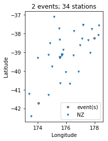

.. parsed-literal::

    (<Figure size 432x288 with 1 Axes>,
     <matplotlib.axes._subplots.AxesSubplot at 0x7f4d70b8bd50>)

.. code:: ipython3

    # event_depths() simply plots a 2D cross section of all the events at depth
    insp.event_depths(xaxis="longitude")

.. parsed-literal::

    (<Figure size 576x432 with 1 Axes>,
     <matplotlib.axes._subplots.AxesSubplot at 0x7f4d707e1610>)

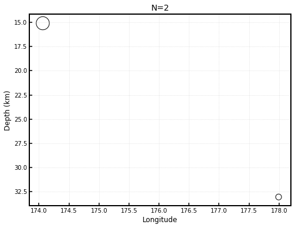

.. code:: ipython3

    # raypaths() shows source-receiver connection points for any pair that has atleast one measurement
    insp.raypaths(iteration="i01", step_count="s00")

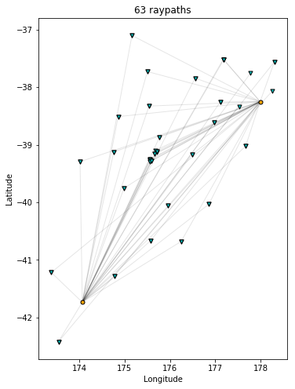

.. parsed-literal::

    (<Figure size 576x576 with 1 Axes>,
     <matplotlib.axes._subplots.AxesSubplot at 0x7f4d68eeb350>)

.. code:: ipython3

    # raypath_density() provides a more detailed raypath plot by coloring in the density of rays. Useful 
    # if you have a large number of source-receiver pairs, at which point the raypaths tend to be more difficult
    # to interpret
    insp.raypath_density(iteration="i01", step_count="s00")

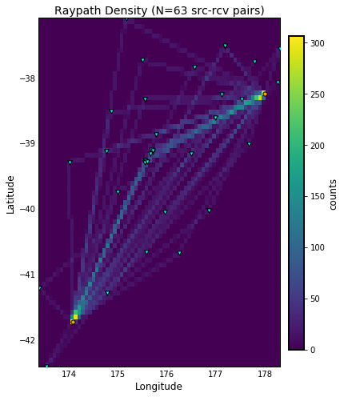

.. code:: ipython3

    # event_hist() makes a simple histogram of event information based on a given source parameter
    print(insp.sources.keys())
    insp.event_hist(choice="magnitude")

.. parsed-literal::

    Index(['time', 'magnitude', 'depth_km', 'latitude', 'longitude'], dtype='object')

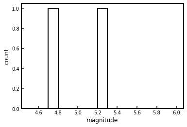

.. parsed-literal::

    (<Figure size 432x288 with 1 Axes>,
     <matplotlib.axes._subplots.AxesSubplot at 0x7f4d68b7acd0>)

--------------

Measurement start times and window lengths
~~~~~~~~~~~~~~~~~~~~~~~~~~~~~~~~~~~~~~~~~~

The following plotting functions are concerned with visualizing what
part of the seismic waveform we are measuring. These include record
sections and window plots.

.. code:: ipython3

    # travel_times() plots a proxy for phase arrivals, like a seismic record section.
    # useful for inspecting potential phases of your measurements
    insp.travel_times(markersize=2, t_offset=-20, constants=[2, 4, 6, 8, 10])

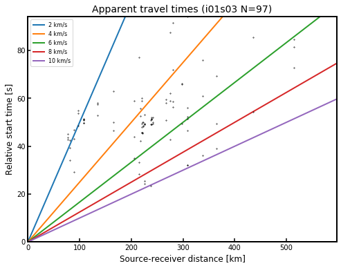

.. code:: ipython3

    # plot_windows() plots the time windows against source-receiver distance to illustrate which phases are 
    # included in the inversion. This was inspired by Carl Tape's PhD thesis and the LASIF plotting functionality
    # showcased in Krischer et al. (2018; JGR).
    insp.plot_windows(iteration="i01", step_count="s00")

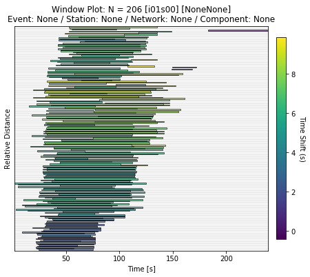

--------------

Inversion statistics
~~~~~~~~~~~~~~~~~~~~

The following plotting functions help the user understand how an
inversion is progressing by comparing iterations against one another

.. code:: ipython3

    # convergence() shows the convergence plot, or misfit reduction over the course of the inversion
    # Note: because our test data only has two iterations, its convergence plot is not very illustrative.
    insp.convergence(windows="nwin")

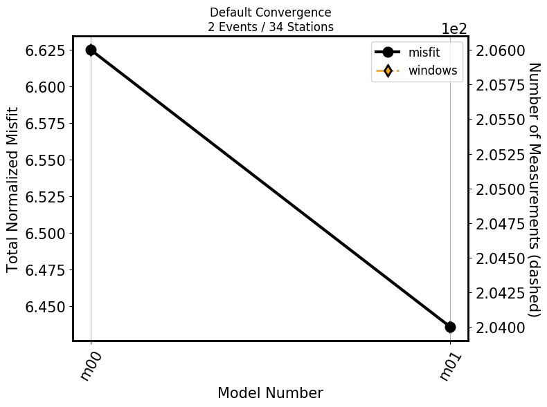

.. parsed-literal::

    (<Figure size 800x600 with 2 Axes>,
     <matplotlib.axes._subplots.AxesSubplot at 0x7f4d68a7f090>)

.. code:: ipython3

    # hist() creates misfit histograms for all measurements comparing two evaluations (defaults to first and last)
    # choices are available from any of the `windows` attributes
    print(insp.windows.keys())
    insp.hist(choice="cc_shift_in_seconds")
    insp.hist(iteration="i01", step_count="s00", iteration_comp="i01", step_count_comp="s01", choice="dlnA")

.. parsed-literal::

    Index(['event', 'iteration', 'step', 'network', 'station', 'channel',
           'component', 'misfit', 'length_s', 'dlnA', 'window_weight',
           'max_cc_value', 'relative_endtime', 'relative_starttime',
           'cc_shift_in_seconds', 'absolute_starttime', 'absolute_endtime'],
          dtype='object')

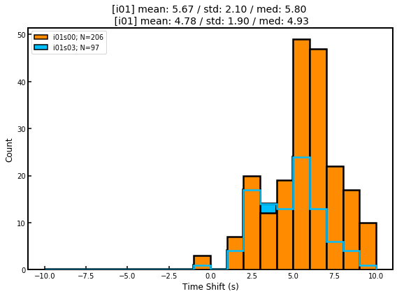

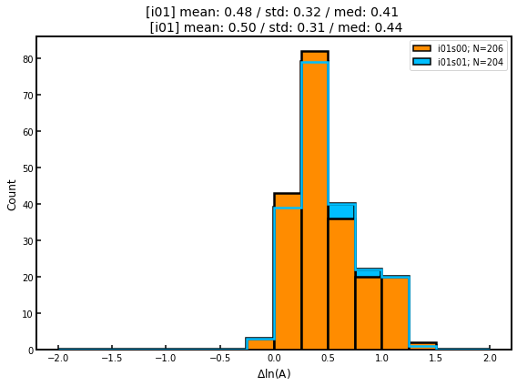

.. parsed-literal::

    (<Figure size 576x432 with 1 Axes>,
     <matplotlib.axes._subplots.AxesSubplot at 0x7f4d68c9f750>)

--------------

Measurement statistics
~~~~~~~~~~~~~~~~~~~~~~

These plotting functions allow the user to plot measurements for a given
evaluation in order to better understand the statistical distribution of
measurements, or comparisons against one another.

.. code:: ipython3

    # scatter() compares any two attributes in the `windows` dataframe
    print(insp.windows.keys())
    insp.scatter(x="relative_starttime", y="max_cc_value")

.. parsed-literal::

    Index(['event', 'iteration', 'step', 'network', 'station', 'channel',
           'component', 'misfit', 'length_s', 'dlnA', 'window_weight',
           'max_cc_value', 'relative_endtime', 'relative_starttime',
           'cc_shift_in_seconds', 'absolute_starttime', 'absolute_endtime'],
          dtype='object')

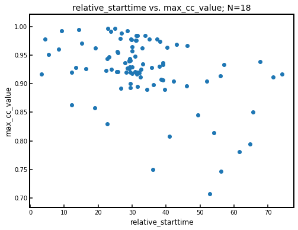

.. parsed-literal::

    (<Figure size 576x432 with 1 Axes>,
     <matplotlib.axes._subplots.AxesSubplot at 0x7f4d68c2ad10>)

.. code:: ipython3

    # measurement_hist() makes histograms of measurement numbers for 'stations' or 'event'
    # Useful for identifying events or stations with outlier number of measurements
    insp.measurement_hist(iteration="i01", step_count="s00", choice="station")
    insp.measurement_hist(iteration="i01", step_count="s00", choice="event")

.. parsed-literal::

    /home/bchow/REPOSITORIES/pyatoa/pyatoa/visuals/insp_plot.py:601: PerformanceWarning: indexing past lexsort depth may impact performance.
      level=choice).loc[iteration, step_count].nwin.to_numpy()

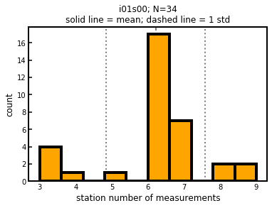

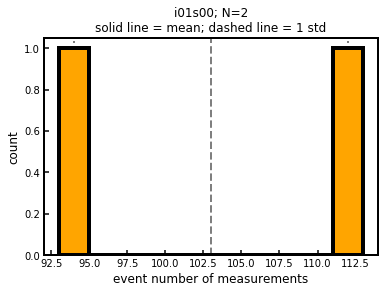

.. code:: ipython3

    # station_event_misfit_map() creates a map for a single station. Each point that isn't the station 
    # will be colored by a certain value corresponding to each event. Choices are 'nwin' or 'misfit'
    print(insp.stations)
    insp.station_event_misfit_map(station="BFZ", iteration="i01", step_count="s00", choice="misfit")

.. parsed-literal::

    ['BFZ' 'BKZ' 'ETVZ' 'FWVZ' 'HIZ' 'KHEZ' 'KHZ' 'KNZ' 'MAVZ' 'MKAZ' 'MRZ'
     'MXZ' 'NNZ' 'NTVZ' 'OPRZ' 'OTVZ' 'PXZ' 'RATZ' 'RTZ' 'TLZ' 'TMVZ' 'TOZ'
     'TRVZ' 'TSZ' 'URZ' 'VRZ' 'WAZ' 'WEL' 'WHVZ' 'WIZ' 'WSRZ' 'HAZ' 'MWZ' 'PUZ']

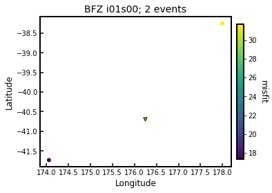

.. parsed-literal::

    (<Figure size 432x288 with 2 Axes>,
     <matplotlib.axes._subplots.AxesSubplot at 0x7f4d66b18cd0>)

.. code:: ipython3

    # event_station_misfit_map() creates a map for a single event. Each point that isn't the event 
    # will be colored by a certain value corresponding to each station. Choices are 'nwin' or 'misfit'
    print(insp.events)
    insp.event_station_misfit_map(event="2014p952799", iteration="i01", step_count="s00", choice="nwin", cmap="jet_r")

.. parsed-literal::

    ['2014p952799' '2013p617227']

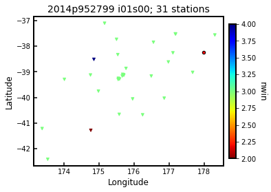

.. parsed-literal::

    (<Figure size 432x288 with 2 Axes>,
     <matplotlib.axes._subplots.AxesSubplot at 0x7f4d68b05f10>)

.. code:: ipython3

    # event_misfit_map() plots all events on a map and their corresponding scaled misfit value
    # for a given evaluation (defaults to last evaluation in the Inspector)
    insp.event_misfit_map(choice="misfit")

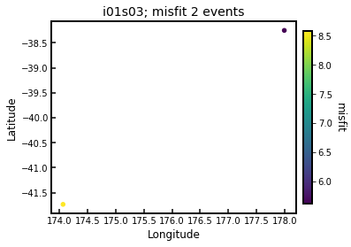

.. parsed-literal::

    (<Figure size 432x288 with 2 Axes>,
     <matplotlib.axes._subplots.AxesSubplot at 0x7f4d66a57890>)

