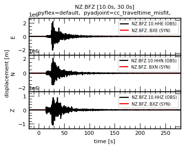
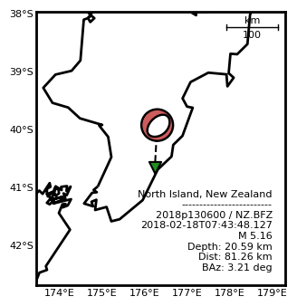
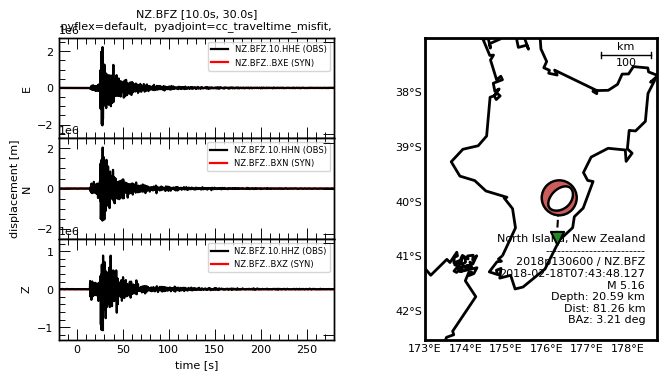
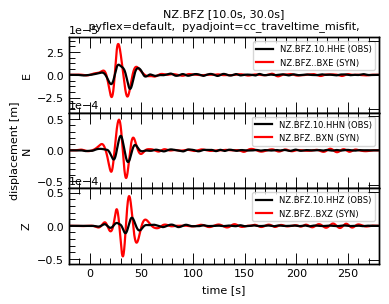
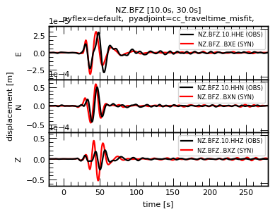
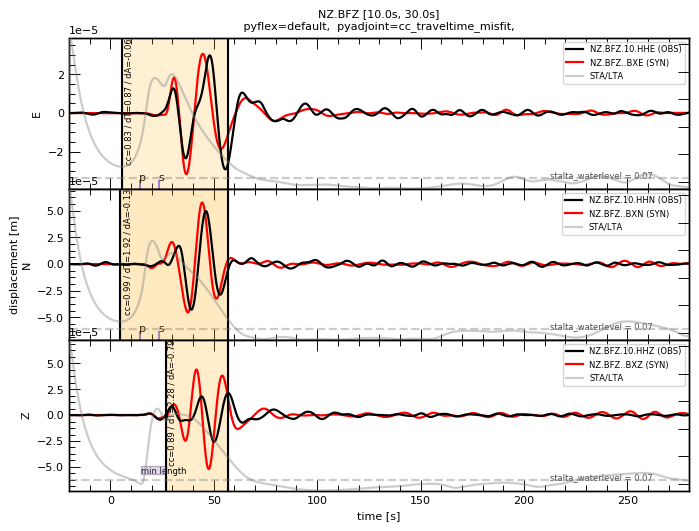
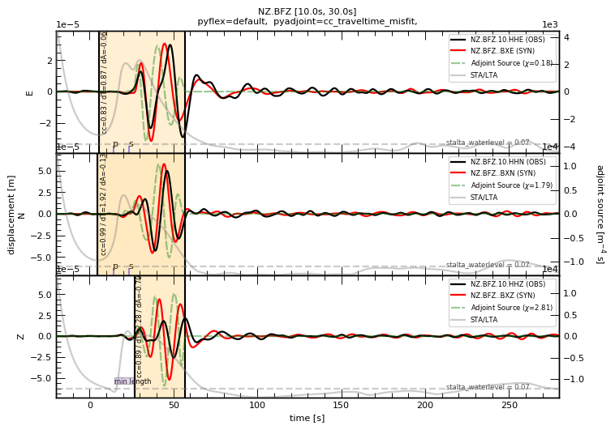

Manager
=======

The :doc:`Manager </modules/core.manager>` is the main class within the Pyatoa package. Its job is to group waveforms and metadata, perform processing operations, and output time windows and adjoint sources. 

--------------

Initialization
--------------

``Manager``\ s come with a handy string representation shows the data
that is required, and the status of the ``Manager``\ s internal
workflow. Internally used statistics can be accessed using the ``stats``
attribute.

.. code:: ipython3

    from pyatoa import Manager, Config, logger
    logger.setLevel("DEBUG")
    
    mgmt = Manager()
    mgmt

.. parsed-literal::

    [2022-03-02 14:08:46] - pyatoa - INFO: no config provided, initiating default
    [2022-03-02 14:08:46] - pyatoa - DEBUG: Component list set to E/N/Z

.. parsed-literal::

    Manager Data
        dataset   [ds]:        None
        quakeml   [event]:     None
        station   [inv]:       None
        observed  [st_obs]:    None
        synthetic [st_syn]:    None
    Stats & Status
        half_dur:              None
        time_offset_sec:       None
        standardized:          False
        obs_processed:         False
        syn_processed:         False
        nwin   [windows]:      None
        misfit [adjsrcs]:      None

We’ll simply supply data directly to the initalization of the Manager
class using ObsPy objects. First we’ll need to read in some data from
the test data directory, which includes station and event metadata, and
observed and synthetic waveforms. The ``Manager`` can gather data
automatically using the ``Gatherer`` class, but we’ll save that for a
separate section.

.. code:: ipython3

    import obspy
    
    inv = obspy.read_inventory("../tests/test_data/test_dataless_NZ_BFZ.xml")
    cat = obspy.read_events("../tests/test_data/test_catalog_2018p130600.xml")
    event = cat[0]
    st_obs = obspy.read("../tests/test_data/test_obs_data_NZ_BFZ_2018p130600.ascii")
    st_syn = obspy.read("../tests/test_data/test_syn_data_NZ_BFZ_2018p130600.ascii")

Now we can instantiate a
``Manager with all the data we just created. We'll also need to provide a``\ Config\`
object to provide some parameters to some tasks we’ll be performing with
the Manager

.. code:: ipython3

    cfg = Config()
    mgmt = Manager(config=cfg, inv=inv, event=event, st_obs=st_obs, st_syn=st_syn)
    mgmt

.. parsed-literal::

    [2022-03-02 14:08:46] - pyatoa - DEBUG: Component list set to E/N/Z

.. parsed-literal::

    Manager Data
        dataset   [ds]:        None
        quakeml   [event]:     smi:nz.org.geonet/2018p130600
        station   [inv]:       NZ.BFZ
        observed  [st_obs]:    3
        synthetic [st_syn]:    3
    Stats & Status
        half_dur:              0.6989458964552759
        time_offset_sec:       None
        standardized:          False
        obs_processed:         False
        syn_processed:         False
        nwin   [windows]:      None
        misfit [adjsrcs]:      None

--------------

Standardization
---------------

Oftentimes, observed and synthetic waveforms will differ in sampling
rate and/or start and end time. We will need to standardize the
waveforms to ensure their time series match.

   **NOTE:** By convention Pyatoa standardizes all data to the synthetic
   stream. The assumption being that the numerical solver is expecting
   adjoint sources with the sample sampling rate and start time as its
   output synthetics.

.. code:: ipython3

    print(f"OBSSERVED DATA\n\tsampling_rate: {st_obs[0].stats.sampling_rate:.2f}\n\tnpts: {st_obs[0].stats.npts:.2f}")
    print(f"SYNTHETIC DATA\n\tsampling_rate: {st_syn[0].stats.sampling_rate:.2f}\n\tnpts: {st_syn[0].stats.npts:.2f}")
    
    mgmt.standardize()
    print("\nStandardizing streams...\n")
    
    print(f"OBSSERVED DATA\n\tsampling_rate: {mgmt.st_obs[0].stats.sampling_rate:.2f}\n\tnpts: {mgmt.st_obs[0].stats.npts:.2f}")
    print(f"SYNTHETIC DATA\n\tsampling_rate: {mgmt.st_syn[0].stats.sampling_rate:.2f}\n\tnpts: {mgmt.st_syn[0].stats.npts:.2f}")

.. parsed-literal::

    [2022-03-02 14:08:46] - pyatoa - INFO: standardizing streams
    [2022-03-02 14:08:46] - pyatoa - DEBUG: zero pad NZ.BFZ.10.HHE (0, 0) samples
    [2022-03-02 14:08:46] - pyatoa - DEBUG: new starttime NZ.BFZ.10.HHE: 2018-02-18T07:43:28.127644Z
    [2022-03-02 14:08:46] - pyatoa - DEBUG: zero pad NZ.BFZ.10.HHN (0, 0) samples
    [2022-03-02 14:08:46] - pyatoa - DEBUG: new starttime NZ.BFZ.10.HHN: 2018-02-18T07:43:28.127644Z
    [2022-03-02 14:08:46] - pyatoa - DEBUG: zero pad NZ.BFZ.10.HHZ (0, 0) samples
    [2022-03-02 14:08:46] - pyatoa - DEBUG: new starttime NZ.BFZ.10.HHZ: 2018-02-18T07:43:28.127644Z
    [2022-03-02 14:08:46] - pyatoa - DEBUG: time offset is -20.0s

.. parsed-literal::

    OBSSERVED DATA
    	sampling_rate: 100.00
    	npts: 37001.00
    SYNTHETIC DATA
    	sampling_rate: 33.33
    	npts: 10000.00
    
    Standardizing streams...
    
    OBSSERVED DATA
    	sampling_rate: 33.33
    	npts: 10000.00
    SYNTHETIC DATA
    	sampling_rate: 33.33
    	npts: 10000.00

--------------

Plotting
--------

Once data are standardized, the Manager can plot waveforms. The more
data that is provided in the Manager class (e.g. time windows, adjoint
sources), the richer the resulting waveform plots will be.

With metadata, source-receiver maps are also generated. These figures
can be made standalone, or created together, illustrated below. By
default, maps will try to create a square domain around the source and
receiver, however a ``corners`` argument may be provided to the plot
function, which will set fixed bounds for the map.

   **NOTE:** In the plots you will see that the synthetic data is orders
   of magnitude smaller than the observed data. That is because we
   haven’t run the preprocessing step yet, which will follow.

.. code:: ipython3

    mgmt.plot(choice="wav", figsize=(4, 3))

.. code:: ipython3

    mgmt.plot(choice="map", figsize=(4, 4))

.. code:: ipython3

    mgmt.plot(choice="both", corners={"lat_min": -42.5,
                                      "lat_max": -37.0,
                                      "lon_min": 173.0,
                                      "lon_max": 178.5},
              figsize=(8, 4)
             )

--------------

Preprocessing
-------------

Preprocessing involves detrending, filtering, and instrument response
removal for observed waveforms. Instrument response must be available in
the ``inv`` attribute.

Preprocessing parameters should be set in the ``config`` attribute. The
relevant parameters are located in the ``PROCESS`` section of the
``Config`` string representation.

.. code:: ipython3

    mgmt.inv[0][0][0].response

.. parsed-literal::

    Channel Response
    	From m/s (None) to count (None)
    	Overall Sensitivity: 2.51658e+09 defined at 1.000 Hz
    	3 stages:
    		Stage 1: PolesZerosResponseStage from m/s to V, gain: 1500
    		Stage 2: CoefficientsTypeResponseStage from V to count, gain: 1.67772e+06
    		Stage 3: FIRResponseStage from count to count, gain: 1

.. code:: ipython3

    mgmt.config

.. parsed-literal::

    CONFIG
        iteration:               None
        step_count:              None
        event_id:                None
    GATHER
        client:                  None
        start_pad:               20
        end_pad:                 500
        save_to_ds:              True
    PROCESS
        min_period:              10.0
        max_period:              30.0
        filter_corners:          2.0
        unit_output:             DISP
        rotate_to_rtz:           False
        win_amp_ratio:           0.0
        synthetics_only:         False
    LABELS
        component_list:          ['E', 'N', 'Z']
        observed_tag:            observed
        synthetic_tag:           synthetic
        paths:                   {'waveforms': [], 'synthetics': [], 'responses': [], 'events': []}
    EXTERNAL
        pyflex_preset:           default
        adj_src_type:            cc_traveltime_misfit
        pyflex_config:           <pyflex.config.Config object at 0x7f27c15b5c10>
        pyadjoint_config:        <pyadjoint.config.Config object at 0x7f27c15b5ed0>

| Pyatoa ships with a default preprocessing function, which involves
  tapering, response removal, and filtering.
| The ``Stats and Status`` section of the ``Manager`` string
  representation lets the user know if the waveforms have been
  preprocessed successfully.

.. code:: ipython3

    mgmt.preprocess()
    mgmt.plot(choice="wav", figsize=(4, 3))

.. parsed-literal::

    [2022-03-02 14:08:48] - pyatoa - INFO: preprocessing observation data
    [2022-03-02 14:08:48] - pyatoa - INFO: adjusting taper to cover time offset -20.0
    [2022-03-02 14:08:48] - pyatoa - DEBUG: removing response, units to DISP
    [2022-03-02 14:08:48] - pyatoa - DEBUG: rotating from generic coordinate system to ZNE
    [2022-03-02 14:08:48] - pyatoa - DEBUG: bandpass filter: 10.0 - 30.0s w/ 2.0 corners
    [2022-03-02 14:08:48] - pyatoa - INFO: preprocessing synthetic data
    [2022-03-02 14:08:48] - pyatoa - INFO: adjusting taper to cover time offset -20.0
    [2022-03-02 14:08:48] - pyatoa - DEBUG: no response removal, synthetic data or requested not to
    [2022-03-02 14:08:48] - pyatoa - DEBUG: bandpass filter: 10.0 - 30.0s w/ 2.0 corners
    [2022-03-02 14:08:48] - pyatoa - DEBUG: convolving data w/ Gaussian (t/2=0.70s)

--------------

Custom preprocessing functions
------------------------------

A custom preprocessing routine may be required. It is possible to
substitute a user-defined preprocessing function using the ``overwrite``
argument in the ``preprocess()`` function.

To use ``overwrite``, the user must define a function with two mandatory
arguments: ``Manager`` and ``choice``. The ``choice`` argument allows
different preprocessing steps for observed (obs) and synthetic (syn)
data. The function must return an ObsPy ``Stream`` object.

This functionality is illustrated below.

.. code:: ipython3

    def custom_preprocessing(mgmt, choice):
        """
        This function performs a custom preprocessing for the Manager class.
        
        :type mgmt: pyatoa.core.manager.Manager
        :param mgmt: the Manager class, which contains standardized data
        :type choice: str
        :param choice: choice of output, either "obs" or "syn"
        :rtype: obspy.core.stream.Stream
        :return: A preprocessed ObsPy Stream object
        """
        if choice == "obs":
            st = mgmt.st_obs
        elif choice == "syn":
            st = mgmt.st_syn
            
        # The `choice` argument allows different preprocessing for `obs` and `syn`
        if choice == "obs":
            st.remove_response(inventory=mgmt.inv, 
                               output=mgmt.config.unit_output)
            
            # Here we add a random action to scale data
            for tr in st:
                tr.data *= 2
    
        # Access to Config parameters is still possible 
        st.filter("bandpass", freqmin=1/mgmt.config.max_period, 
                  freqmax=1/mgmt.config.min_period)
        
        # MUST output a Stream
        return st
    
    # Instantiate the Manager class
    mgmt = Manager(config=cfg, inv=inv, event=event, st_obs=st_obs, st_syn=st_syn)
    
    # Functions can be chained together to simplify workflow calls
    mgmt.standardize().preprocess(overwrite=custom_preprocessing)
    mgmt.plot(choice="wav", figsize=(4, 3))

.. parsed-literal::

    [2022-03-02 14:08:48] - pyatoa - INFO: standardizing streams
    [2022-03-02 14:08:48] - pyatoa - DEBUG: zero pad NZ.BFZ.10.HHE (0, 0) samples
    [2022-03-02 14:08:48] - pyatoa - DEBUG: new starttime NZ.BFZ.10.HHE: 2018-02-18T07:43:28.127644Z
    [2022-03-02 14:08:48] - pyatoa - DEBUG: zero pad NZ.BFZ.10.HHN (0, 0) samples
    [2022-03-02 14:08:48] - pyatoa - DEBUG: new starttime NZ.BFZ.10.HHN: 2018-02-18T07:43:28.127644Z
    [2022-03-02 14:08:48] - pyatoa - DEBUG: zero pad NZ.BFZ.10.HHZ (0, 0) samples
    [2022-03-02 14:08:48] - pyatoa - DEBUG: new starttime NZ.BFZ.10.HHZ: 2018-02-18T07:43:28.127644Z
    [2022-03-02 14:08:48] - pyatoa - DEBUG: time offset is -20.0s
    [2022-03-02 14:08:48] - pyatoa - INFO: preprocessing observation data
    [2022-03-02 14:08:48] - pyatoa - INFO: preprocessing synthetic data

--------------

Time windowing using Pyflex
---------------------------

Time windows are selected based on an STA/LTA waveform derived using the
synthetic stream, and internal rejection criteria defined by the FLEXWIN
algorithm. Parameters used to define the internal rejection criteria are
set in the Pyflex Config object. Here we use the default Pyflex
parameters to select windows for our test data.

Plotting the Manager shows the newly chosen time windows, rejected time
windows and the reason for their rejection, annotations denoting the
quality of each window, and the STA/LTA waveform and its accompanying
water level.

.. code:: ipython3

    mgmt.window()
    mgmt.plot(choice="wav")

.. parsed-literal::

    [2022-03-02 14:08:48] - pyatoa - INFO: running Pyflex w/ map: default
    [2022-03-02 14:08:49] - pyatoa - INFO: 1 window(s) selected for comp E
    [2022-03-02 14:08:49] - pyatoa - INFO: 1 window(s) selected for comp N
    [2022-03-02 14:08:49] - pyatoa - INFO: 1 window(s) selected for comp Z
    [2022-03-02 14:08:49] - pyatoa - WARNING: Manager has no ASDFDataSet, cannot save windows
    [2022-03-02 14:08:49] - pyatoa - INFO: 3 window(s) total found

We can see that 3 windows have been collected, one for each component.
It is possible to access the individual ``pyflex.Window`` objects by
querying the ``Manager.windows`` atrribute, which is a dictionary
containing lists of ``Window`` objects.

.. code:: ipython3

    mgmt.windows

.. parsed-literal::

    {'E': [Window(left=849, right=2569, center=1709, channel_id=NZ.BFZ.10.HHE, max_cc_value=0.8272815676868746, cc_shift=29, dlnA=-0.06282611168496877)],
     'N': [Window(left=827, right=2569, center=1698, channel_id=NZ.BFZ.10.HHN, max_cc_value=0.9873360888477708, cc_shift=64, dlnA=-0.13343443319126463)],
     'Z': [Window(left=1557, right=2569, center=2063, channel_id=NZ.BFZ.10.HHZ, max_cc_value=0.8923893777352877, cc_shift=76, dlnA=-0.7922907145441169)]}

--------------

Misfit measurement & adjoint sources with Pyadjoint
---------------------------------------------------

Within each time window, we can evaluate the adjoint source. For each
component, a misfit value :math:`\chi` is calculated, which can be
collected and summed with misfit values from other components, stations
and source-receiver pairs, to provide an evaluation of an objective
function for a seismic inversion.

The adjoint source type is defined by the Config parameter
``adj_src_type``, and the configuration parameters of Pyadjoint are set
in the Config parameter ``pyadjoint_config``

Plotting the Manager at this stage sees inclusion of adjoint source
traces, as well as :math:`\chi` values for each component.

.. code:: ipython3

    mgmt.measure()
    mgmt.plot(choice="wav")

.. parsed-literal::

    [2022-03-02 14:08:49] - pyatoa - DEBUG: running Pyadjoint w/ type: cc_traveltime_misfit
    [2022-03-02 14:08:49] - pyatoa - INFO: 0.179 misfit for comp E
    [2022-03-02 14:08:49] - pyatoa - INFO: 1.786 misfit for comp N
    [2022-03-02 14:08:49] - pyatoa - INFO: 2.808 misfit for comp Z
    [2022-03-02 14:08:49] - pyatoa - WARNING: Manager has no ASDFDataSet, cannot save adjoint sources
    [2022-03-02 14:08:49] - pyatoa - INFO: total misfit 4.774

As with the windows, the resultant ``Pyadjoint.AdjointSource`` objects
are stored in a dictionary in the Manager under the ``adjsrcs``
attribute.

.. code:: ipython3

    mgmt.adjsrcs

.. parsed-literal::

    {'E': <pyadjoint.adjoint_source.AdjointSource at 0x7f27b82ef050>,
     'N': <pyadjoint.adjoint_source.AdjointSource at 0x7f27c153cb50>,
     'Z': <pyadjoint.adjoint_source.AdjointSource at 0x7f27c153cf10>}

.. code:: ipython3

    vars(mgmt.adjsrcs["Z"])

.. parsed-literal::

    {'adj_src_type': 'cc_traveltime_misfit',
     'adj_src_name': 'Cross Correlation Traveltime Misfit',
     'misfit': 2.80845,
     'dt': 0.03,
     'min_period': 10.0,
     'max_period': 30.0,
     'component': 'BXZ',
     'network': 'NZ',
     'station': 'BFZ',
     'location': '10',
     'starttime': 2018-02-18T07:43:28.127644Z,
     'adjoint_source': array([ 0.,  0.,  0., ...,  0.,  0.,  0.])}

The ``measure()`` function is the final step in the Pyatoa internal
workflow. What to do with this processed data is covered in other
sections. A summary of the workflow, and the internal stats of the
``Manager`` can be accessed through the Manager.

.. code:: ipython3

    mgmt

.. parsed-literal::

    Manager Data
        dataset   [ds]:        None
        quakeml   [event]:     smi:nz.org.geonet/2018p130600
        station   [inv]:       NZ.BFZ
        observed  [st_obs]:    3
        synthetic [st_syn]:    3
    Stats & Status
        half_dur:              0.6989458964552759
        time_offset_sec:       -20.0
        standardized:          True
        obs_processed:         True
        syn_processed:         True
        nwin   [windows]:      3
        misfit [adjsrcs]:      4.773751366563893

.. code:: ipython3

    mgmt.stats

.. parsed-literal::

    {'dataset_id': None,
     'event_id': 'smi:nz.org.geonet/2018p130600',
     'inv_name': 'NZ.BFZ',
     'nwin': 3,
     'len_obs': 3,
     'len_syn': 3,
     'misfit': 4.773751366563893,
     'half_dur': 0.6989458964552759,
     'time_offset_sec': -20.0,
     'standardized': True,
     'obs_processed': True,
     'syn_processed': True}

--------------

The flow function
-----------------

The ``Manager.flow()`` is a convenient function that calls each Manager
function consecutively. If a ``Manager`` is included into a larger
workflow tool, this makes running its internal workflow more concise.
The flow takes key word arguments corresponding to optional arguments
accepted by each of its workflow functions.

.. code:: python

   # The flow function is equivalent to chaining the four main functions
   mgmt.flow() == mgmt.standardize().preprocess().window().measure()

.. code:: ipython3

    mgmt = Manager(config=cfg, inv=inv, event=event, st_obs=st_obs, st_syn=st_syn)
    mgmt.flow()
    mgmt.plot()

.. parsed-literal::

    [2022-03-02 14:08:50] - pyatoa - INFO: standardizing streams
    [2022-03-02 14:08:50] - pyatoa - DEBUG: zero pad NZ.BFZ.10.HHE (0, 0) samples
    [2022-03-02 14:08:50] - pyatoa - DEBUG: new starttime NZ.BFZ.10.HHE: 2018-02-18T07:43:28.127644Z
    [2022-03-02 14:08:50] - pyatoa - DEBUG: zero pad NZ.BFZ.10.HHN (0, 0) samples
    [2022-03-02 14:08:50] - pyatoa - DEBUG: new starttime NZ.BFZ.10.HHN: 2018-02-18T07:43:28.127644Z
    [2022-03-02 14:08:50] - pyatoa - DEBUG: zero pad NZ.BFZ.10.HHZ (0, 0) samples
    [2022-03-02 14:08:50] - pyatoa - DEBUG: new starttime NZ.BFZ.10.HHZ: 2018-02-18T07:43:28.127644Z
    [2022-03-02 14:08:50] - pyatoa - DEBUG: time offset is -20.0s
    [2022-03-02 14:08:50] - pyatoa - INFO: preprocessing observation data
    [2022-03-02 14:08:50] - pyatoa - INFO: adjusting taper to cover time offset -20.0
    [2022-03-02 14:08:50] - pyatoa - DEBUG: removing response, units to DISP
    [2022-03-02 14:08:50] - pyatoa - DEBUG: rotating from generic coordinate system to ZNE
    [2022-03-02 14:08:50] - pyatoa - DEBUG: bandpass filter: 10.0 - 30.0s w/ 2.0 corners
    [2022-03-02 14:08:50] - pyatoa - INFO: preprocessing synthetic data
    [2022-03-02 14:08:50] - pyatoa - INFO: adjusting taper to cover time offset -20.0
    [2022-03-02 14:08:50] - pyatoa - DEBUG: no response removal, synthetic data or requested not to
    [2022-03-02 14:08:50] - pyatoa - DEBUG: bandpass filter: 10.0 - 30.0s w/ 2.0 corners
    [2022-03-02 14:08:50] - pyatoa - DEBUG: convolving data w/ Gaussian (t/2=0.70s)
    [2022-03-02 14:08:50] - pyatoa - INFO: running Pyflex w/ map: default
    [2022-03-02 14:08:50] - pyatoa - INFO: 1 window(s) selected for comp E
    [2022-03-02 14:08:50] - pyatoa - INFO: 1 window(s) selected for comp N
    [2022-03-02 14:08:50] - pyatoa - INFO: 1 window(s) selected for comp Z
    [2022-03-02 14:08:50] - pyatoa - WARNING: Manager has no ASDFDataSet, cannot save windows
    [2022-03-02 14:08:50] - pyatoa - INFO: 3 window(s) total found
    [2022-03-02 14:08:50] - pyatoa - DEBUG: running Pyadjoint w/ type: cc_traveltime_misfit
    [2022-03-02 14:08:50] - pyatoa - INFO: 0.365 misfit for comp E
    [2022-03-02 14:08:50] - pyatoa - INFO: 1.620 misfit for comp N
    [2022-03-02 14:08:50] - pyatoa - INFO: 0.004 misfit for comp Z
    [2022-03-02 14:08:50] - pyatoa - WARNING: Manager has no ASDFDataSet, cannot save adjoint sources
    [2022-03-02 14:08:50] - pyatoa - INFO: total misfit 1.989

.. image:: manager_files/manager_34_1.png

