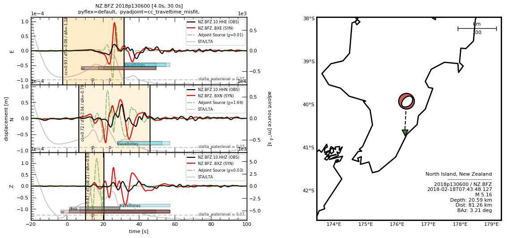

Quick Start
===========

For a very brief introduction to ``Pyatoa``\ ’s misfit quantification
capabilities, let’s generate the waveform image shown on the front page.
The code snippet below collects, formats and measures observed and
synthetic waveform data using default values. Comments throughout the
code black explain what each statement is doing. The end result is a
waveform and map figure that presents necessary information to assess
waveform misfit.

.. code:: ipython3

    import os
    from obspy import read_events
    from pyatoa import Config, Manager, logger
    
    # Ensure that we get the maximum level of under-the-hood log output
    logger.setLevel("DEBUG")
    
    # All the data we need is stored within the following directory
    test_data = "../tests/test_data"
    
    # We need an ObsPy Event object to define where and when our event is
    event = read_events(os.path.join(test_data, "test_catalog_2018p130600.xml"))[0]
    
    # The Config object controls how the User interfaces with Pyatoa
    cfg = Config(event_id="2018p130600",
                 min_period=4,   # minimum filter bandpass in seconds
                 max_period=30,  # maximum filter bandpass in seconds
                 end_pad=100,    # desired time-series end point w.r.t event origin time
                 client=None,    # This parameter ensures that Pyatoa does not search FDSN for data
                 paths={         # Paths where data and metadata is stored in a specific format
                     "waveforms": os.path.join(test_data, "test_mseeds"),
                     "responses": os.path.join(test_data, "test_seed"),
                     "synthetics": os.path.join(test_data, "synthetics"),
                        },
    
                 )
    
    # The Manager object is the main object in Pyatoa, it stores waveform and metadata and processes accordingly
    # Each Manager is linked to a single event, but can loop through individual stations for mass processing
    mgmt = Manager(config=cfg, event=event)
    
    # The Manager.gather() function performs a series of generalized searches for corresponding data
    mgmt.gather(code="NZ.BFZ.*.*")
    
    # the Manager.flow() function standardizes and preprocesses waveforms, then windows them and generates adjoint sources
    mgmt.flow()
    
    # The Manager can plot maps and waveform figures individually, or together
    mgmt.plot(choice="both", show=True)

.. parsed-literal::

    [2022-03-03 11:02:25] - pyatoa - DEBUG: Component list set to E/N/Z
    [2022-03-03 11:02:25] - pyatoa - INFO: gathering data for NZ.BFZ.*.*
    [2022-03-03 11:02:25] - pyatoa - INFO: gathering observed waveforms
    [2022-03-03 11:02:25] - pyatoa - INFO: searching local filesystem for observations
    [2022-03-03 11:02:25] - pyatoa - DEBUG: searching for observations: ../tests/test_data/test_mseeds/2018/NZ/BFZ/*/NZ.BFZ.*.*.2018.049
    [2022-03-03 11:02:25] - pyatoa - INFO: retrieved observations locally:
    ../tests/test_data/test_mseeds/2018/NZ/BFZ/HHE/NZ.BFZ.10.HHE.D.2018.049
    [2022-03-03 11:02:25] - pyatoa - INFO: retrieved observations locally:
    ../tests/test_data/test_mseeds/2018/NZ/BFZ/HHN/NZ.BFZ.10.HHN.D.2018.049
    [2022-03-03 11:02:25] - pyatoa - INFO: retrieved observations locally:
    ../tests/test_data/test_mseeds/2018/NZ/BFZ/HHZ/NZ.BFZ.10.HHZ.D.2018.049
    [2022-03-03 11:02:25] - pyatoa - INFO: matching observed waveforms found
    [2022-03-03 11:02:25] - pyatoa - INFO: gathering StationXML
    [2022-03-03 11:02:25] - pyatoa - INFO: searching local filesystem for station info
    [2022-03-03 11:02:25] - pyatoa - DEBUG: searching for responses: ../tests/test_data/test_seed/BFZ.NZ/RESP.NZ.BFZ.*.*
    [2022-03-03 11:02:25] - pyatoa - INFO: retrieved response locally:
    ../tests/test_data/test_seed/BFZ.NZ/RESP.NZ.BFZ.10.HHE
    [2022-03-03 11:02:25] - pyatoa - INFO: retrieved response locally:
    ../tests/test_data/test_seed/BFZ.NZ/RESP.NZ.BFZ.10.HHN
    [2022-03-03 11:02:25] - pyatoa - INFO: retrieved response locally:
    ../tests/test_data/test_seed/BFZ.NZ/RESP.NZ.BFZ.10.HHZ
    [2022-03-03 11:02:25] - pyatoa - INFO: matching StationXML found
    [2022-03-03 11:02:25] - pyatoa - INFO: gathering synthetic waveforms
    [2022-03-03 11:02:25] - pyatoa - INFO: searching local filesystem for synthetics
    [2022-03-03 11:02:25] - pyatoa - DEBUG: searching for synthetics: ../tests/test_data/synthetics/{net}.{sta}.*{cmp}.sem{dva}
    [2022-03-03 11:02:25] - pyatoa - INFO: retrieved synthetics locally:
    ../tests/test_data/synthetics/NZ.BFZ.BXE.semd
    [2022-03-03 11:02:25] - pyatoa - INFO: retrieved synthetics locally:
    ../tests/test_data/synthetics/NZ.BFZ.BXN.semd
    [2022-03-03 11:02:25] - pyatoa - INFO: retrieved synthetics locally:
    ../tests/test_data/synthetics/NZ.BFZ.BXZ.semd
    [2022-03-03 11:02:25] - pyatoa - INFO: matching synthetic waveforms found
    [2022-03-03 11:02:25] - pyatoa - INFO: standardizing streams
    [2022-03-03 11:02:25] - pyatoa - DEBUG: zero pad NZ.BFZ.10.HHE (0, 0) samples
    [2022-03-03 11:02:25] - pyatoa - DEBUG: new starttime NZ.BFZ.10.HHE: 2018-02-18T07:43:28.127644Z
    [2022-03-03 11:02:25] - pyatoa - DEBUG: zero pad NZ.BFZ.10.HHN (0, 0) samples
    [2022-03-03 11:02:25] - pyatoa - DEBUG: new starttime NZ.BFZ.10.HHN: 2018-02-18T07:43:28.127644Z
    [2022-03-03 11:02:25] - pyatoa - DEBUG: zero pad NZ.BFZ.10.HHZ (0, 0) samples
    [2022-03-03 11:02:25] - pyatoa - DEBUG: new starttime NZ.BFZ.10.HHZ: 2018-02-18T07:43:28.127644Z
    [2022-03-03 11:02:25] - pyatoa - DEBUG: start and endtimes already match to 0.001
    [2022-03-03 11:02:25] - pyatoa - DEBUG: appending 1 zeros to NZ.BFZ.10.HHE
    [2022-03-03 11:02:25] - pyatoa - DEBUG: appending 1 zeros to NZ.BFZ.10.HHN
    [2022-03-03 11:02:25] - pyatoa - DEBUG: appending 1 zeros to NZ.BFZ.10.HHZ
    [2022-03-03 11:02:25] - pyatoa - DEBUG: time offset is -20.0s
    [2022-03-03 11:02:25] - pyatoa - INFO: preprocessing observation data
    [2022-03-03 11:02:25] - pyatoa - INFO: adjusting taper to cover time offset -20.0
    [2022-03-03 11:02:25] - pyatoa - DEBUG: removing response, units to DISP
    [2022-03-03 11:02:25] - pyatoa - DEBUG: rotating from generic coordinate system to ZNE
    [2022-03-03 11:02:25] - pyatoa - DEBUG: bandpass filter: 4.0 - 30.0s w/ 2.0 corners
    [2022-03-03 11:02:25] - pyatoa - INFO: preprocessing synthetic data
    [2022-03-03 11:02:25] - pyatoa - INFO: adjusting taper to cover time offset -20.0
    [2022-03-03 11:02:25] - pyatoa - DEBUG: no response removal, synthetic data or requested not to
    [2022-03-03 11:02:25] - pyatoa - DEBUG: bandpass filter: 4.0 - 30.0s w/ 2.0 corners
    [2022-03-03 11:02:25] - pyatoa - DEBUG: convolving data w/ Gaussian (t/2=0.70s)
    [2022-03-03 11:02:25] - pyatoa - INFO: running Pyflex w/ map: default
    [2022-03-03 11:02:25] - pyatoa - INFO: 1 window(s) selected for comp E
    [2022-03-03 11:02:25] - pyatoa - INFO: 1 window(s) selected for comp N
    [2022-03-03 11:02:25] - pyatoa - INFO: 1 window(s) selected for comp Z
    [2022-03-03 11:02:25] - pyatoa - WARNING: Manager has no ASDFDataSet, cannot save windows
    [2022-03-03 11:02:25] - pyatoa - INFO: 3 window(s) total found
    [2022-03-03 11:02:25] - pyatoa - DEBUG: running Pyadjoint w/ type: cc_traveltime_misfit
    [2022-03-03 11:02:25] - pyatoa - INFO: 0.007 misfit for comp E
    [2022-03-03 11:02:25] - pyatoa - INFO: 1.688 misfit for comp N
    [2022-03-03 11:02:25] - pyatoa - INFO: 0.029 misfit for comp Z
    [2022-03-03 11:02:25] - pyatoa - WARNING: Manager has no ASDFDataSet, cannot save adjoint sources
    [2022-03-03 11:02:25] - pyatoa - INFO: total misfit 1.724

